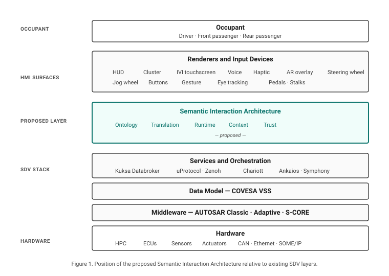
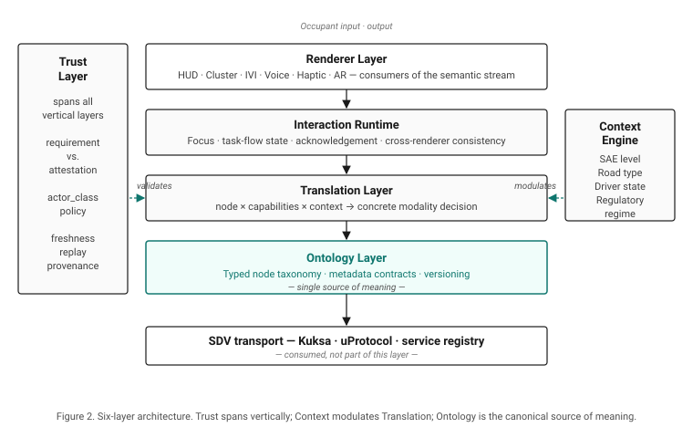
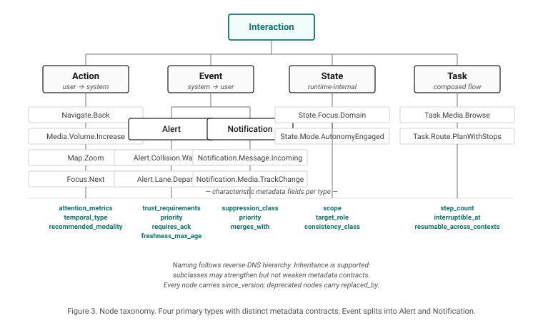

# Toward a Semantic Interaction Architecture for Software-Defined Vehicles

**A Position Paper on Decoupling Interaction Meaning from Implementation**

---

**Author:** Jan Janeček
**Affiliation:** Independent researcher
**Version:** 0.1 — Draft for circulation
**Date:** May 2026

---

## Abstract

As vehicles evolve into multimodal, AI-augmented, software-defined platforms, the Human–Machine Interface (HMI) is becoming the most volatile and most fragile layer of the in-vehicle stack. Current automotive HMI architectures remain hardware-centric, vendor-specific, and tightly coupled to particular renderers and input devices, producing high rework cost, inconsistent user experience, and a growing attack surface. This paper argues that the industry needs a *semantic interaction layer* — an open, vendor-neutral abstraction in which interactions are described by their meaning, attention demand, contextual fitness, and authority of origin, rather than by buttons, screens, or widgets. We position this layer above existing Software-Defined Vehicle (SDV) data and service abstractions (COVESA VSS, Eclipse Kuksa, Eclipse uProtocol, AUTOSAR Adaptive), describe a six-layer architecture and a typed node taxonomy with measurable metadata, and outline how trust and attention can be promoted to first-class properties of every interaction. We close with a path toward standardisation within the Eclipse SDV Working Group and an open research agenda.

---

## 1. Motivation

The Software-Defined Vehicle is conventionally defined in terms of computing topology, OTA capability, and service-oriented architecture. Yet from the occupant's perspective, the SDV manifests almost entirely through interaction surfaces: head-up displays, instrument clusters, infotainment touchscreens, voice assistants, haptic actuators, and increasingly, AI agents that act on the occupant's behalf. The interaction layer is where the value of the SDV becomes perceptible, where regulatory exposure concentrates, and where the marginal cost of change is highest.

Despite this, the interaction layer has not received the abstraction work that data layers (signals, telemetry) and service layers (orchestration, OTA, digital twins) have received. Most production HMI stacks are still designed *screen-first*: a graphical layout binds a fixed widget to a fixed input device, exposes a fixed task flow, and treats voice, gesture, or haptic feedback as bolted-on alternatives. Cross-renderer consistency is achieved by repetition rather than abstraction. Capability changes require redesign rather than reconfiguration.

The cost of this tight coupling compounds along three axes. **Engineering cost** rises as each new screen size, input modality, or in-cabin AI feature triggers cascading rework. **User experience cost** rises as the same intent (*return to previous view*, *increase volume*, *acknowledge alert*) acquires inconsistent behaviour across vehicles, generations, and contexts. **Security cost** rises as third-party applications, cloud services, and AI agents acquire the ability to emit interactions that are indistinguishable, from the user's standpoint, from interactions originating in safety-critical subsystems.

We argue that these costs are not solved by better tooling, more screens, or larger language models. They are symptoms of a missing layer of abstraction.

---

## 2. Related Work and Position in the Ecosystem

Significant abstraction work exists below and around the interaction layer, but not within it.

**Data abstraction.** COVESA's Vehicle Signal Specification (VSS) defines a hierarchical, vendor-neutral catalogue of vehicle signals and is widely adopted as a common data vocabulary. VSS deliberately scopes itself to *signals*, not interactions; its recent `HMI` branch covers display properties such as font size and voice prompts, not interaction semantics.

**Service and communication abstraction.** Eclipse Kuksa provides a vehicle data broker over VSS. Eclipse uProtocol (with Eclipse Zenoh transport) abstracts in-vehicle and vehicle-to-cloud messaging. Eclipse Chariott provides a service registry and capability discovery. Eclipse Safe Open Vehicle Core (S-CORE) provides safety-ready middleware. None of these projects model *what an interaction means to the occupant*; they model how services and signals talk to each other.

**Middleware and runtime.** AUTOSAR Classic and Adaptive standardise ECU software architecture and middleware. SOAFEE introduces cloud-native, mixed-criticality runtime patterns. These layers sit below the interaction layer and are orthogonal to it.

**HMI frameworks.** Android Automotive's Car App Library is the closest existing analogue to a semantic interaction layer: applications declare templates (List, Message, Navigation) and a host renders them with built-in distraction optimisation. Its scope is narrow (a small set of application categories, single-OEM ecosystem) and it remains closed to the wider SDV stack. Qt Automotive, Kanzi, and similar tools offer renderer-side abstractions but not semantic ones.

**Multimodal interaction.** The W3C Multimodal Architecture and Interfaces (MMI) Recommendation, with its EMMA annotation format, defines a generic semantic model for multimodal input. It has had limited automotive uptake, but its vocabulary is a candidate substrate.

**Adjacent domains.** Game engines such as Unreal's Enhanced Input and Unity's Input System routinely abstract input actions from devices. ARIA performs an analogous role for web accessibility. These prior arts demonstrate that the proposed abstraction is tractable; they have not been adapted to the automotive constraint set (safety, multi-renderer, ASIL, regulated distraction limits).

Figure 1 positions the proposed layer in the SDV stack.



The proposed Semantic Interaction Architecture (SIA) sits **above** existing service and data abstractions and **below** concrete renderers. It is not a replacement for any current SDV project; it is the missing connective tissue between them and the occupant.

---

## 3. Architecture Overview

We propose six functional layers, illustrated in Figure 2. Layers are listed below from foundational to occupant-facing; Trust and Context Engine span the stack laterally rather than occupying a single position in the vertical order.



**Ontology Layer.** A typed taxonomy of interaction nodes with formal metadata contracts. The vocabulary is open, hierarchical, and versioned. This is the single source of meaning.

**Translation Layer.** A bidirectional adaptor that maps semantic nodes to concrete input and output modalities given a capability set and a context. Its inputs are: the node, available renderers and input devices declaring measurable capabilities, the active context vector, and user accessibility profile. Its output is a concrete rendering or input mapping decision.

**Interaction Runtime.** State management for focus, in-flight task flows, modal stacks, acknowledgement timeouts, and consistency across distributed renderers. Equivalent in role to a window manager, but operating on semantics rather than pixels.

**Renderer Layer.** A heterogeneous set of consumers — HUD, cluster, IVI, voice, haptic, AR — each declaring its capabilities and consuming the semantic stream filtered by Translation. Renderers are interchangeable; the ontology is not.

**Context Engine.** A continuously updated vector of contextual axes (driving state, autonomy level, road type, occupant state, regulatory regime) that modulates priority, modality preference, and suppression policy. Context is not a tree; it is a composable predicate.

**Trust Layer.** Spans all five layers above. Validates message origin, freshness, and authority before semantic propagation. Applies policy to which actor classes may emit which node classes at which trust levels.

---

## 4. Node Taxonomy

A common failure mode in interaction ontologies is conflating semantically different node types into a single schema. We separate four primary node types, each with its own metadata contract.



**Action.** Occupant-initiated. May be discrete (`Navigate.Back`), sustained (`Media.Volume.Increase`), or continuous (`Map.Zoom`). Carries `recommended_modality`, `attention_cost`, `temporal_type`.

**Event.** System-initiated. Splits into **Alert** (safety-relevant, may require acknowledgement) and **Notification** (informational, suppressible). Carries `priority`, `interruptibility`, `requires_acknowledgement`, `trust_requirements`.

**State.** Focus, mode, and context transitions. Not user-facing on its own; consumed by Runtime to coordinate renderers. Carries `scope`, `target_role`, `consistency_class`.

**Task.** A composed multi-step flow over Actions and States, with start/end conditions and resumption semantics. Carries `step_count`, `interruptible_at`, `resumable_across_contexts`.

Naming follows reverse-DNS hierarchy (`Interaction.Action.Navigate.Back`). Inheritance is supported: subclasses inherit parent metadata and may strengthen but not weaken contracts. Versioning is mandatory on every node.

---

## 5. Metadata Contracts

Every node carries a typed metadata block. Fields are partitioned into **declarative** (defined in the ontology and stable across deployments) and **runtime** (filled by emitter at the moment of emission). We summarise the contract for each node type.

| Field | Action | Alert | Notification | State | Task |
|---|---|---|---|---|---|
| `since_version` | ● | ● | ● | ● | ● |
| `direction` | ● | ● | ● | ● | ● |
| `temporal_type` | ● | ● | ● | — | — |
| `attention_metrics` | ● | ● | ● | — | ● |
| `priority` | — | ● | ● | — | — |
| `interruptibility` | — | ● | ● | — | ● |
| `requires_ack` | — | ● | ○ | — | — |
| `ack_kind` | — | ● | ○ | — | — |
| `trust_requirements` | ○ | ● | ○ | ○ | ○ |
| `target_role` | ● | ● | ● | ● | ● |
| `accessibility_alt` | ● | ● | ● | — | ● |
| `regulatory_basis` | ○ | ● | — | — | ○ |
| `pii_class` | ● | ● | ● | — | ● |
| `temporal_freshness_ms` | — | ● | ● | ● | — |
| `suppression_class` | — | ● | ● | — | — |
| `merges_with` | — | ● | ● | — | — |
| `fallback_chain` | ● | ● | ● | — | ● |
| `degradation_policy` | ● | ● | ● | — | ● |

● mandatory · ○ optional · — not applicable

Two design decisions warrant emphasis.

**Attention is measurable, not enumerated.** The `attention_metrics` field carries quantitative predicted values — estimated glance time in milliseconds, mean single glance, task step count — rather than qualitative levels. This permits mechanical compliance checks against published distraction guidelines (NHTSA, JAMA, UNECE) and allows context-dependent scaling without overloading enum semantics. A qualitative fallback (`cognitive_load: minimal | moderate | high | locked_while_driving`) is permitted for legacy and rapid prototyping use.

**Trust is split between requirement and attestation.** A node declares what trust properties consumers should require; an instance carries the attestation that those properties hold. The two are deliberately decoupled (Section 6).

---

## 6. Trust Model

In current automotive cybersecurity practice, trust is largely concerned with firmware integrity, ECU authentication, OTA signatures, and CAN-bus isolation. ISO/SAE 21434 and UNECE R155 codify this concern at the management-system level. None of these standards address what we term *interaction integrity*: the property that the meaning, priority, and origin of an interaction reaching the occupant is what it claims to be.

As in-vehicle AI agents, third-party applications, and cloud services proliferate, the interaction layer becomes a new attack surface. An attacker who cannot take the brakes can still suppress a collision warning, inject a fake low-trust alert, or coerce the priority of a benign notification to displace a critical one.

The proposed trust model separates two artefacts:

**Trust requirements** are declared on the node in the ontology. They specify what the consumer (Translation Layer, Renderer) must verify before propagating or rendering. Example fields:

```
Alert.Collision.Warning:
  trust_requirements:
    min_trust_level: critical
    signed_origin_required: true
    permitted_actor_classes: [adas, vsc]
    max_age_ms: 200
    replay_protection: required
```

**Trust attestation** is attached to the instance by the emitter. It carries the cryptographic and provenance evidence:

```
attestation:
  actor_class: adas
  actor_id: ADAS_v2.3.1
  signature: <JWS over canonical node form>
  timestamp_ms: 1731504920123
  provenance_chain: [adas → trust_verifier → runtime]
```

The Trust Layer is responsible for verifying that attestation satisfies requirements before the node propagates. Mismatches are not silently rendered; they degrade through a declared `degradation_policy`.

We propose an explicit `actor_class` taxonomy, since it drives policy:

| Class | Description | Example |
|---|---|---|
| `human_direct` | Physical input by occupant | Button press |
| `human_voice` | Voice command (occupant) | "Increase volume" |
| `agent_local` | On-device assistant | Local LLM |
| `agent_cloud` | Cloud-hosted assistant | Cloud LLM |
| `adas` | Driver assistance subsystem | AEB, LKA |
| `vsc` | Vehicle-state-critical system | Tyre pressure |
| `service` | Internal vehicle service | Climate |
| `third_party_app` | App-store application | Music app |

Policy can then be expressed mechanically: *"`agent_cloud` may not emit nodes with `min_trust_level: critical`"*; *"`third_party_app` notifications are subject to `suppression_class: third_party`"*. This is the layer at which current SDV trust work — token-based authentication between services, workload integrity — does not reach, and at which we believe an open contribution is most needed.

---

## 7. Attention Model

The Attention Model is the second area in which the proposed ontology departs from current practice. Where contemporary automotive HMI guidelines (NHTSA Driver Distraction Guidelines, ISO 15005, JAMA) prescribe measurable thresholds — total eyes-off-road time, single glance duration, task completion time — most software-side HMI frameworks operate on qualitative tags ("distraction-optimised: true/false") that are not directly auditable against those thresholds.

The proposed model attaches measurable predicted metrics to every interaction-bearing node:

```
attention_metrics:
  glance_time_estimated_ms: 1500
  mean_single_glance_ms: 400
  task_steps: 3
  voice_alt_available: true
  cognitive_load: moderate
```

The Translation Layer composes the static node metric with a context modifier produced by the Context Engine, producing a context-effective attention cost. Example composition:

```
effective_cost(node, context) =
    node.attention_metrics × context.attention_modifier
    where context.attention_modifier =
        f(autonomy_level, road_type, traffic_density, driver_state)
```

Renderers and Runtime can then apply explicit budgets (*"maximum 2000 ms total eyes-off-road time (TEORT) during manual highway driving"*) and reject, defer, or transform interactions that exceed them. This makes regulatory compliance an observable property of the system rather than a designer's responsibility.

---

## 8. Context as a Multi-Axis Vector

Current automotive HMI architectures often model context as a flat enumeration (`city / highway / parking / autonomous`). Real context is multi-dimensional; collapsing it into a single label discards information that the Translation Layer needs.

We model context as a vector of orthogonal axes:

| Axis | Example values |
|---|---|
| `sae_level` | 0 .. 5 |
| `road_type` | urban, rural, highway, off-road |
| `traffic_density` | free, dense, congested |
| `weather` | clear, rain, snow, fog |
| `time_of_day` | day, dusk, night |
| `autonomy_engaged` | boolean |
| `driver_state` | attentive, drowsy, distracted, unknown |
| `regulatory_regime` | UNECE, NHTSA, GB, … |

Translation and suppression policies become composable predicates over the vector (`autonomy_engaged ∧ sae_level ≥ 3 ⇒ permit Task.Media.Browse`). VSS data populates several of these axes directly; others (driver state, regulatory regime) require dedicated input.

---

## 9. Capability Negotiation

Renderers and input devices declare *measurable* capabilities, not labels. Example:

```
Renderer.HUD:
  max_simultaneous_elements: 4
  text_max_chars: 32
  refresh_rate_hz: 60
  color_count: 4
  supports_animation: false
  safety_certified: ASIL-B
  glance_optimized: true
```

```
InputDevice.SteeringWheel.Right:
  axes: [rotate_continuous]
  buttons: [press, tilt_4way]
  haptic: [pulse, sustained_vibration]
  reachable_during: [driving, parking]
  safety_certified: ASIL-A
```

The Translation Layer can then mechanically compute, for a given node and context, the set of renderers capable of conveying it within its attention budget — and select among them using user accessibility profile and explicit policy. Capability declarations are versioned with the same scheme as ontology nodes.

---

## 10. Versioning and Evolution

A vehicle in service for 15 years must remain interoperable with newer ontology versions delivered over the air. The ontology therefore mandates explicit versioning on every node, capability, and policy:

```
since_version: 1.4.0
deprecated_since: 2.0.0
replaced_by: Interaction.Action.Navigate.Hierarchical.Back
compatible_with_min_version: 1.2.0
```

Translation Layer is required to honour the lowest version present in the vehicle's renderer and input device set. Ontology changes follow semantic versioning: minor versions add nodes and optional fields; major versions may deprecate. Deprecation requires a transition period and a `replaced_by` pointer.

---

## 11. Relation to Existing Standards

| Standard | Layer | Relationship |
|---|---|---|
| COVESA VSS | Data | Populates Context axes; Action nodes may reference VSS signals |
| W3C MMI / EMMA | Multimodal input | Candidate substrate for Translation Layer input mapping |
| ISO 15005 / ISO 17287 | Ergonomics | Source for `attention_metrics` field semantics |
| NHTSA Driver Distraction Guidelines | Regulation | Compliance check on `effective_cost` |
| JAMA Guidelines | Regulation | Compliance check on `effective_cost` |
| UNECE R79 | Lane-keep / steering | Constrains `regulatory_basis` of relevant Alerts |
| UNECE R155 / ISO 21434 | Cybersecurity | Trust Layer extends CSMS to interaction integrity |
| Eclipse Kuksa / uProtocol | Transport | Carries Trust-validated semantic messages |
| Eclipse S-CORE | Middleware | Hosts Runtime and Translation Layer |
| Eclipse LMOS | AI agents | Emitters of `agent_local` / `agent_cloud` class |
| Android Car App Library | App-level HMI | Closed-ecosystem analogue; not a substitute |

---

## 12. Open Questions and Path Forward

The proposal is deliberately scoped to a position paper; concrete specification work remains open. We identify the following near-term questions:

1. *Schema formalism.* JSON Schema, OWL, SHACL, or a hybrid (VSS uses a custom `.vspec` format generating to JSON Schema). The choice has long-term tooling consequences.
2. *Cryptographic substrate for Trust.* JWS, COSE, W3C Verifiable Credentials, or a domain-specific scheme. Alignment with R155-mandated key management is required.
3. *Empirical validation of attention metric composition.* The proposed `effective_cost = base × context_modifier` formulation requires user study evidence.
4. *Conflict resolution between renderers.* When two renderers can serve a node within budget, the selection policy needs principled grounding.
5. *Reference open-source implementation.* A prototype on top of Eclipse Kuksa would provide concrete grounding for further discussion.

**On cross-domain generalisation.** The pattern described in this paper — typed interaction nodes with measurable attention and trust contracts, capability-negotiated translation, and multi-axis context — is not, in principle, automotive-specific. Analogous coupling problems are visible in aviation flight-deck HMI, surgical and intensive-care environments (alarm fatigue, multi-role trust), industrial control rooms (ISA-18.2), and emerging XR interaction surfaces. We treat domain *bindings* — regulatory hooks, actor-class taxonomies, attention-metric units, capability vocabularies — as the unit of value, with the underlying grammar being potentially reusable across these domains. Cross-domain generalisation is nevertheless explicitly out of scope for this paper. Premature genericity has been a recurring failure mode in multimodal interaction standardisation (the W3C MMI architecture being the canonical example); useful generality, where it emerges at all, emerges from at least one worked specificity. We accordingly recommend that any cross-domain effort be deferred until the automotive binding has been validated through implementation and adoption.

We propose three coordinated paths:

**Standardisation path.** Engagement with the Eclipse SDV Working Group, specifically the newly forming AI Special Interest Group (2026 kick-off), to introduce the interaction layer as a complement to ongoing service-trust integration work across Ankaios, Kuksa, OpenSOVD, Symphony, and uProtocol. The 2025 Eclipse SDV review explicitly identified *advanced HMI solutions* as an area for 2026 onboarding.

**Academic path.** A workshop or work-in-progress submission to AutomotiveUI 2026, targeting the in-vehicle agent and trust subcommunities. Adjacent venues: ACM CHI, HCII Mobility track, escar for the security dimension.

**Industry path.** Direct engagement with Tier-1 HMI groups (Bosch CoC HMI, Mercedes-Benz Tech Innovation, Harman) and OEM HMI research teams (BMW Group Research, MBition) for prototype co-development.

A worked example tracing one `Alert.Collision.Warning` end-to-end is provided as Appendix A.

---

## References (selected)

- COVESA. *Vehicle Signal Specification.* https://covesa.global/project/vehicle-signal-specification/
- Eclipse Foundation. *Eclipse SDV Working Group.* https://sdv.eclipse.org/
- W3C. *Multimodal Architecture and Interfaces 1.0.* W3C Recommendation.
- W3C. *EMMA: Extensible MultiModal Annotation Markup Language.*
- ISO 15005:2017. *Road vehicles — Ergonomic aspects of transport information and control systems.*
- ISO/SAE 21434:2021. *Road vehicles — Cybersecurity engineering.*
- UNECE Regulation No. 155. *Cybersecurity and cybersecurity management system.*
- NHTSA. *Visual-Manual NHTSA Driver Distraction Guidelines for In-Vehicle Electronic Devices.*
- Ebel, P., Lingenfelder, C., Vogelsang, A. *Measuring Interaction-based Secondary Task Load* (arXiv:2108.13243).
- Demir, C., Meschtscherjakov, A., Gärtner, M. *Unlocking Trust and Acceptance in Tomorrow's Ride: How In-Vehicle Intelligent Agents Redefine SAE Level 5 Autonomy.* MTI 8(12):111, 2024.
- *Agent2Agent Threats in Safety-Critical LLM Assistants: A Human-Centric Taxonomy* (arXiv:2602.05877, 2026).
- Gomaa, A. *Adaptive user-centered multimodal interaction towards reliable and trusted automotive interfaces.* ICMI 2022.
- Google. *Android for Cars App Library.* https://developer.android.com/training/cars/apps

---

*Comments, corrections, and counter-positions are explicitly invited. Contact: dizencz@gmail.com*
