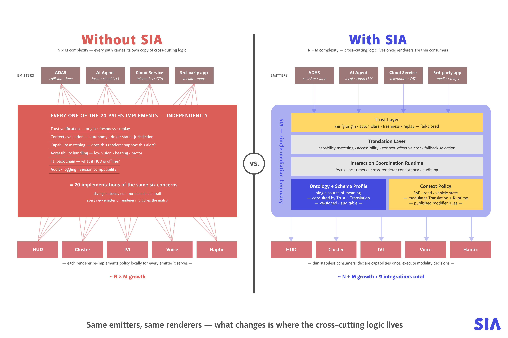
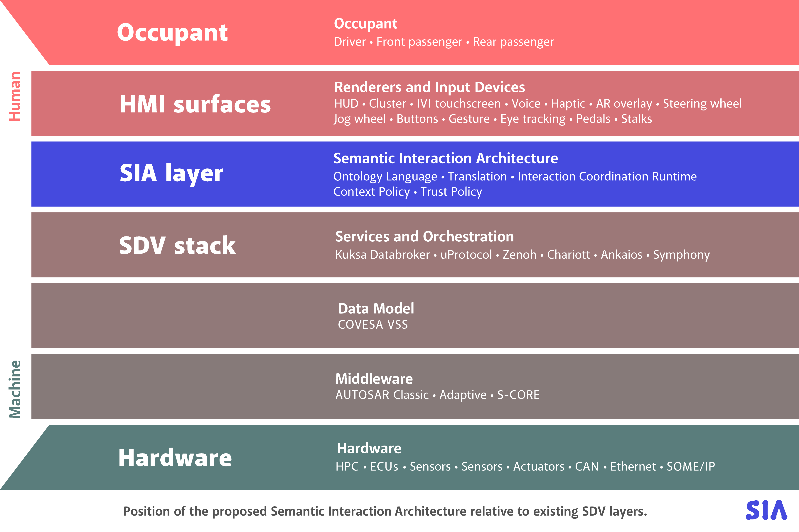
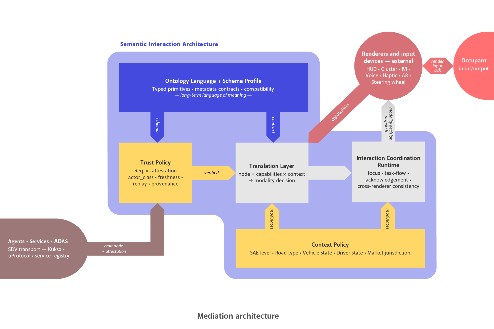
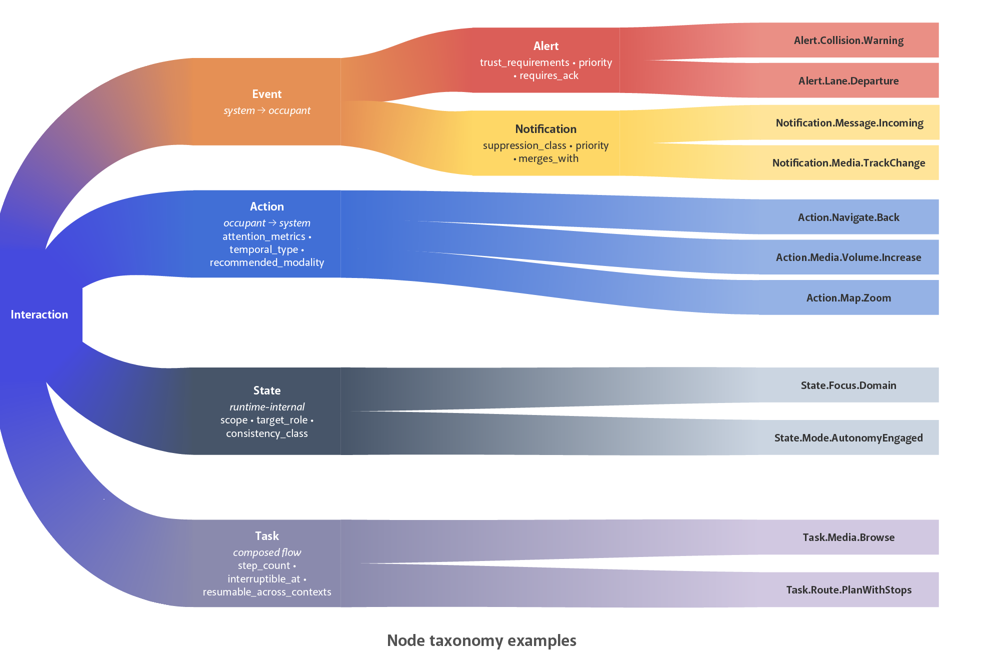

# Toward a Semantic Interaction Architecture for Software-Defined Vehicles

**A Position Paper on Decoupling Interaction Meaning from Implementation**

---

**Author:** Jan Janeček  
**Affiliation:** Cars Making Sense  
**Version:** 0.4.0 — Pre-standard draft<br>
**Date:** July 2026

---

## Abstract

As vehicles become multimodal, AI-augmented, software-defined platforms, the interaction layer has become one of the most volatile and least consistently abstracted parts of the in-vehicle stack. Abstraction has scaled below interaction — hardware, signals, middleware and services — but only narrowly within interaction itself. A long tradition of automotive ontology and HMI research has produced valuable component contributions, yet we found no public, vendor-neutral framework that treats the vehicle’s interaction surface as a typed, measurable, trust-aware semantic vocabulary.

We propose a **Semantic Interaction Architecture** (SIA): a narrow mediation layer in which interactions are described by their meaning, attention demand, contextual fitness and authority of origin, rather than by buttons, screens or widgets. SIA sits above existing SDV data and service abstractions — such as COVESA VSS, Eclipse Kuksa, Eclipse uProtocol and AUTOSAR Adaptive — and below concrete renderers, which remain external consumers of a verified semantic stream. Its contribution is second-wave integration, not first-wave invention: it combines renderers as external consumers, actor-class trust with requirement-vs-attestation separation, attention metrics aligned with distraction-guideline axes, deterministic capability negotiation, bounded context retention, authenticated delivery receipts and a separate occupant-response contract. We describe the architecture and a deliberately small 0.4.0 profile suitable for reference implementation and standardisation discussion.

This position paper is explanatory. The normative implementer contract, lifecycle and conformance requirements are defined in [`03_Core-Specification.md`](./03_Core-Specification.md); machine-readable contracts and executable examples are published in [`schema/`](./schema/) and [`examples/v0.4.0/`](./examples/v0.4.0/).

---

## 1. Motivation

The first generation of software-defined vehicles has surfaced a structural problem that early SDV literature did not centrally address. As infotainment surfaces grew, voice assistants proliferated, over-the-air update cadence accelerated, and AI agents began entering the cabin, the interaction layer became both more visible to occupants and more fragile as a system boundary. The same intent — return to a previous view, acknowledge an alert, increase volume, set a destination — may behave differently across brands, vehicle generations, firmware versions and modalities. More importantly, the authority of a message reaching the occupant is often not semantically explicit: from the driver’s perspective, a warning produced by ADAS, a message produced by a third-party application and a suggestion produced by an AI assistant may share the same visual or auditory surface.

Substantial abstraction work already exists in automotive systems. COVESA VSS abstracts vehicle signals. Eclipse Kuksa and uProtocol help services exchange data. AUTOSAR, S-CORE and related middleware projects address runtime and software architecture. Android Automotive and HMI frameworks such as Qt, Kanzi or Unity provide application and rendering abstractions. What remains largely absent is a **semantic interaction abstraction**: a layer that decouples what an interaction means, who is authorised to emit it, what attention it demands, and which renderers are eligible to express it.

The absence is not due to a lack of related work. Automotive ontology and semantic-HMI research has existed for nearly two decades. Prior work has modelled infotainment service UIs, vehicle signals, situation awareness, customisation and service orchestration. These contributions are valuable, but they mostly address slices of the problem. They do not define a common interaction vocabulary for the whole vehicle surface with measurable attention and multi-actor trust as first-class concerns.

This paper takes the position that the recurring inconsistency of in-vehicle interaction is not merely an execution problem. It is partly an abstraction problem. The vehicle stack has abstractions for signals, services, middleware and renderers; it lacks a stable mediation boundary for interaction meaning.

A natural objection is that any additional boundary creates additional complexity. We argue the inverse. The complexity already exists today, but it is duplicated across every emitter–renderer pair: each direct path may implement its own trust checks, context rules, capability assumptions, accessibility fallbacks, acknowledgement logic and audit behaviour. SIA does not introduce this complexity; it consolidates it into one auditable boundary.



*Figure 1. Without SIA, cross-cutting interaction logic is duplicated across emitter–renderer pairs. With SIA, this logic is consolidated at a mediation boundary; renderers become thinner consumers and adding new emitters or renderers becomes linear rather than multiplicative. The concern labels inside the illustration reflect the 0.3 draft: 0.4.0 expands trust verification to eight checks, adds bounded context retention, and splits renderer delivery receipts from the occupant response.*

The first version of such a boundary should be deliberately narrow. We scope SIA 0.4.0 to three cores:

1. **Interaction meaning** for high-value commands, alerts and notifications.
2. **Attention policy** for priority, interruptibility and driving context.
3. **Trust provenance** for determining which actors may emit which interaction types.

The architecture must nevertheless be designed for evolution: new domains, node families, metadata fields and renderer capabilities should be additive where possible, and older vehicles should be able to ignore, suppress or safely degrade constructs they do not understand.

### 1.1 Scope of the survey and claim

The claim of absence in this paper is limited to publicly documented standards, open-source SDV projects, published automotive ontology work and production-facing HMI frameworks available at the time of writing. We do not claim that no OEM-internal equivalent exists. The narrower claim is that we found no public, vendor-neutral and standardisation-oriented interaction vocabulary that combines semantic meaning, actor-class trust, measurable attention demand and renderer capability negotiation in a single mediation layer.

### 1.2 One concrete trace

A single example makes the boundary tangible. Consider a forward-collision warning during manual highway driving:

1. The **ADAS** subsystem emits `Alert.Collision.Warning` with an attestation declaring `actor_class: adas`.
2. **Trust Policy** resolves the signed catalog and actor credential, binds the instance to the exact declaration digest, and checks the closed envelope, semantic authority, signature, freshness, replay, revocation, and semantic validity. A third-party application or cloud agent attempting to emit the same node would be rejected here.
3. **Context Policy** supplies the signed current vector: `motion_state: moving`, `operating_mode: driving`, `energy_state: not_charging`, `road_type: highway`, `driver_state: attentive`, and `occupancy: [driver]`, with a source, observation time, and confidence for each axis.
4. The **Translation Layer** filters available renderers by capability and policy. A safety-certified cluster may qualify; a centre IVI touchscreen may be dropped if it exceeds the active attention budget.
5. The **Coordination Runtime** dispatches the selected modality, consumes authenticated renderer delivery receipts, and only then opens any separately declared occupant-response wait.

The same semantic node may translate differently when parked, charging, or in a higher automation context. These are orthogonal observations, not one mutually exclusive vehicle label: a collision warning remains applicable while charging because another vehicle may strike the stationary car. The declaration, trust contract and attention estimate are written once; the delivery decision changes with capabilities and context.

---

## 2. Related Work and Position in the Ecosystem

SIA is not a replacement for existing SDV work. It is intended as a narrow layer between services and renderers. Its closest neighbours are data vocabularies, service abstractions, HMI frameworks, multimodal standards and prior automotive ontology research.

### 2.1 Adjacent infrastructure layers

**COVESA Vehicle Signal Specification (VSS)** defines a hierarchical catalogue of vehicle signals. It is a data vocabulary, not an interaction vocabulary. SIA can consume VSS-derived data to populate context axes, but it does not duplicate VSS.

**Eclipse Kuksa, uProtocol, Zenoh and related SDV projects** provide vehicle data brokering, communication and service integration. These layers move information between components; they do not define what an interaction means to the occupant.

**AUTOSAR Classic and Adaptive, Eclipse S-CORE and SOAFEE** address middleware, runtime and safety-oriented system architecture. They are below the proposed interaction boundary.

**Android Automotive Car App Library** is an important production analogue: apps declare templates and the host renders them with built-in distraction constraints. Its scope is intentionally narrow, application-category specific and tied to a specific ecosystem. SIA generalises the principle to a vehicle-wide semantic contract, while leaving renderer implementation external. The growing complexity of automotive HMI surfaces, security surfaces and user-experience demands that motivate SIA are surveyed in Grobelna et al. 2025.

**W3C Multimodal Architecture and EMMA** define generic models for multimodal input. They are relevant as possible substrates for input mapping, but they are not automotive-specific and do not carry the safety, trust and attention contracts proposed here.

### 2.2 Prior automotive ontology and semantic-HMI work

Several prior works intersect with SIA’s scope:

- **Bertoa et al. 2007** proposed semantic descriptions for generating infotainment HMI for plug-in services in a BMW context. This is an important historical antecedent for semantic UI generation, but the scope was infotainment-specific and based on OWL-style reasoning.
- **Feld & Müller 2011** described an automotive ontology for managing knowledge inside the vehicle and sharing it between vehicles. It addressed situation-aware in-car intelligence rather than a typed interaction mediation layer.
- **Klotz et al. 2018 / VSSo** formalised vehicle signals as an ontology over VSS. It is a data-layer ontology and an important input to SIA’s Context Policy.
- **Laclau et al. 2024 / AXIL** proposed a user-experience-focused runtime priority model for service orchestration in SDVs. AXIL is application/service oriented; SIA’s priority and attention metadata are per interaction.
- **Cappelli & Di Marzo Serugendo 2025 / Onto-CMS** is the closest contemporary neighbour, addressing ontology-based customisation management for driver–vehicle interfaces. It can be seen as complementary: Onto-CMS helps decide which interface elements may be customised; SIA describes what an interaction means, what it costs and who may emit it.
- **Sigüenza et al. 2012** explored integration of HMI with the Semantic Sensor Web using SOSA/SSN-style observation models, relevant as a pattern for how observable vehicle data can be shared in a semantically typed way. SIA's Context Policy draws on the same principle of typed observation streams, applied to context axes rather than raw sensor data.

These works show that semantic representation in automotive HMI is not new. The novelty claimed here is not the existence of semantics, but the integration of semantics with trust provenance, attention metrics, context and renderer capability negotiation in a narrow runtime boundary.

### 2.3 Why SIA is positioned as a second-wave layer

Prior work has not broadly crossed into industrial standardisation for three structural reasons:

1. **Scope limitation.** Existing work often addresses one slice: infotainment, signals, customisation, troubleshooting, situation awareness or service priority.
2. **Runtime formalism mismatch.** Many ontology approaches rely on OWL and description-logic reasoning. This is useful at authoring time, but runtime open-world reasoning is difficult to reconcile with deterministic and certifiable in-vehicle behaviour.
3. **Limited multi-actor trust model.** Earlier work largely assumed machine-to-human interaction. In-cabin AI agents and third-party applications make the question of who is authorised to say what much more explicit.

SIA is therefore deliberately a second-wave proposal: a small mediation contract that composes with existing SDV work rather than attempting to replace it.

### 2.4 Position in the SDV stack



*Figure 2. SIA sits above existing data and service abstractions and below concrete renderers. It is not a renderer, GUI toolkit, data model or middleware replacement.*

---

## 3. Architecture Overview

SIA defines one narrow question: **how should interaction meaning cross the boundary between SDV services and concrete HMI implementations?**

The architecture has three functional components and two cross-cutting policies.

**Ontology Language and Schema Profile.** A stable vocabulary defines interaction node types, naming, inheritance, metadata contracts, compatibility rules and validation constraints. In this paper, “ontology” means a controlled semantic vocabulary and typed schema. It does not imply OWL reasoning at runtime.

**Translation Layer.** A deterministic adaptor maps semantic nodes to concrete input and output modalities. Its inputs are the node, available renderer/input capabilities, active context vector and accessibility profile. Its output is a modality decision and dispatch plan.

**Interaction Coordination Runtime.** A coordination function handles focus, acknowledgements, suppression, fallback and cross-renderer consistency. It does not replace a GUI framework; it coordinates semantic state that multiple renderers need to handle consistently.

**Trust Policy.** A gate at the entry point of SIA. Signed catalogs and actor credentials define current authority. All nodes emitted by agents, services, applications or ADAS are digest-bound to that state and pass eight verification checks before entering the semantic pipeline.

**Context Policy.** A continuously updated policy function that supplies the current driving and occupant context. It modulates translation and runtime decisions, especially attention budgets and suppression behaviour.

Renderers and input devices are external to SIA. They declare measurable capabilities into the Translation Layer and consume the resulting modality decisions. This boundary is deliberate: SIA should standardise the interaction contract, not the visual design or implementation of each HMI surface.



*Figure 3. SIA contains three functional components and two policies. Emitters submit nodes through Trust Policy; renderers register capabilities and consume modality decisions. The illustration predates the 0.4.0 contract in three details: the core context axes are now `motion_state`, `operating_mode`, `energy_state`, `road_type`, `driver_state`, and `occupancy`; Trust Policy verifies eight requirements; and the single “render / input / ack” arrow is now two separate authenticated loops — a renderer delivery receipt and an independent occupant response.*

---

## 4. Semantic Node Contract

A common failure mode in interaction schemas is treating all interactions as generic messages. SIA separates semantically different node types because they carry different obligations.



*Figure 4. Four architectural semantic types. In the 0.4.0 minimal profile, only two concrete `Event` subtypes — `Alert` and `Notification` — are emitted. The per-family metadata labels shown are illustrative 0.3 vocabulary: in 0.4.0, acknowledgement fields became the `occupant_response` contract and suppression/merging became the declared blocked disposition (`drop`, `defer`, `coalesce`).*

**Action.** Occupant-initiated. May be discrete (`Action.Navigate.Back`), sustained (`Action.Media.Volume.Increase`) or continuous (`Action.Map.Zoom`). A complete input authentication, execution-result and cancellation contract is deferred from 0.4.0; the output-renderer delivery contract must not be reused as a shortcut.

**Alert.** System-initiated and safety-relevant. May be non-suppressible and may require acknowledgement. Carries priority, interruptibility, trust requirements, regulatory basis and attention metrics.

**Notification.** System-initiated but informational. May be suppressible or mergeable. Carries priority, suppression class, privacy class and fallback policy.

**State.** Runtime-internal focus, mode or context transition. Usually not user-facing on its own.

**Task.** A composed multi-step flow over actions and states. Deferred from the minimal 0.4.0 profile.

Each node declaration carries an `inherits_from` reference to its parent in the hierarchy. Subclasses may strengthen, but not weaken, safety, attention or trust requirements. Unknown subclasses must resolve to their known parent where safe or fail closed where critical.

A useful node should answer a small set of human-readable questions:

| Question | SIA field family |
| --- | --- |
| What is being requested, asserted or coordinated? | node identity, type, inheritance |
| Who is speaking or acting? | actor class, actor id, attestation |
| Who is the intended recipient? | target role, scope |
| How urgent or interruptive is it? | priority, interruptibility |
| What response is expected? | occupant-response kind, timeout, authority |
| What context changes delivery? | applicability, unknown-context policy, blocked disposition |
| What happens if the preferred renderer fails? | presentation contract and delivery policy |

This is an ergonomics requirement as much as a technical one. A schema that is technically valid but unreadable by HMI engineers, UX researchers and safety engineers will not scale socially. Conversely, a readable vocabulary that cannot be validated, diffed, tested, versioned or safely degraded is not usable in an SDV stack.

---

## 5. Metadata Contracts

Every emitted node carries a typed declarative contract. Runtime instances carry identity, payload, timing and attestation only; they cannot override declaration-owned policy. The 0.4.0 profile emits only `Alert` and `Notification`.

| Contract family | Alert | Notification |
| --- | --- | --- |
| Identity, inheritance and version | ● | ● |
| Direction, target and temporal type | ● | ● |
| Payload schema reference and digest | ● | ● |
| Semantic validity | ● | ● |
| Trust requirements | ● | ● |
| Attention metrics | ● | ● |
| Priority and interruptibility | ● | ● |
| Context policy | ● | ● |
| Presentation and delivery policy | ● | ● |
| Occupant-response contract | ● | ● |
| PII class and accessibility alternatives | ● | ● |
| Regulatory or assessment basis | ○ | ○ |

● mandatory · ○ optional · — not applicable

Context retention is nested under `context_policy.on_blocked`. A declaration chooses exactly one disposition: `never_block`, `drop`, `defer`, or `coalesce`. Deferred and coalesced items have a bounded TTL, deterministic expiry behaviour and explicit queue limits; coalescing also declares the canonical key fields. Renderer delivery is governed by `presentation_contract`, while a human response is governed independently by `occupant_response`. This prevents “message accepted by a renderer” from being confused with “person acknowledged the interaction.”

Two design decisions are load-bearing.

First, **attention demand is represented by measurable predictive proxies**, not only qualitative labels. `attention_metrics` carries predicted values such as estimated total glance time, mean single-glance duration and task step count. These values are not proof of safety or compliance. They are auditable estimates that can be compared with empirical testing and used by the runtime as a dispatch-time budget.

Second, **trust is split between requirement and attestation**. A node declares what trust properties consumers should require; an instance carries evidence that those properties hold. This separation prevents the emitter from self-declaring its own semantic authority without verification.

---

## 6. Trust Model

Current automotive cybersecurity practice rightly focuses on platform integrity, authenticated communication, secure OTA, ECU protection, transport security and organisational security management. SIA assumes these foundations. It adds a narrower concern: **interaction integrity**.

Interaction integrity is the property that the meaning, priority and origin of an interaction reaching the occupant is what it claims to be.

SIA does not determine whether a physical collision is imminent. That is the job of ADAS and its sensors. SIA determines whether an emitted `Alert.Collision.Warning` is authorised, fresh, attributable, policy-compliant and eligible for presentation. A correctly attested but factually wrong warning is a sensing or ADAS fault; a spoofed, stale or unauthorised warning is an SIA trust failure.

This distinction matters as in-cabin AI agents, third-party applications and cloud services acquire more expressive power. An attacker or misaligned agent may not need control over braking to create risk. It may attempt to suppress a warning, inject a fake alert, raise the priority of a benign message, or issue a safety-relevant instruction while authenticated as a benign actor. Service-level authentication establishes whether a component may speak; SIA constrains what semantic categories it may speak with. Recent work on LLM-based driving assistants and agent-to-agent threat taxonomies illustrates why semantic authority constraints are becoming a practical requirement rather than a theoretical concern (Kumar et al. 2026; Stappen et al. 2026).

### 6.1 Trust requirements

Trust requirements are declared on the node:

```yaml
Alert.Collision.Warning:
  trust_requirements:
    signed_origin_required: true
    permitted_actor_classes: [adas]
    max_ingress_age_ms: 200
    replay_protection: required
```

This example reflects the Minimal SIA Profile 0.4.0, which includes only `adas` as a permitted class for collision warnings.

Authority is expressed through `permitted_actor_classes`. A generic scalar such as `min_trust_level` is intentionally avoided because it duplicates and obscures the actor taxonomy.

### 6.2 Trust attestation

Trust attestation is attached to the emitted instance:

```yaml
attestation:
  actor_class: adas
  actor_id: ADAS_v2.3.1
  key_id: vehicle-hsm:adas:7
  algorithm: ES256
  signature: <signature over the canonical runtime envelope>
  timestamp_ms: 1778803920123
  nonce: <random-per-emission>
  provenance_chain: [adas]
```

Trust Policy verifies that the attestation satisfies the declared requirements and the authority-issued actor credential before the node enters the semantic pipeline. The instance also binds the signed catalog, declaration, registry, and credential digests. A valid cryptographic signature from an expired or revoked credential is rejected. Failure is fail-closed: the node is logged and never reaches Translation or any renderer.

### 6.3 Actor classes

The Minimal SIA Profile 0.4.0 uses six actor classes. A future profile may add more, but an unknown class cannot inherit authority from a superficially similar known class.

| Class | Description | Example |
| --- | --- | --- |
| `human_direct` | Occupant-originated physical or verified input | Button press, verified cabin voice command |
| `agent_local` | On-device assistant | Local LLM or rules agent |
| `agent_cloud` | Cloud-hosted assistant | Cloud LLM assistant |
| `adas` | Driver assistance subsystem | AEB, lane keeping |
| `service` | Internal vehicle service | Climate, media, navigation |
| `third_party_app` | App-store or external application | Music or messaging app |

Voice is not treated as a separate actor class in this model. Voice is a modality and authentication channel; the actor remains the human, agent or service that originates the interaction. Implementations may add fields such as `input_modality`, `speaker_verification` or `cabin_presence_confidence` without changing the actor taxonomy.

### 6.4 Two-tier verification

Full asymmetric verification on every semantic node may be too expensive for resource-constrained paths. A practical implementation can use two tiers:

1. **Session establishment:** asymmetric verification of an external actor, such as a cloud agent or third-party application.
2. **Per-interaction verification:** short-lived symmetric authentication, such as HMAC, for nodes emitted within the verified session.

The two-tier split governs how trust is verified, not whether trust is required. Safety-critical nodes still carry strict requirements and fail closed when requirements are not met. The architecture must also support explicit session revocation: an onboard intrusion-detection or policy-monitoring component may invalidate a symmetric session ticket before expiry if an actor begins exhibiting malicious or policy-violating behaviour.

### 6.5 Non-goals of the trust model

SIA does not solve sensor spoofing, ADAS decision quality, renderer compromise after dispatch, operating-system security, or whole-vehicle certification. It also does not judge whether the content of a verified message is factually correct. Its scope is the integrity and eligibility of the interaction claim crossing the HMI boundary.

---

## 7. Attention Model

Contemporary automotive HMI guidelines use measurable constructs such as total eyes-off-road time, single-glance duration and task completion time. Many software frameworks, by contrast, reduce distraction handling to qualitative tags such as “distraction-optimised”. SIA introduces a machine-readable attention contract that can be enforced at dispatch time and audited later.

A node may declare:

```yaml
attention_metrics:
  glance_time_estimated_ms: 1500
  mean_single_glance_ms: 400
  task_steps: 3
  voice_alt_available: true
  cognitive_load: moderate
```

The Translation Layer composes the static estimate with a context modifier. The modifier is applied independently to each numeric attention field; for example, for the primary glance budget:

```text
effective_glance_cost(node, context) =
    node.attention_metrics.glance_time_estimated_ms × context.attention_modifier
```

The same pattern applies to `mean_single_glance_ms` and selected acknowledgement timeouts. Non-numeric fields such as `cognitive_load` and `voice_alt_available` are not scaled. The result can be compared against deployment-defined budgets. For example, a safety alert during manual highway driving may be allowed only if it can be conveyed through a low-glance path, while a media-browsing task may be suppressed or deferred.

The important claim is limited. SIA does not prove that an interaction complies with NHTSA, ISO 15005, ISO 15007, JAMA or any other guideline. Proof requires empirical procedures such as occlusion testing and eye-glance measurement in the integrated vehicle. SIA standardises the contract that makes attention demand visible to software: a node carries an estimate, the runtime has an enforcement point, and an audit can reconstruct which budget applied in which context.

This distinction prevents overclaiming. `attention_metrics` are estimates until calibrated. Their value is that they force attention cost to become explicit, comparable and testable rather than hidden inside renderer-local design assumptions.

---

## 8. Context as a Multi-Axis Vector

Automotive HMI systems often collapse context into broad labels such as city, highway, parking or autonomous. SIA treats context as a vector of independent axes. This keeps road infrastructure, vehicle state, automation state, driver state and jurisdiction separate.

| Axis | Class | Example values |
| --- | --- | --- |
| `motion_state` | Core | `stationary`, `moving`, `unknown` |
| `operating_mode` | Core | `driving`, `parked`, `service`, `unknown` |
| `energy_state` | Core | `charging`, `not_charging`, `unknown` |
| `road_type` | Core | `urban`, `rural`, `highway`, `off_road` |
| `driver_state` | Core | `attentive`, `drowsy`, `distracted`, `not_monitoring`, `unknown` |
| `occupancy` | Core | verified set of `driver`, `front_passenger`, `rear_passenger` roles |
| `sae_level` | Extended | `0`, `1`, `2`, `3`, `4`, `5` |
| `autonomy_engaged` | Extended | boolean |
| `market_jurisdiction` | Extended | `US`, `EU`, `JP`, `CN`, `GB`, … |
| `traffic_density` | Extended | `free`, `dense`, `congested` |
| `weather` | Extended | `clear`, `rain`, `snow`, `fog` |
| `time_of_day` | Extended | `day`, `dusk`, `night` |

Translation and context policies become predicates over the vector. Applicability is evaluated first; only an applicable interaction can then be blocked:

```text
applicable(node, context) ∧ driver_state = distracted ∧ priority ≠ critical
    ⇒ apply node.context_policy.on_blocked.disposition
```

```text
autonomy_engaged = true ∧ sae_level ≥ 3
    ⇒ permit selected Task.* flows otherwise locked while driving
```

The declared disposition is one of `never_block`, `drop`, `defer`, or `coalesce`. `drop` terminates with an audit record. `defer` retains each instance within declared TTL and queue bounds. `coalesce` retains only the newest semantically equivalent instance for a canonical key and releases that latest state for full re-evaluation when context becomes eligible. `never_block` continues to capability negotiation and the declared safety fallback.

Context Policy must not mutate semantic identity. `Alert.Collision.Warning` remains applicable while charging because threats may be external; `Alert.Lane.Departure.Warning` is a genuine `moving_only` example and becomes `not_applicable` while stationary. Neither may be silently converted into diagnostics. Priority, actor permissions, applicability, disposition and presentation remain declaration-owned properties.

Each core observation carries source, observation time, and confidence and binds a signed context policy with per-axis freshness, confidence, and unknown-handling requirements. If an axis cannot be determined, Context Policy must use the declared safest applicable fallback rather than relax constraints. An unknown motion state is treated as the stricter moving case for attention budgeting unless a lower-level safety-certified source proves otherwise.

---

## 9. Capability Negotiation

Renderers and input devices declare measurable capabilities rather than informal labels. The examples below illustrate the broader architecture; the Minimal SIA Profile 0.4.0 restricts the active output-renderer set to cluster, IVI and voice, and defers HUD, haptic and AR surfaces. Steering-wheel input may provide an authenticated occupant response without becoming an output renderer.

```yaml
Renderer.Cluster:
  max_simultaneous_elements: 6
  text_max_chars: 48
  refresh_rate_hz: 60
  supports_animation: true
  safety_profile: safety_relevant_visual
  glance_optimized: true
```

```yaml
Renderer.IVI:
  max_simultaneous_elements: 12
  text_max_chars: 160
  refresh_rate_hz: 60
  supports_animation: true
  safety_profile: general_interactive_visual
  glance_optimized: false
```

```yaml
InputDevice.SteeringWheel.Right:
  axes: [rotate_continuous]
  buttons: [press, tilt_4way]
  haptic: [pulse, sustained_vibration]
  reachable_during: [driving, parking]
  safety_profile: driver_reachable_control
```

The Translation Layer computes candidate renderers by filtering against node requirements, context and capability. The first version does not require a global optimisation engine. Deterministic candidate filtering and a small arbitration matrix are sufficient.

When several renderers qualify, arbitration should be deterministic and auditable:

1. **Safety mandate.** If the node requires a safety-certified surface, non-qualifying renderers are eliminated.
2. **Modality preference.** Among surviving candidates, the renderer that best satisfies the node’s recommended modality and minimises time-to-indication — the interval from dispatch decision to perceptible occupant output — wins.
3. **Context availability.** If gaze or occupant-attention data is available, the system may prefer the surface the occupant is already attending to, but never in a way that overrides safety requirements.

The output should be explainable in logs: for example, “cluster selected because HUD unavailable; IVI rejected due to attention budget”.

---

## 10. Versioning and Evolution

A vehicle may remain in service for 15 years while its software and interaction vocabulary evolve. SIA therefore separates three version axes: `spec_version` for wire contracts and lifecycle, `profile_id` plus `profile_version` for a negotiated conformance subset, and `catalog_version` for the installed semantic vocabulary. Every runtime instance carries all three.

Normative runtime envelopes are closed. An unknown field is not presumed harmless, because it may attempt to change priority, rendering, retention or acknowledgement policy. Additive evolution therefore occurs through a compatible profile revision or an explicitly negotiated feature. Breaking required fields or changed semantics require a major profile version. Unknown critical nodes fail closed or enter the deployment's documented safety fallback; non-critical nodes may be rejected or handled only through an explicitly compatible known parent.

Catalog evolution remains independently versioned. New subclasses may strengthen but never weaken inherited safety, attention or trust requirements. Deprecated declarations remain resolvable for a published support window. The full compatibility contract is normative in the Core Specification.

---

## 11. Minimal SIA Profile 0.4.0

The full architecture is intentionally broader than the first implementation target. A first conformance profile should be small enough to implement, test and discuss in a standards forum, while still exercising every load-bearing mechanism.

### 11.1 Fixed scope

**Node types.** The profile includes two concrete `Event` subtypes: `Alert` and `Notification`. `Action`, `State` and `Task` remain architectural types for future profiles and are not emitted.

| Type | Example nodes | Typical emitter | Default modality |
| --- | --- | --- | --- |
| `Alert` | `Alert.Collision.Warning`, `Alert.Lane.Departure`, `Alert.Driver.Drowsiness`, `Alert.TirePressure.Low`, `Alert.Powertrain.Fault` | `adas`, `service` | cluster + audio |
| `Notification` | `Notification.Navigation.Maneuver`, `Notification.Call.Incoming`, `Notification.Message.Received`, `Notification.Media.NowPlaying`, `Notification.Charging.Status` | `service`, `third_party_app` | IVI or voice |

**Renderers.** The profile uses three output surfaces: instrument cluster, centre IVI and voice. HUD, haptic and AR surfaces are deferred.

**Actor classes.** The profile uses six classes: `human_direct`, `adas`, `service`, `third_party_app`, `agent_local` and `agent_cloud`.

**Context axes.** The profile uses `motion_state`, `operating_mode`, `energy_state`, `road_type`, `driver_state`, and `occupancy`. Additional axes require a negotiated extension and cannot silently relax a decision.

### 11.2 Example node declaration

A 0.4.0 declaration for a collision warning looks like this (the JSON source in `examples/v0.4.0/` is executable conformance material):

```yaml
id: Interaction.Event.Alert.Collision.Warning
inherits_from: Interaction.Event.Alert
since_version: 0.4.0
direction: system_to_occupant
target_role: driver
temporal_type: discrete
priority: critical
interruptibility: non_interruptible
semantic_validity_ms: 500
payload_schema_ref: sia:payload:collision-warning:1
payload_schema_sha256: aaaaaaaaaaaaaaaaaaaaaaaaaaaaaaaaaaaaaaaaaaaaaaaaaaaaaaaaaaaaaaaa

trust_requirements:
  signed_origin_required: true
  permitted_actor_classes: [adas]
  max_ingress_age_ms: 200
  replay_protection: required
  session_revocation_required: true

attention_metrics:
  glance_time_estimated_ms: 800
  mean_single_glance_ms: 300
  task_steps: 0
  voice_alt_available: true
  cognitive_load: minimal

context_policy:
  policy_ref: sia:policy:core-context:1
  policy_sha256: bbbbbbbbbbbbbbbbbbbbbbbbbbbbbbbbbbbbbbbbbbbbbbbbbbbbbbbbbbbbbbbb
  applicability: always
  unknown_context: safe_worst_case
  on_blocked:
    disposition: never_block

presentation_contract:
  preferred_renderers: [cluster, voice]
  required_renderers: []
  delivery_success_policy: any_selected_presented
  delivery_timeout_ms: 300
  degradation_policy: next_eligible

occupant_response:
  kind: explicit_or_timeout
  authority: driver_only
  timeout_ms: 2000

pii_class: none
accessibility_alternatives: [visual, auditory]
regulatory_basis:
  - ISO_15623
  - UNECE_R152
```

A matching runtime emission would carry the instance-specific payload and attestation (see Appendix A for a full end-to-end trace):

```yaml
node_id: Interaction.Event.Alert.Collision.Warning
spec_version: 0.4.0
profile_id: sia-minimal
profile_version: 0.4.0
catalog_version: 0.4.0
catalog_sha256: cccccccccccccccccccccccccccccccccccccccccccccccccccccccccccccccc
node_schema_sha256: aaaaaaaaaaaaaaaaaaaaaaaaaaaaaaaaaaaaaaaaaaaaaaaaaaaaaaaaaaaaaaaa
instance_id: c8e1f4b2-7bd0-4c44-9a8e-0a9c7c2c4b21
occurred_at_ms: 1784116800000
valid_until_ms: 1784116800500
target_role: driver
payload:
  time_to_collision_s: 1.4
  threat_bearing_deg: 12
  threat_range_m: 18
  relative_speed_kmh: 42
attestation:
  actor_class: adas
  actor_id: ADAS_v2.3.1
  actor_registry_version: 0.4.0
  actor_registry_sha256: dddddddddddddddddddddddddddddddddddddddddddddddddddddddddddddddd
  actor_credential_id: 11111111-1111-4111-8111-111111111111
  actor_credential_sha256: eeeeeeeeeeeeeeeeeeeeeeeeeeeeeeeeeeeeeeeeeeeeeeeeeeeeeeeeeeeeeeee
  key_id: vehicle-hsm:adas:7
  algorithm: ES256
  timestamp_ms: 1784116800000
  nonce: cmFuZG9tLW5vbmNlLTE
  provenance_chain: [ADAS_v2.3.1]
  signature: <signature-over-canonical-instance>
```

### 11.3 Why this profile is enough

A profile of two emitted node families, five reference nodes, three renderers, six actor classes and six orthogonal context axes is small enough for a reference implementation. It is also large enough to test the core claims:

- trust requirements can reject unauthorised emitters before rendering;
- attention metrics can affect dispatch decisions;
- renderer capabilities can drive deterministic translation;
- bounded drop, defer and coalescing behaviour can be tested;
- renderer receipt and occupant response can be observed as separate feedback loops;
- catalog, declaration, policy, registry, dispatch, receipt, and response bindings can be tested as one causal chain;
- fallback behaviour and terminal outcomes can be audited.

This makes 0.4.0 a practical falsification target. If the architecture cannot be made useful at this scale, it should not be expanded.

---

## 12. Relation to Existing Standards and Adjacent Work

| Standard or work | Layer | Relationship |
| --- | --- | --- |
| COVESA VSS | Data | Populates context axes; nodes may reference VSS signals |
| W3C VSSo | Data ontology | Ontology over VSS; potential Context Policy substrate |
| W3C SOSA/SSN | Sensor observations | Modelling pattern for observable/actuatable distinction |
| W3C MMI / EMMA | Multimodal input | Candidate input vocabulary for Translation Layer mapping |
| ISO 15005 / ISO 15007 / ISO 17287 | Ergonomics | Source family for attention and task-load semantics |
| NHTSA Driver Distraction Guidelines | Regulation / guidance | Quantitative axes for attention estimates and later audit |
| JAMA Guidelines | Regulation / guidance | Additional reference for visual-manual task constraints |
| UNECE R79 / R152 | Regulation | Regulatory basis for selected alert families |
| ISO 15623 | Forward collision warning | Informs `Alert.Collision.Warning` family |
| UNECE R155 / ISO/SAE 21434 | Cybersecurity | Platform and CSMS foundations extended by interaction integrity |
| ISO 26262 | Functional safety | Constrains runtime determinism and certification strategy |
| AXIL | Runtime priority | Complementary application/service priority model |
| Eclipse Kuksa / uProtocol | Transport and data exchange | Candidate substrate for carrying verified semantic messages |
| Eclipse S-CORE | Middleware | Possible host environment for runtime implementation |
| Android Automotive Car App Library | App-level HMI | Production analogue with narrower ecosystem scope |
| Onto-CMS | DVI customisation | Complementary customisation policy layer |
| Bertoa et al. 2007 | Semantic infotainment UI | Historical antecedent for semantic UI generation |

---

## 13. Open Questions and Path Forward

SIA remains a pre-standard proposal. Version 0.4.0 resolves the minimum interoperable lifecycle and JSON contract; the following deployment and validation questions remain open.

### 13.1 Runtime and authoring encodings

JSON Schema 2020-12 is the normative 0.4.0 exchange and conformance contract. YAML or a `.vspec`-style DSL may be used as an authoring surface only when it compiles deterministically to the canonical JSON model. CBOR or Protobuf may become future transport profiles, but must preserve closed-envelope validation, canonical signing, reason codes and lifecycle semantics. OWL or SHACL may remain useful for authoring-time consistency checking; runtime open-world reasoning is not proposed for safety-relevant paths.

### 13.2 Trust substrate

The precise cryptographic substrate remains open: JWS, COSE, Verifiable Credentials or a domain-specific scheme. The baseline assumption is two-tier verification: asymmetric trust at session establishment and fast symmetric verification per interaction.

### 13.3 Attention calibration

The proposed attention metrics require empirical calibration. A staged path is appropriate:

1. **Heuristic phase:** use static budgets and conservative modifiers derived from existing ergonomic guidance.
2. **Validation phase:** use occlusion testing, eye-glance measurement and simulator studies to calibrate estimates against real interaction behaviour.

### 13.4 Reference implementation

A useful next step is a reference implementation over Eclipse Kuksa or a comparable SDV substrate. The implementation should include:

- the minimal 0.4.0 node set and schema validator;
- a trust gate with actor-class permissions;
- a three-renderer arbitration matrix;
- bounded drop, defer and coalescing stores;
- authenticated renderer receipts and separate occupant responses;
- deterministic conformance vectors and hash-linked audit logs explaining each transition.

### 13.5 Standardisation and community path

Eclipse SDV is a plausible first venue for discussion because SIA composes naturally with Kuksa, uProtocol, S-CORE and related trust work. However, the architectural boundary is intentionally independent of any single standards body. AutomotiveUI, CHI, HCII Mobility and escar are also appropriate venues for critique from HMI, UX and security communities.

The recommended path is therefore:

1. publish a concise position paper;
2. build a minimal reference implementation;
3. compare the same use cases against VSS/VSSo, Onto-CMS, AXIL and Android Automotive constraints;
4. use the results to decide whether SIA should become a standardisation effort, a research prototype or a narrower design pattern.

### 13.6 Cross-domain generalisation

The underlying pattern — typed interaction nodes, measurable attention, trust provenance, capability-negotiated rendering and multi-axis context — may apply beyond vehicles, for example in aviation, medical environments, industrial control rooms or XR. This paper intentionally does not generalise there. Useful generality should emerge from one validated domain binding, not from premature abstraction.

---

## 14. Conclusion

SIA is not proposed as another large vehicle operating system, GUI toolkit or data model. It is a narrow mediation contract between the meaning of an interaction and the concrete surfaces that express it.

The core claim is simple: software-defined vehicles need a stable layer where interaction meaning, attention demand, contextual fitness and semantic authority are explicit before rendering occurs. Without that layer, the same cross-cutting logic is repeatedly reimplemented across emitters and renderers. With it, interaction behaviour becomes more consistent, more auditable and easier to evolve.

The proposal is intentionally modest in its first step. A minimal 0.4.0 profile with five reference nodes, three renderers, six actor classes and six orthogonal context axes should be enough to test whether the architecture is useful. Its bounded retention and two distinct feedback loops also make the uncomfortable cases explicit: a message may be held without being lost, presented without being acknowledged, or rejected before rendering. If the architecture is useful, the vocabulary can grow. If it is not, it should be narrowed or rejected. That falsifiability is a feature: SIA should earn its complexity by reducing duplicated complexity elsewhere.

---

## References

- Android Developers. *Android for Cars App Library.* <https://developer.android.com/training/cars/apps>
- Bertoa, M. et al. *HMI generation for plug-in services from semantic descriptions.* 4th International Workshop on Software Engineering for Automotive Systems (SEAS '07), IEEE, 2007.
- Cappelli, M. A., Di Marzo Serugendo, G. *Ontology-Based Customisation Management System for Driver-Vehicle Interfaces: A Preventive Approach to Incident Reduction and Legal Accountability in Highly Automated Vehicles.* Applied Sciences 15(3):1043, 2025.
- COVESA. *Vehicle Signal Specification.* <https://covesa.global/project/vehicle-signal-specification/>
- Eclipse Foundation. *Eclipse SDV Working Group.* <https://sdv.eclipse.org/>
- Feld, M., Müller, C. *The automotive ontology: managing knowledge inside the vehicle and sharing it between cars.* AutomotiveUI '11, ACM, pp. 79–86, 2011.
- Grobelna, I., Mailland, D., Horwat, M. *Design of Automotive HMI: New Challenges in Enhancing User Experience, Safety, and Security.* Applied Sciences 15(10):5572, 2025.
- ISO 15005:2017. *Road vehicles — Ergonomic aspects of transport information and control systems.*
- ISO 15007. *Road vehicles — Measurement of driver visual behaviour with respect to transport information and control systems.*
- ISO 15623. *Transport information and control systems — Forward vehicle collision warning systems.*
- ISO 26262. *Road vehicles — Functional safety.*
- ISO/SAE 21434:2021. *Road vehicles — Cybersecurity engineering.*
- Klotz, B., Troncy, R., Wilms, D., Bonnet, C. *VSSo — A Vehicle Signal and Attribute Ontology.* 9th International Semantic Sensor Networks Workshop (SSN), 2018.
- Kumar, A., Tapwal, R., Maple, C. *DriveSafe: A Hierarchical Risk Taxonomy for Safety-Critical LLM-Based Driving Assistants.* arXiv:2601.12138, 2026.
- Laclau, P., Bonnet, S., Ducourthial, B., Li, X., Lin, T. *Enhancing Automotive User Experience with Dynamic Service Orchestration for Software Defined Vehicles.* arXiv:2407.02491, 2024.
- NHTSA. *Visual-Manual NHTSA Driver Distraction Guidelines for In-Vehicle Electronic Devices.* Federal Register 78 FR 24818, 2013; test procedures 2019.
- Sigüenza, Á. et al. *Sharing Human-Generated Observations by Integrating HMI and the Semantic Sensor Web.* Sensors 12(5):6307, 2012.
- Stappen, L., Turan, A. E., Hagerer, J., Groh, G. *Agent2Agent Threats in Safety-Critical LLM Assistants: A Human-Centric Taxonomy.* arXiv:2602.05877, 2026.
- UNECE Regulation No. 155. *Cybersecurity and cybersecurity management system.*
- UNECE Regulation No. 152. *Advanced Emergency Braking System.*
- W3C. *EMMA: Extensible MultiModal Annotation Markup Language.*
- W3C. *Multimodal Architecture and Interfaces 1.0.* W3C Recommendation.
- W3C / OGC. *Semantic Sensor Network Ontology (SOSA/SSN).*

---

*Comments, corrections and counter-positions are explicitly invited. Contact: <dizencz@gmail.com>*
