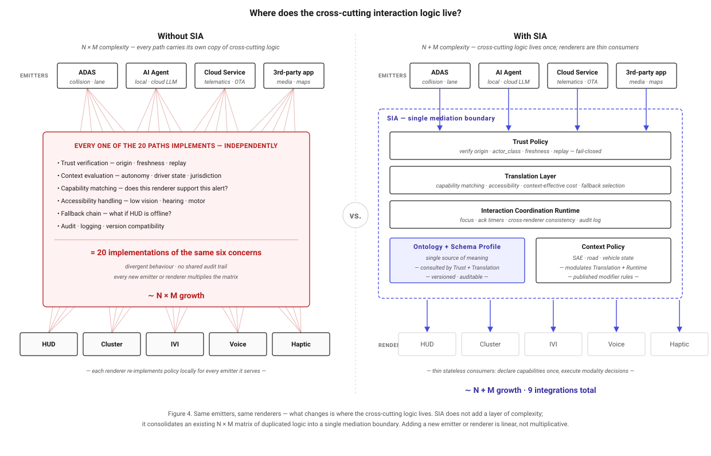
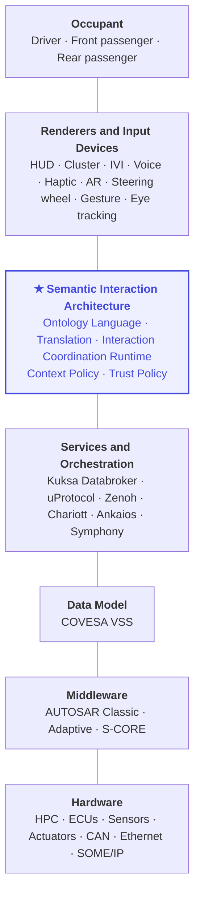
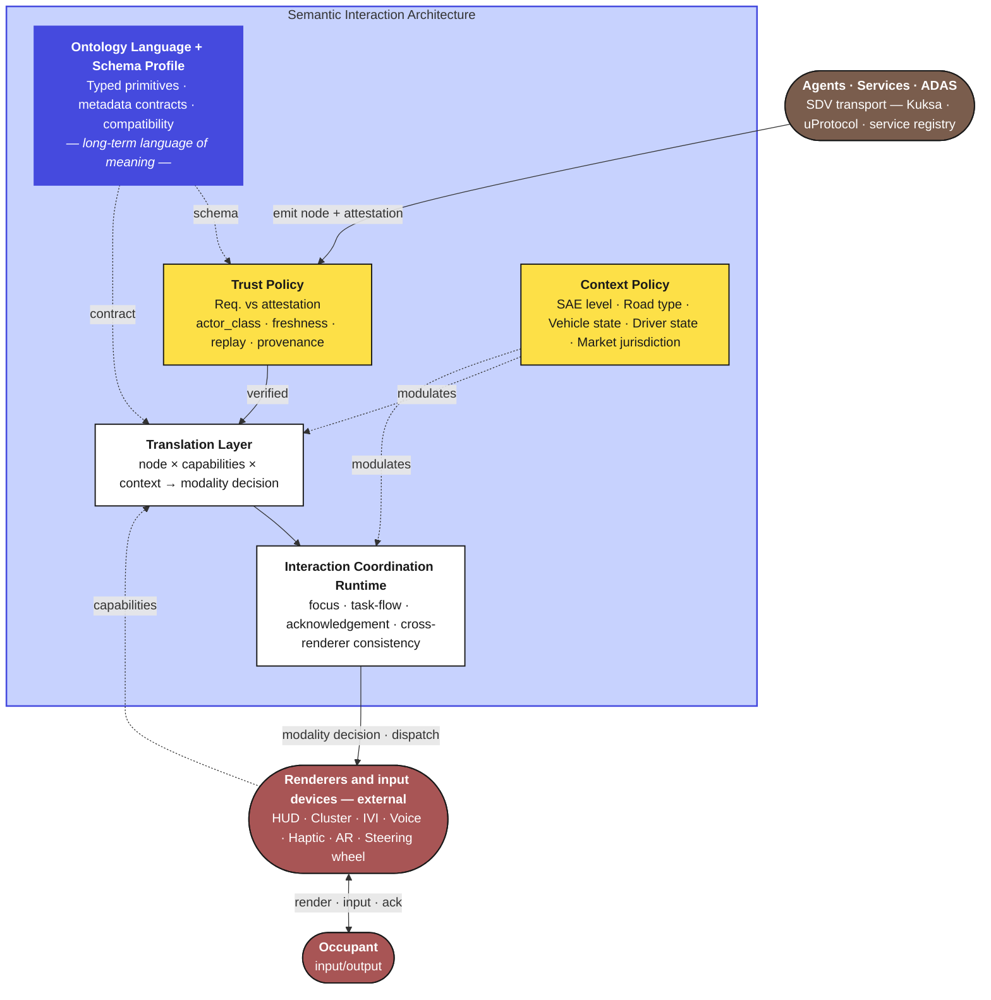
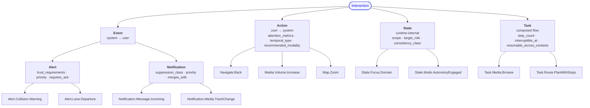

# Toward a Semantic Interaction Architecture for Software-Defined Vehicles

**A Position Paper on Decoupling Interaction Meaning from Implementation**

---

**Author:** Jan Janeček
**Affiliation:** Cars Making Sense
**Version:** 0.2 — Draft, revised after public-source falsification survey
**Date:** May 2026

---

## Abstract

As vehicles evolve into multimodal, AI-augmented, software-defined platforms, the Human–Machine Interface (HMI) is becoming the most volatile and most fragile layer of the in-vehicle stack. The first generation of software-defined vehicles has surfaced a structural problem that earlier SDV literature did not anticipate: the interaction layer has scaled in surface area and modality, while abstraction has scaled mostly *below* it (hardware, signals, services) and only narrowly *within* it. A 19-year tradition of automotive ontology research — from Bertoa et al.'s 2007 OWL-based UI generator for BMW infotainment, through the EURECOM/BMW Vehicle Signal Ontology (VSSo, 2018), to Onto-CMS (Cappelli & Di Marzo Serugendo, 2025) for driver-interface customisation — has produced significant component contributions but has not crossed into industrial standardisation. We argue that four design moves were each absent from prior work, and propose their integration as a *Semantic Interaction Architecture* (SIA): (i) renderers as first-class external consumers of a single semantic stream; (ii) a Trust Policy with actor-class taxonomy and a requirement-vs-attestation separation, motivated by the deployment of in-cabin LLM agents from 2023 onward; (iii) attention metrics quantitatively aligned with NHTSA Visual-Manual Driver Distraction Guidelines, making compliance mechanically expressible; (iv) measurable capability predicates enabling automated translation decisions. We position SIA above existing SDV data and service abstractions (COVESA VSS, Eclipse Kuksa, Eclipse uProtocol, AUTOSAR Adaptive) and below concrete renderers, describe a mediation architecture of three functional components and two cross-cutting policy functions, and a typed node taxonomy with measurable metadata, and outline a path toward standardisation within the Eclipse SDV Working Group. The proposal is second-wave: it integrates and extends prior work rather than replacing it.

---

## 1. Motivation

The first generation of software-defined vehicles, now widely deployed across European, Asian, and North American markets, has surfaced a structural problem that early SDV literature did not anticipate. As infotainment surfaces grew, in-cabin AI agents proliferated, and over-the-air update cadence accelerated, the interaction layer became the most volatile and most fragile layer of the in-vehicle stack — and the layer with the highest user-visible cost of inconsistency. The pattern is visible across OEMs and continents: massive central displays whose behaviour changes between firmware versions; voice and AI agents whose authority over safety-relevant communication is undefined; cross-vehicle and cross-generation inconsistency that turns brand familiarity into a liability rather than an asset. A 2025 review of the field concluded that *"there is currently no unified, universally applied safety framework that harmonizes these requirements across all vehicle systems and manufacturers"* and that *"inconsistent applications of safety principles can lead to confusion, inefficiencies, and even increased risk for drivers as interfaces and interaction models differ between vehicles"* (Kettani & Mecheter, *Applied Sciences* 15(10):5572, 2025). This paper takes the position that these symptoms are not failures of execution but failures of abstraction.

Substantial abstraction work *does* exist in production automotive HMI — hardware abstraction layers (HAL), middleware abstractions (AUTOSAR Adaptive, Acsia, Spyrosoft MicroHMI), cross-OS frameworks (Qt Automotive Suite, Kanzi, DiSTI), and template-based application-level abstractions (Android Automotive Car App Library). What is largely absent is a **semantic interaction abstraction** that decouples interaction *meaning* — what an action signifies, what attention it costs, what trust it requires, who is authorised to emit it — from the renderer that delivers it.

The absence is not from lack of trying. A 19-year tradition of automotive ontology research has produced component contributions: BMW-internal OWL ontologies for infotainment service UI generation (Bertoa et al. 2007); the DFKI Automotive Ontology for situation-aware in-car intelligence (Feld & Müller 2011); the EURECOM/BMW Vehicle Signal Ontology (Klotz et al. 2018, now W3C/VSSO); the Stellantis/Heudiasyc Automotive eXperience Integrity Level (AXIL) for runtime service-priority orchestration (Laclau et al. 2024); and most recently, Onto-CMS for ontology-based customisation management in highly automated vehicles (Cappelli & Di Marzo Serugendo, 2025). None has crossed into industrial standardisation. Three reasons for this are identified in Section 2.

The cost of *not* having the missing layer compounds along three axes. **Engineering cost** rises as each new screen size, input modality, or in-cabin AI feature triggers cascading rework — a problem industry HMI vendors (Unity, Qt Group, Acsia) explicitly position their tooling against. **User experience cost** rises as the same intent (*return to previous view*, *increase volume*, *acknowledge alert*) acquires inconsistent behaviour across vehicles, generations, and OTA updates; calibration drift after OTA is a documented phenomenon affecting ADAS behaviour, occupant detection, and steering thresholds. **Security cost** rises as third-party applications, cloud services, and AI agents — Mercedes MBUX + ChatGPT in 900,000 vehicles (2023–), BMW Intelligent Personal Assistant, Tesla Grok, Renault + OpenAI (2026), GM and VW generative AI deployments — acquire the capacity to emit interactions that are, from the occupant's standpoint, indistinguishable from interactions originating in safety-critical subsystems. This is a new attack surface, addressed below in Section 6 and grounded in a rapidly growing 2024–2026 literature on automotive LLM-agent threats (DriveSafe, arXiv 2601.12138; Agent2Agent Threats in Safety-Critical LLM Assistants, arXiv 2602.05877; Agent Missing-Tool Hallucination, LLM Security Database 2026).

We argue that these costs are not solved by better tooling, more screens, or larger language models alone. They are symptoms of a missing mediation boundary between SDV services and concrete HMI implementations.

A natural objection at this point is that any such mediation boundary is itself an additional layer, and that additional layers are themselves complexity. The objection is real but, we will argue, inverted. The complexity already exists; it lives today as duplicated logic distributed across every emitter–renderer pair in the current stack — every direct path implements its own trust verification, context evaluation, capability matching, accessibility handling, fallback chain, and audit logic, and divergences between these implementations are a primary source of inconsistency and security exposure. SIA does not introduce that complexity; it consolidates it into one auditable mediation boundary. Figure 1 contrasts the two regimes side by side.



*Figure 1. Where the cross-cutting interaction logic lives, before vs. after SIA. Without SIA, every emitter–renderer pair carries its own implementation of trust, context, capability, accessibility, fallback, and audit logic — a matrix of N × M duplications that diverges over time. With SIA, this cross-cutting logic exists once at the mediation boundary; renderers become thin stateless consumers and adding new emitters or renderers is linear, not multiplicative.*

This paper takes a deliberately second-wave position. It does not claim novelty for the idea of semantic representation in automotive HMI; that idea is nearly two decades old. It claims novelty for the *integration* of four specific design moves that prior work has not combined: (i) renderers as first-class external consumers of a single semantic stream; (ii) a Trust Policy with explicit actor-class taxonomy and requirement-vs-attestation separation; (iii) attention metrics quantitatively aligned with regulatory distraction guidelines; (iv) measurable capability predicates enabling automated translation decisions. These moves are described in Sections 3–10; their relation to existing work is set out in Section 2.

The first version of such a boundary should be deliberately narrow. We scope it to three cores: **intent/action abstraction** for high-value commands and interaction events, **attention policy** for priority, interruptibility, and driving context, and **trust provenance** for determining which actors may emit which interaction types with which authority. The ontology language must nevertheless be designed for scale from the beginning: new domains, node families, metadata fields, and renderer capabilities should be additive where possible, and older vehicles must be able to ignore or degrade newer constructs safely. It must also be ergonomic for human authors: the language should mirror the structure of natural communication rather than expose only machine-oriented transport fields. Cross-domain portability and a vehicle-wide interaction runtime are treated as future specification work rather than as requirements for initial adoption.

---

## 2. Related Work and Position in the Ecosystem

This section is organised in four parts. Section 2.1 surveys the SDV and HMI infrastructure layers above and below the proposed semantic interaction layer. Section 2.2 surveys the prior automotive ontology and semantic-HMI research that intersects most directly with SIA's scope. Section 2.3 asks why that prior work has not crossed into industrial standardisation, and Section 2.4 positions SIA relative to all of it.

### 2.1 Infrastructure and adjacent layers

**Data abstraction.** COVESA's Vehicle Signal Specification (VSS) defines a hierarchical, vendor-neutral catalogue of vehicle signals and is widely adopted as a common data vocabulary. VSS deliberately scopes itself to *signals*, not interactions; its recent `HMI` branch covers display properties such as font size and voice prompts, not interaction semantics.

**Service and communication abstraction.** Eclipse Kuksa provides a vehicle data broker over VSS. Eclipse uProtocol (with Eclipse Zenoh transport) abstracts in-vehicle and vehicle-to-cloud messaging. Eclipse Chariott provides a service registry and capability discovery. Eclipse Safe Open Vehicle Core (S-CORE) provides safety-ready middleware. None of these projects model *what an interaction means to the occupant*; they model how services and signals talk to each other.

**Middleware, runtime, and HAL.** AUTOSAR Classic and Adaptive standardise ECU software architecture and middleware. SOAFEE introduces cloud-native, mixed-criticality runtime patterns. Industry HMI vendors (Acsia, Spyrosoft, DiSTI, Qt Group) provide modular HMI frameworks with hardware abstraction layers across QNX, Linux, and Android Automotive. These layers sit below the interaction layer and are orthogonal to it.

**HMI frameworks at the application boundary.** Android Automotive's Car App Library is the closest existing analogue to a semantic interaction layer in current production: applications declare templates (List, Message, Navigation) and a host renders them with built-in distraction optimisation. Its scope is narrow (a small set of application categories), single-OEM ecosystem, and closed to the wider SDV stack. Qt Automotive Suite, Kanzi, Unity for HMI, and similar tools offer renderer-side abstractions but not semantic ones — the abstraction is *graphical*, not *meaning-bearing*.

**Multimodal interaction.** The W3C Multimodal Architecture and Interfaces (MMI) Recommendation, with its EMMA annotation format, defines a generic semantic model for multimodal input. It has had limited automotive uptake; one notable integration was Sigüenza et al.'s 2012 framework combining W3C MMI with OGC SWE for connected vehicles. MMI vocabulary is a candidate substrate for SIA's Translation Layer input mapping.

**Adjacent domains.** Game engines such as Unreal's Enhanced Input and Unity's Input System routinely abstract input actions from devices. ARIA performs an analogous role for web accessibility. These prior arts demonstrate that the proposed abstraction is tractable; they have not been adapted to the automotive constraint set (functional safety certification, multi-renderer, attention regulation, ASIL-graded runtime determinism).

### 2.2 Prior automotive ontology and semantic-HMI research

The idea that semantic representation could improve automotive HMI is approximately 19 years old. We summarise the most relevant contributions; a fuller layer-by-layer comparison is in preparation as a companion document.

**Bertoa et al. 2007 (BMW)** — *HMI generation for plug-in services from semantic descriptions* (SEAS '07) — proposed an OWL/OWL-S domain ontology for automotive infotainment services and a generic UI generator that integrated dynamically delivered services into the existing BMW Group HMI. The scope was infotainment-only, the formalism was OWL with runtime description-logic reasoning, and the result did not cross into series production.

**Feld & Müller 2011 (DFKI)** — *The Automotive Ontology* (AutomotiveUI '11) — proposed a general OWL ontology for personalisation, adaptive HMI, and situation-aware in-car intelligence, with explicit support for V2V knowledge sharing. It is a knowledge ontology, not an interaction ontology: it answers *what we know about the driver and situation*, not *what interaction should happen*.

**Klotz et al. 2018 (EURECOM + BMW)** — *VSSo: A Vehicle Signal and Attribute Ontology* (SSN 2018; now W3C/VSSO under standardisation) — derived from COVESA VSS, models ~300 vehicle signals as `ObservableSignal` and `ActuatableSignal` subclasses using the W3C/OGC SOSA/SSN modelling pattern. It is the canonical data-layer ontology for vehicles. SIA consumes VSS and VSSo as substrate for Context Policy inputs.

**Cappelli & Di Marzo Serugendo 2025 (U. Geneva)** — *Onto-CMS* (*Applied Sciences* 15(3):1043) — ontology-based customisation management for driver–vehicle interfaces in SAE L3/L4 vehicles, using OWL + RDF knowledge graph + SPARQL. Three modifiability classes (customisable / semi-customisable / non-customisable) protect standardised safety elements from over-customisation. This is the closest contemporary neighbour to SIA. The two are complementary: Onto-CMS determines **which** interface elements a driver may modify; SIA determines **what** each interaction means, at what attention cost, with what trust requirement, on which renderer.

**Laclau et al. 2024 (Stellantis + Heudiasyc)** — *Automotive eXperience Integrity Level (AXIL)* (arXiv 2407.02491; experimental validation in HAL 04711357) — a runtime priority metric for non-safety-critical applications in SDVs, deliberately analogous to ASIL. Drives a dynamic service-orchestration algorithm that selects degraded application modes under resource constraints. AXIL is per-**application**; SIA's `priority` is per-**interaction**. The two compose naturally: an application with high AXIL produces interactions whose default `priority` and resource-allocation profile reflect that.

**Liang 2024 (Yung-Ta IT)** — *Architecture of ontology-based task modelling for automotive troubleshooting service* — three-tier OWL + SWRL architecture for after-sales diagnostics. Adjacent domain (workshop/service), not in-vehicle interaction.

**Zhu, Sturm, Seiler, Wagner 2025 (TU Munich)** — *Complexity Handling in the SDV: Documenting the Expert Knowledge* (ICSA-C 2025) — knowledge management for SDV development engineers; addresses process complexity, not runtime interaction.

**W3C Automotive Ontology Community Group / EDM Council AUTO** — schema.org-based business metadata ontology; vehicle types, classification, sales. Out of scope for in-vehicle interaction.

A growing 2018–2025 cluster of automotive knowledge-graph research (Suryawanshi et al. 2019 on map data; Henson et al. 2019 on autonomous driving scenes; Teern et al. 2025 on evolvable knowledge graphs for AD; Yuan et al. 2024 on vehicle-centric data sharing) confirms an active methodology community, none addressing the interaction layer with measurable attention and multi-actor trust as first-class concerns.

### 2.3 Why has prior work not crossed into industrial standardisation?

Three structural reasons:

1. **Scope limitation.** Each prior contribution covered a slice (infotainment — Bertoa; signals — VSSo; customisation — Onto-CMS; service priority — AXIL; troubleshooting — Liang; situation awareness — Feld & Müller). None covered the **entire interaction surface** of the vehicle as a single typed taxonomy with consistent metadata contracts.

2. **Runtime formalism mismatch.** Nearly every prior work uses OWL with description-logic reasoning at runtime. OWL reasoners (Pellet, HermiT) have variable, sometimes unbounded latency, and OWL's open-world semantics are at odds with the closed-world, deterministic behaviour expected of safety-certified vehicle software. ISO 26262 ASIL certification is impractical for OWL-DL reasoning embedded in safety paths. SIA addresses this directly by adopting a different formalism stack (see Section 12).

3. **Absence of a multi-actor trust dimension.** Until approximately 2023, in-cabin communication was unambiguously machine-to-human. With the deployment of in-cabin LLM agents — Mercedes MBUX + ChatGPT (2023, 900,000 US vehicles), BMW Intelligent Personal Assistant, Tesla Grok, Renault + OpenAI (2026), GM and VW generative AI — the question of *who is speaking to the occupant* has become first-order. None of the prior automotive ontology work, including the most recent (Onto-CMS, AXIL, 2024–2025), incorporates an explicit actor-class taxonomy distinguishing `human_direct`, `agent_local`, `agent_cloud`, `adas`, `vsc`, `third_party_app`.

These three reasons are also three openings for SIA. The contribution of this paper is the integration of design moves that address each of them.

### 2.4 Position of SIA

Figure 2 positions the proposed layer in the SDV stack.



*Figure 2. Position of the proposed Semantic Interaction Architecture relative to existing SDV layers.*

The proposed Semantic Interaction Architecture (SIA) sits **above** existing service and data abstractions and **below** concrete renderers. It is not a replacement for any current SDV project, nor for the prior automotive ontology work surveyed above; it is the missing connective tissue. Onto-CMS may run alongside it as a policy layer over the Ontology; AXIL may inform per-interaction `priority` defaults; VSS/VSSo feeds the Context Policy; W3C MMI/EMMA is a candidate input vocabulary for the Translation Layer.

---

## 3. Architecture Overview

We propose three functional components and two cross-cutting policy functions, illustrated in Figure 3. This is a mediation architecture rather than an interaction operating system: it defines what crosses the boundary and how policy is applied, while leaving renderer implementation and most HMI runtime behavior to existing stacks.

**Ontology Language and Schema Profile.** A stable ontology language defines the long-term vocabulary of interaction meaning, inheritance, metadata contracts, and compatibility rules. The initial standardisation target should be a small typed event/command schema profile for high-value interactions. This keeps the first implementation tractable without sacrificing a scalable naming and evolution model.

**Translation Layer.** A bidirectional adaptor that maps semantic nodes to concrete input and output modalities given a capability set and a context. Its inputs are: the node, available renderers and input devices declaring measurable capabilities, the active context vector, and user accessibility profile. Its output is a candidate modality set and a rendering or input mapping decision.

**Interaction Coordination Runtime.** A coordination function for focus, in-flight task flows, acknowledgement timers, and consistency across distributed renderers. It does not replace a GUI framework; it coordinates semantic state that multiple renderers need to handle consistently.

**Trust Policy** is a gate at the entry point of SIA: all nodes emitted by agents, services, or ADAS systems pass through trust verification before entering the semantic pipeline. Nodes that fail verification are rejected and logged; they never reach the Translation Layer. **Context Policy** supplies a continuously updated context vector that modulates both the Translation Layer (modality selection) and the Interaction Coordination Runtime (conflict resolution, acknowledgement timeouts).

**Renderers and input devices are external to SIA.** Concrete output and input surfaces — HUD, cluster, IVI touchscreen, voice, haptic, AR overlay, steering wheel controls — are not components of SIA. They are vendor-specific implementations that interface with SIA in two directions: they *declare* measurable capabilities into the Translation Layer (Section 9), and they *consume* the modality decisions produced by the Coordination Runtime. This boundary is deliberate: it preserves SIA's vendor neutrality and keeps the standard small enough to be implementable across heterogeneous OEM stacks. Renderers are the only entities that face the occupant directly; all nodes reaching them have already been verified by Trust Policy and coordinated by the Runtime.



*Figure 3. Mediation architecture. SIA contains three functional components (Ontology, Translation, Runtime) and two cross-cutting policies (Trust, Context). Emitters and renderers are external: emitters submit nodes through Trust Policy; renderers register capabilities into Translation and consume the resulting modality decisions from Runtime. The Ontology Language + Schema Profile is the authoritative reference for both Trust Policy and Translation Layer.*

## 3.1 Human-Ergonomic Language Design

SIA should be machine-verifiable without becoming machine-shaped. Automotive interaction is ultimately communication between actors: an occupant asks, a vehicle informs or warns, an agent proposes, a safety system interrupts, and the recipient may acknowledge, ignore, defer, or recover. The ontology should therefore preserve communicative structure explicitly.

This does not mean the language should become free-form natural language. Natural communication should inform the ergonomics of the ontology — its primitives, naming, and authoring model — while the representation itself remains deterministic, typed, parsable, testable, and safe to validate at runtime. A node must be readable by humans and mechanically enforceable by software.

A useful node should answer a small set of human-readable questions:

| Communicative role | SIA representation |
| --- | --- |
| What is being requested, asserted, or coordinated? | Node identity and type (`Action`, `Event`, `State`, `Task`) |
| Who is speaking or acting? | `actor_class`, `actor_id`, attestation |
| Who is the intended recipient? | `target_role`, scope |
| How urgent or interruptive is it? | `priority`, `interruptibility`, `suppression_class` |
| What response is expected? | `requires_ack`, `ack_kind`, timeout and authority |
| What context changes its meaning? | Context vector and policy predicates |
| What happens if the preferred channel fails? | `fallback_chain`, `degradation_policy` |

This is an ergonomics requirement on the language itself. A schema that is technically valid but hard for HMI engineers, safety engineers, or UX researchers to read will not scale socially, even if it scales computationally. Conversely, a readable language that cannot be validated, diffed, tested, versioned, or safely degraded is not usable in an SDV stack. Naming should therefore prefer domain language over implementation jargon, preserve stable parent-child meaning, and make safety-relevant obligations visible at the node boundary.

---

## 4. Node Taxonomy

A common failure mode in interaction schemas is conflating semantically different node types into a single generic message model. We separate four primary semantic primitives, each with its own metadata contract.



*Figure 4. Node taxonomy. Four primary types with distinct metadata contracts; Event splits into Alert and Notification. Naming follows reverse-DNS hierarchy; subclasses may strengthen but not weaken contracts.*

**Action.** Occupant-initiated. May be discrete (`Navigate.Back`), sustained (`Media.Volume.Increase`), or continuous (`Map.Zoom`). Carries `recommended_modality`, `attention_metrics`, `temporal_type`.

**Event.** System-initiated. Splits into **Alert** (safety-relevant, may require acknowledgement) and **Notification** (informational, suppressible). Carries `priority`, `interruptibility`, `requires_ack`, `trust_requirements`.

**State.** Focus, mode, and context transitions consumed by the coordination runtime. State is not usually user-facing on its own. Carries `scope`, `target_role`, `consistency_class`.

**Task.** A composed multi-step flow over Actions and States, with start/end conditions and resumption semantics. In an initial standard this can be limited to a small set of high-value flows. Carries `step_count`, `interruptible_at`, `resumable_across_contexts`.

Each node declaration carries an `inherits_from` reference to its parent in the hierarchy (e.g., `Alert.Collision.Warning` declares `inherits_from: Interaction.Event.Alert`). `inherits_from` is a declaration-time field on the node, not a runtime field on the instance; it defines the contract resolution path. Naming follows a stable reverse-DNS hierarchy (`Interaction.Action.Navigate.Back`). First-version work should prefer explicit typed schemas over a deep class tree: subclasses may strengthen but not weaken metadata contracts. Versioning is mandatory on every node, and compatibility behavior must be defined for unknown subclasses and unknown optional fields.

---

## 5. Metadata Contracts

Every node carries a typed metadata block. Fields are partitioned into **declarative** (defined in the ontology language and stable across deployments) and **runtime** (filled by emitter at the moment of emission). The first schema profile should expose only the subset needed for interoperability, while reserving extension points for future node families and domain-specific bindings. We summarise the contract for each node type.

| Field | Action | Alert | Notification | State | Task |
| --- | --- | --- | --- | --- | --- |
| `since_version` | ● | ● | ● | ● | ● |
| `deprecated_since` | ○ | ○ | ○ | ○ | ○ |
| `replaced_by` | ○ | ○ | ○ | ○ | ○ |
| `compatible_with_min_version` | ○ | ○ | ○ | ○ | ○ |
| `direction` | ● | ● | ● | ● | ● |
| `temporal_type` | ● | ● | ● | — | — |
| `recommended_modality` | ● | — | — | — | — |
| `attention_metrics` | ● | ● | ● | — | ● |
| `priority` | — | ● | ● | — | — |
| `interruptibility` | — | ● | ● | — | ● |
| `requires_ack` | — | ● | ○ | — | — |
| `ack_kind` | — | ● | ○ | — | — |
| `ack_timeout_ms` | — | ● | ○ | — | — |
| `ack_authority` | — | ● | ○ | — | — |
| `trust_requirements` | ○ | ● | ○ | ○ | ○ |
| `target_role` | ● | ● | ● | ● | ● |
| `scope` | — | — | — | ● | ○ |
| `consistency_class` | — | — | — | ● | — |
| `accessibility_alt` | ● | ● | ● | — | ● |
| `regulatory_basis` | — | ● | ○ | — | ○ |
| `assessment_basis` | — | ○ | ○ | — | ○ |
| `pii_class` | ○ | ● | ● | — | ○ |
| `temporal_freshness_ms` | — | ● | ● | ● | — |
| `suppression_class` | — | ● | ● | — | — |
| `merges_with` | — | ● | ● | — | — |
| `fallback_chain` | ● | ● | ● | — | ● |
| `degradation_policy` | ● | ● | ● | — | ● |
| `step_count` | — | — | — | — | ● |
| `interruptible_at` | — | — | — | — | ● |
| `resumable_across_contexts` | — | — | — | — | ● |

● mandatory · ○ optional · — not applicable

Two further notes on table scope. `inherits_from` is a node-declaration field (it defines a parent in the ontology) and applies to every node; it is therefore omitted from the per-type contract table. The runtime `attestation` block (signature, timestamp, nonce, provenance chain) is required whenever `trust_requirements` are declared on the consuming side; its shape is specified in Section 6 rather than per node type.

Two design decisions warrant emphasis.

**Attention demand is represented by predictive proxies, not only enums.** The `attention_metrics` field carries predicted values — estimated glance time in milliseconds, mean single glance, task step count — rather than qualitative levels alone. These values are not direct measurements of driver attention; they are auditable proxies that can be compared against published distraction guidelines (NHTSA, JAMA, UNECE) and adjusted by context. A qualitative fallback (`cognitive_load: minimal | moderate | high | locked_while_driving`) is permitted for legacy and rapid prototyping use.

**Trust is split between requirement and attestation.** A node declares what trust properties consumers should require; an instance carries the attestation that those properties hold. The two are deliberately decoupled (Section 6).

---

## 6. Trust Model

In current automotive cybersecurity practice, trust is largely concerned with firmware integrity, ECU authentication, OTA signatures, platform integrity, transport integrity, and CAN-bus isolation. ISO/SAE 21434 and UNECE R155 codify much of this concern at the management-system level. These standards provide necessary foundations, but they do not fully specify what we term *interaction integrity*: the property that the meaning, priority, and origin of an interaction reaching the occupant is what it claims to be.

As in-vehicle AI agents, third-party applications, and cloud services proliferate, the interaction layer is increasingly identified in the academic literature as an emerging attack surface. The argument is most clearly made in *Agent2Agent Threats in Safety-Critical LLM Assistants: A Human-Centric Taxonomy* (arXiv 2602.05877, 2026), which notes that *"the immediate threat to bodily health distinguishes in-vehicle agents from enterprise chatbots: manipulated responses can cause driver distraction"* and that drivers operate *"under inherent cognitive load, diminishing their capacity for scrutiny"*. The *DriveSafe* hierarchical risk taxonomy for safety-critical LLM-based driving assistants (arXiv 2601.12138, 2026) enumerates 129 atomic risk categories and reports that frontier reasoning LLMs *"often fail to appropriately refuse unsafe or non-compliant driving-related queries"*. The LLM Security Database documents *Agent Missing-Tool Hallucination* with explicit automotive cases of agents executing physical state changes without satisfying safety interlocks. A real-world precedent — the Chevrolet $1 Tahoe incident — demonstrated prompt-injection attacks against an automotive chatbot in a dealership-facing context; in-cabin equivalents have not yet been publicly documented but are the natural extrapolation.

The threat space, characterised abstractly, is this: an attacker (or a misaligned agent) who cannot take the brakes can still attempt to **suppress a collision warning**, **inject a fake low-trust alert**, **coerce the priority of a benign notification to displace a critical one**, or **issue a safety-critical instruction while authenticated as a benign actor**. Service-level authentication, which is the focus of current Eclipse SDV trust integration work (token-based trust models, unified policy evaluation across Ankaios, Kuksa, OpenSOVD, Symphony, uProtocol), establishes *whether a component may speak*; it does not constrain *what categories of thing it may say*. The Trust Policy described in this section addresses the second question.

The proposed trust model separates two artefacts:

**Trust requirements** are declared on the node in the semantic schema. They specify what Trust Policy must verify before the node enters the semantic pipeline. Example fields:

```yaml
Alert.Collision.Warning:
  trust_requirements:
    signed_origin_required: true
    permitted_actor_classes: [adas, vsc]
    max_age_ms: 200
    replay_protection: required
```

Declarative authority is expressed exclusively through `permitted_actor_classes`: the actor taxonomy is the single source of who may emit what. Earlier drafts of this proposal carried an additional `min_trust_level` scalar; it was removed because it duplicated information already encoded in the actor taxonomy and created ambiguity when the two disagreed. Implementations that need a coarser policy summary can derive it locally from the class set rather than carry it on the node.

**Trust attestation** is attached to the instance by the emitter. It carries the cryptographic and provenance evidence:

```yaml
attestation:
  actor_class: adas
  actor_id: ADAS_v2.3.1
  signature: <JWS over canonical node form>
  timestamp_ms: 1778803920123          # ≈ 2026-05-14 12:12 UTC
  nonce: <random-per-emission>
  provenance_chain: [adas]             # one-hop at emission; multi-hop appended by intermediaries
```

Trust Policy verifies that attestation satisfies requirements declared in the ontology before the node enters the pipeline. Trust failure is fail-closed: the node is rejected and a `SecurityEvent` is logged; it never reaches the Translation Layer or any renderer. This is distinct from `degradation_policy`, which is declared on the node and applied by the Translation Layer to walk the `fallback_chain` when a preferred external renderer is unavailable — for example, routing to voice when a HUD is offline. A safety-critical node may define both: a strict trust requirement that fails closed, and a renderer fallback chain for when trust passes but the preferred output surface is unavailable.

An explicit `actor_class` taxonomy is one practical way to drive policy:

| Class | Description | Example |
| --- | --- | --- |
| `human_direct` | Physical input by occupant | Button press |
| `human_voice` | Voice command (occupant) | "Increase volume" |
| `agent_local` | On-device assistant | Local LLM |
| `agent_cloud` | Cloud-hosted assistant | Cloud LLM |
| `adas` | Driver assistance subsystem | AEB, LKA |
| `vsc` | Vehicle-state-critical system | Tyre pressure |
| `service` | Internal vehicle service | Climate |
| `third_party_app` | App-store application | Music app |

Policy can then be expressed mechanically: *"only `adas` and `vsc` may emit `Alert.Collision.Warning`"*; *"`third_party_app` notifications are subject to `suppression_class: third_party`"*. This complements current SDV trust work — token-based authentication between services, workload integrity, and platform security — by constraining not only whether an actor may speak, but what semantic authority it has when it speaks.

**Performance: a two-tier trust model.** Full asymmetric signature verification (JWS, COSE) on *every* semantic node would impose unacceptable latency on resource-constrained ECUs. We therefore propose a two-tier model. **Tier 1 (asymmetric, session establishment)** verifies an external entity — a cloud LLM agent, a third-party application — with a full JWS signature once; on success, the Trust Policy issues that component a short-lived symmetric session ticket. **Tier 2 (symmetric, per-interaction)** authenticates the individual nodes emitted within that session using fast symmetric verification (e.g., HMAC). Cryptographic operations are delegated where possible to the Hardware Security Modules (HSM) that are standard on modern automotive SoCs, keeping per-node verification within the real-time budget. The strict requirements declared on a safety-critical node (e.g., `Alert.Collision.Warning`) still apply at both tiers; the two-tier split governs *how* trust is verified, not *whether* it is required.

---

## 7. Attention Model

The Attention Policy is the second area in which the proposed mediation layer departs from current practice. Where contemporary automotive HMI guidelines (NHTSA Driver Distraction Guidelines, ISO 15005, JAMA) prescribe measurable thresholds — total eyes-off-road time, single glance duration, task completion time — most software-side HMI frameworks operate on qualitative tags ("distraction-optimised: true/false") that are not directly auditable against those thresholds.

The proposed model attaches predicted attention-demand proxies to interaction-bearing nodes:

```yaml
attention_metrics:
  glance_time_estimated_ms: 1500
  mean_single_glance_ms: 400
  task_steps: 3
  voice_alt_available: true
  cognitive_load: moderate
```

The Translation Layer composes the static node metric with a context modifier produced by context policy, producing a context-effective attention cost. One possible composition rule is:

```text
effective_cost(node, context) =
    node.attention_metrics × context.attention_modifier
    where context.attention_modifier =
        f(autonomy_level, road_type, traffic_density, driver_state)
```

Renderers and Runtime can then apply explicit budgets and reject, defer, or transform interactions that exceed them. Budgets are configured **per node class and per context**, not globally. For illustration in this paper we use two reference budgets for manual highway driving: ≤ 1500 ms TEORT for `Alert.*` (safety-critical, must surface immediately) and ≤ 2000 ms TEORT for general `Action.*` (e.g., media or navigation interactions the driver initiated). Concrete budgets are a deployment-level configuration aligned with NHTSA, JAMA, and ISO 15005 thresholds; SIA defines only the contract that makes such budgets mechanically enforceable. This does not make compliance automatic, but it makes compliance checks more explicit, auditable, and testable than renderer-local qualitative tags.

The choice of measurable, NHTSA-aligned metrics is not arbitrary. The NHTSA Visual-Manual Driver Distraction Guidelines (Federal Register 78 FR 24818, 2013, with test procedures published 2019) define exactly the quantitative thresholds proposed here: a single-glance criterion of ≤ 2 seconds (acceptance requires that no more than 15% of glances exceed 2 seconds and that mean single-glance duration stays at or below 2 seconds), and a total-shutter-open-time limit of 12 seconds under the occlusion method, evaluated through formal test procedures (Occlusion Testing with shuttered glasses; Eye Glance Measurement using driving-simulator testing). The framework tracks total eyes-off-road time, single-glance duration, and percent long glances as decision metrics. SIA's `attention_metrics` field maps directly onto these regulator-defined axes. The guidelines are voluntary rather than FMVSS-enforced; one practical contribution of SIA is to make conformance with voluntary guidelines a mechanically expressible property of an interaction node, observable by audit rather than asserted by designer.

---

## 8. Context as a Multi-Axis Vector

Current automotive HMI architectures often model context as a flat enumeration (`city / highway / parking / autonomous`). Real context is multi-dimensional; collapsing it into a single label discards information that the Translation Layer needs.

We model context as a vector of orthogonal axes. First-version work should distinguish core axes, needed for most policies, from extended axes that may be supplied by richer deployments. Axes are deliberately separated by concern: road infrastructure (`road_type`) is independent of vehicle motion state (`vehicle_state`), which is independent of jurisdiction (`market_jurisdiction`).

| Axis | Class | Example values |
| --- | --- | --- |
| `sae_level` | Core | `0`, `1`, `2`, `3`, `4`, `5` |
| `autonomy_engaged` | Core | boolean |
| `road_type` | Core | `urban`, `rural`, `highway`, `off_road` |
| `vehicle_state` | Core | `moving`, `parked`, `charging`, `service` |
| `driver_state` | Core | `attentive`, `drowsy`, `distracted`, `not_monitoring`, `unknown` |
| `market_jurisdiction` | Core | ISO 3166-1 alpha-2 (`US`, `JP`, `CN`, `GB`, …) plus supranational `EU` |
| `traffic_density` | Extended | `free`, `dense`, `congested` |
| `weather` | Extended | `clear`, `rain`, `snow`, `fog` |
| `time_of_day` | Extended | `day`, `dusk`, `night` |

`market_jurisdiction` identifies the region under whose homologation regime the vehicle is currently operating, not a specific regulatory body — UNECE, NHTSA, KBA, MLIT, etc. are mapped from the jurisdiction by deployment-level configuration. This keeps the axis stable as regulatory bodies rename, merge, or harmonise.

Translation and suppression policies become composable predicates over the vector (`autonomy_engaged ∧ sae_level ≥ 3 ⇒ permit Task.Media.Browse`). VSS data populates several of these axes directly; others (driver state, market jurisdiction) require dedicated input.

**Context modifiers.** Context Policy may scale a defined whitelist of numeric node fields by published modifier rules — currently `attention_metrics.*` (per Section 7) and `ack_timeout_ms` (extended in low-attention contexts such as L4 autonomy). All other declarative fields are immutable across contexts: a node's `priority`, `permitted_actor_classes`, `suppression_class`, and `fallback_chain` cannot be context-modulated. This separates *what the node is* from *how its numeric thresholds adapt to context*, which is the only mutation Context Policy is permitted to perform.

---

## 9. Capability Negotiation

Renderers and input devices declare *measurable* capabilities, not labels. Example:

```yaml
Renderer.HUD:
  max_simultaneous_elements: 4
  text_max_chars: 32
  refresh_rate_hz: 60
  color_count: 4
  supports_animation: false
  safety_profile: safety_relevant_visual
  glance_optimized: true
```

```yaml
InputDevice.SteeringWheel.Right:
  axes: [rotate_continuous]
  buttons: [press, tilt_4way]
  haptic: [pulse, sustained_vibration]
  reachable_during: [driving, parking]
  safety_profile: driver_reachable_control
```

The Translation Layer can then compute candidate renderers for a given node and context, filter them by capability and policy, and select among remaining candidates using user accessibility profile and deployment-specific preferences. This should not be framed initially as a global optimisation problem; deterministic candidate filtering is sufficient for a first version. Capability declarations are versioned with the same scheme as semantic nodes.

The `safety_profile` field on each renderer and input device is an open-vocabulary tag describing the device's role in safety-critical interaction (e.g., `safety_relevant_visual`, `driver_reachable_control`, `non_safety_informational`). Its values are not yet formally enumerated; they are deployment-level labels that map to ASIL/SEooC partitioning and are matched against `trust_requirements` and `target_role` during candidate filtering. Formal enumeration is deferred to specification work (Section 12) once two or more reference deployments inform a converging vocabulary.

**Deterministic arbitration when multiple renderers qualify.** When more than one renderer can convey a node within budget — a collision warning that both the HUD and the cluster can carry — selection must be deterministic and auditable, not heuristic. We propose a multi-stage arbitration evaluated in order by the Translation Layer:

1. **Safety mandate (ASIL/trust).** If the node's `trust_requirements` demand a safety-certified surface, candidates are filtered to those whose `safety_profile` satisfies the required certification (e.g., an ASIL-B cluster). Non-qualifying renderers are eliminated regardless of any other preference.
2. **Modality preference.** Among surviving candidates, the renderer offering the node's `recommended_modality` (visual, auditory, haptic) at the lowest time-to-indication is preferred.
3. **Context availability (gaze).** Where a Driver Monitoring System is present, the Context Policy may steer the decision toward the surface the occupant is already attending to — if the driver is looking at the IVI, rendering there can minimise re-focus time even when the HUD ranks higher by default. This step is advisory and never overrides step 1.

The arbitration is a pure function of the node, the candidate capability set, and the context vector — which makes every selection reproducible and explainable in an audit log (*"cluster selected: HUD failed step 1, voice lost step 2 on time-to-indication"*).

---

## 10. Versioning and Evolution

A vehicle in service for 15 years must remain interoperable with newer ontology and schema versions delivered over the air. The mediation layer therefore needs explicit versioning on every node, capability, and policy:

```yaml
since_version: 1.4.0
deprecated_since: 2.0.0
replaced_by: Interaction.Action.Navigate.Hierarchical.Back
compatible_with_min_version: 1.2.0
```

Translation Layer should advertise supported ontology/schema versions and apply explicit fallback behavior when a renderer or input device cannot support a newer node. Schema changes follow semantic versioning: minor versions add nodes and optional fields; major versions may deprecate. Deprecation requires a transition period, a `replaced_by` pointer where possible, and a declared behavior for unsupported nodes.

Backward compatibility is not an implementation detail; it is a core design constraint. The ontology language should follow these rules:

1. New optional fields are additive and must be safely ignored by consumers that do not understand them.
2. New subclasses inherit parent contracts and may strengthen, but not weaken, safety, attention, or trust requirements.
3. Required-field additions need a major version or a feature flag with explicit fallback behavior.
4. Deprecated nodes remain resolvable for a defined support window and should point to `replaced_by` where semantics can be preserved.
5. Unknown critical nodes must fail closed or degrade through policy; unknown non-critical nodes may be suppressed, deferred, or mapped to a parent class.

---

## 11. Relation to Existing Standards and Adjacent Work

| Standard or work | Layer | Relationship |
| --- | --- | --- |
| COVESA VSS | Data | Populates Context axes; Action nodes may reference VSS signals |
| W3C VSSO (Klotz et al. 2018) | Data ontology | OWL ontology over VSS; SIA consumes as Context Policy substrate |
| W3C SOSA/SSN | Sensor observations | Modelling pattern used by VSSO; informs observable/actuatable distinction |
| W3C MMI / EMMA | Multimodal input | Candidate substrate for Translation Layer input mapping (Sigüenza et al. 2012 precedent) |
| ISO 15005 / ISO 15007 / ISO 17287 | Ergonomics | Source for `attention_metrics` field semantics |
| ISO 9241-110 | Ergonomics | Consistency, task compatibility principles |
| NHTSA Visual-Manual Driver Distraction Guidelines (78 FR 24818) | Regulation | Compliance check on `effective_cost`; provides the quantitative metrics SIA adopts |
| JAMA Guidelines | Regulation | Compliance check on `effective_cost` |
| UNECE R79 | Lane-keep / steering | Constrains `regulatory_basis` of `Alert.Lane.*` family |
| UNECE R152 (AEBS for M1/N1) | Forward collision | Constrains `regulatory_basis` of `Alert.Collision.*` family |
| ISO 15623 | Forward collision warning systems | Informs `regulatory_basis` of `Alert.Collision.Warning` |
| UNECE R155 / ISO 21434 | Cybersecurity | Trust Policy extends CSMS to interaction integrity |
| ISO 26262 | Functional safety | ASIL grading constrains permissible runtime formalism (see §12) |
| ASIL / AXIL (Laclau et al. 2024) | Runtime priority | Per-application AXIL composes with per-interaction `priority`; complementary |
| Eclipse Kuksa / uProtocol | Transport | Carries Trust-validated semantic messages |
| Eclipse S-CORE | Middleware | Possible host environment for Runtime and Translation Layer |
| Eclipse LMOS | AI agents | Emitters of `agent_local` / `agent_cloud` class |
| Onto-CMS (Cappelli & Di Marzo Serugendo 2025) | DVI customisation | Complementary policy layer over the Ontology |
| Bertoa et al. 2007 (BMW) | Infotainment UI generation | Historical antecedent for Translation Layer |
| Android Car App Library | App-level HMI | Closed-ecosystem analogue; not a substitute |

---

## 12. Open Questions and Path Forward

The proposal is deliberately scoped to a position paper; concrete specification work remains open. We identify the following near-term questions:

1. *Schema formalism.* We propose a layered approach: **SHACL** as the authoring source-of-truth for shape constraints, validation rules, and lightweight derived classification (via SHACL-AF rules); **JSON Schema** (or CBOR / Protobuf for resource-constrained ECUs) as the generated runtime contract for on-the-wire validation; and a **custom `.vspec`-style DSL** as a candidate authoring surface, following the COVESA VSS precedent. We deliberately exclude OWL-based reasoning at runtime: open-world semantics and non-deterministic reasoner latency are incompatible with safety-certification requirements (ISO 26262 ASIL grading) and with the real-time deterministic behaviour expected of the interaction runtime. OWL may, however, retain a role at **authoring time** — to detect logical inconsistencies in the ontology itself before deployment — analogous to a type checker in a compiler toolchain. This choice is one of the substantive differences between SIA and the bulk of prior automotive ontology work (Section 2.3, reason 2).
2. *Cryptographic substrate for Trust.* JWS, COSE, W3C Verifiable Credentials, or a domain-specific scheme. We propose the two-tier model of Section 6 — asymmetric verification at session establishment, symmetric (HMAC) per-interaction, HSM-offloaded — as the baseline; what remains open is the precise key-management binding to R155-mandated CSMS processes and the session-ticket lifetime policy.
3. *Empirical validation of attention metric composition.* The proposed `effective_cost = base × context_modifier` formulation requires user study evidence. We propose a two-phase path. **Phase 1 (heuristic):** in early versions, context modifiers are drawn from static tables derived from existing ergonomic standards (e.g., ISO 15005), so that *"dense traffic"* maps to a published demand multiplier rather than a guessed constant. **Phase 2 (data-validated):** in partnership with the AutomotiveUI distraction-research community, NHTSA Occlusion Testing (shuttered-glasses method) conducted in a driving simulator calibrates how each context (e.g., SAE L2 vs. manual driving) actually shifts eyes-off-road time for identical tasks, replacing the heuristic multipliers with measured ones.
4. *Conflict resolution between renderers.* The deterministic arbitration matrix of Section 9 (safety mandate → modality preference → gaze-informed context availability) provides the baseline selection policy. What remains open is principled grounding for the step-2 time-to-indication ranking and for tie-breaking when two safety-certified surfaces are equally available.
5. *Reference open-source implementation.* A prototype on top of Eclipse Kuksa would provide concrete grounding for further discussion.
6. *Empirical comparison with prior automotive HMI ontologies.* A shared use-case set (e.g., a single safety-relevant Alert plus a single voice-initiated Task, traced through Onto-CMS, AXIL-orchestrated services, and SIA) would clarify the practical advantage of SIA's integrated formulation. We invite collaboration from the original authors of these works toward such a comparison.

**On cross-domain generalisation.** The pattern described in this paper — typed interaction nodes with measurable attention and trust contracts, capability-negotiated translation, and multi-axis context — is not, in principle, automotive-specific. Analogous coupling problems are visible in aviation flight-deck HMI, surgical and intensive-care environments (alarm fatigue, multi-role trust), industrial control rooms (ISA-18.2), and emerging XR interaction surfaces. We treat domain *bindings* — regulatory hooks, actor-class taxonomies, attention-metric units, capability vocabularies — as the unit of value, with the underlying grammar being potentially reusable across these domains. Cross-domain generalisation is nevertheless explicitly out of scope for this paper. Premature genericity has been a recurring failure mode in multimodal interaction standardisation (the W3C MMI architecture being the canonical example); useful generality, where it emerges at all, emerges from at least one worked specificity. We accordingly recommend that any cross-domain effort be deferred until the automotive binding has been validated through implementation and adoption.

We propose three coordinated paths:

**Standardisation path.** Engagement with the Eclipse SDV Working Group, including the proposed AI Special Interest Group discussed on the SDV mailing list in late 2025, to introduce the interaction layer as a complement to ongoing service-trust integration work across Ankaios, Kuksa, OpenSOVD, Symphony, and uProtocol. Advanced HMI, AI agents, and trustable interaction should be treated as candidate topics for coordinated SDV work rather than as isolated renderer concerns.

**Academic path.** A workshop or work-in-progress submission to AutomotiveUI 2026, targeting the in-vehicle agent and trust subcommunities. Adjacent venues: ACM CHI, HCII Mobility track, escar for the security dimension.

**Industry path.** Direct engagement with Tier-1 HMI groups (Bosch CoC HMI, Mercedes-Benz Tech Innovation, Harman) and OEM HMI research teams (BMW Group Research, MBition) for prototype co-development.

A worked example tracing one `Alert.Collision.Warning` end-to-end is provided as Appendix A.

---

## References (selected)

- COVESA. *Vehicle Signal Specification.* <https://covesa.global/project/vehicle-signal-specification/>
- Eclipse Foundation. *Eclipse SDV Working Group.* <https://sdv.eclipse.org/>
- W3C. *Multimodal Architecture and Interfaces 1.0.* W3C Recommendation.
- W3C. *EMMA: Extensible MultiModal Annotation Markup Language.*
- W3C / OGC. *Semantic Sensor Network Ontology (SOSA/SSN).*
- ISO 15005:2017. *Road vehicles — Ergonomic aspects of transport information and control systems.*
- ISO 26262. *Road vehicles — Functional safety.*
- ISO/SAE 21434:2021. *Road vehicles — Cybersecurity engineering.*
- UNECE Regulation No. 155. *Cybersecurity and cybersecurity management system.*
- UNECE Regulation No. 152. *Advanced Emergency Braking System.*
- NHTSA. *Visual-Manual NHTSA Driver Distraction Guidelines for In-Vehicle Electronic Devices.* Federal Register 78 FR 24818, 2013; test procedures 2019.
- Bertoa, M. et al. *HMI generation for plug-in services from semantic descriptions.* 4th Int. Workshop on Software Engineering for Automotive Systems (SEAS '07), IEEE, 2007.
- Feld, M., Müller, C. *The automotive ontology: managing knowledge inside the vehicle and sharing it between cars.* AutomotiveUI '11, ACM, pp. 79–86, 2011.
- Klotz, B., Troncy, R., Wilms, D., Bonnet, C. *VSSo — A vehicle signal and attribute ontology.* 9th Int. Semantic Sensor Networks Workshop (SSN), 2018. W3C/VSSO under standardisation.
- Sigüenza, Á. et al. *Sharing Human-Generated Observations by Integrating HMI and the Semantic Sensor Web.* Sensors 12(5):6307, 2012.
- Laclau, P., Bonnet, S., Ducourthial, B., Li, X., Lin, T. *Enhancing Automotive User Experience with Dynamic Service Orchestration for Software Defined Vehicles.* arXiv 2407.02491, 2024 (Stellantis + Heudiasyc).
- Laclau, P. et al. *Experimental Validation of User Experience-focused Service Orchestration.* HAL 04711357, 2024.
- Cappelli, M. A., Di Marzo Serugendo, G. *Ontology-Based Customisation Management System for Driver-Vehicle Interfaces: A Preventive Approach to Incident Reduction and Legal Accountability in Highly Automated Vehicles.* Applied Sciences 15(3):1043, 2025.
- Liang, J. S. *Study on an architecture of ontology-based task modeling and deduction for automotive troubleshooting service.* Proc. IMechE Part D, 2024.
- Zhu, X., Sturm, R., Seiler, C., Wagner, S. *Complexity Handling in the Software-Defined Vehicles: Documenting the Expert Knowledge.* ICSA-C 2025, pp. 553–556.
- Ebel, P., Lingenfelder, C., Vogelsang, A. *Measuring Interaction-based Secondary Task Load* (arXiv:2108.13243).
- Demir, C., Meschtscherjakov, A., Gärtner, M. *Unlocking Trust and Acceptance in Tomorrow's Ride: How In-Vehicle Intelligent Agents Redefine SAE Level 5 Autonomy.* MTI 8(12):111, 2024.
- *Agent2Agent Threats in Safety-Critical LLM Assistants: A Human-Centric Taxonomy.* arXiv 2602.05877, 2026.
- *DriveSafe: A Hierarchical Risk Taxonomy for Safety-Critical LLM-Based Driving Assistants.* arXiv 2601.12138, 2026.
- *Agent Missing-Tool Hallucination.* LLM Security Database, 2026.
- Kettani, M. & Mecheter, A. *Design of Automotive HMI: New Challenges in Enhancing User Experience, Safety, and Security.* Applied Sciences 15(10):5572, 2025.
- Gomaa, A. *Adaptive user-centered multimodal interaction towards reliable and trusted automotive interfaces.* ICMI 2022.
- Google. *Android for Cars App Library.* <https://developer.android.com/training/cars/apps>
- *Companion document (in preparation):* Falsification Survey and Positioning Matrix (separate technical notes).

---

*Comments, corrections, and counter-positions are explicitly invited. Contact: <dizencz@gmail.com>*
