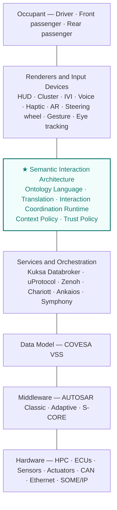
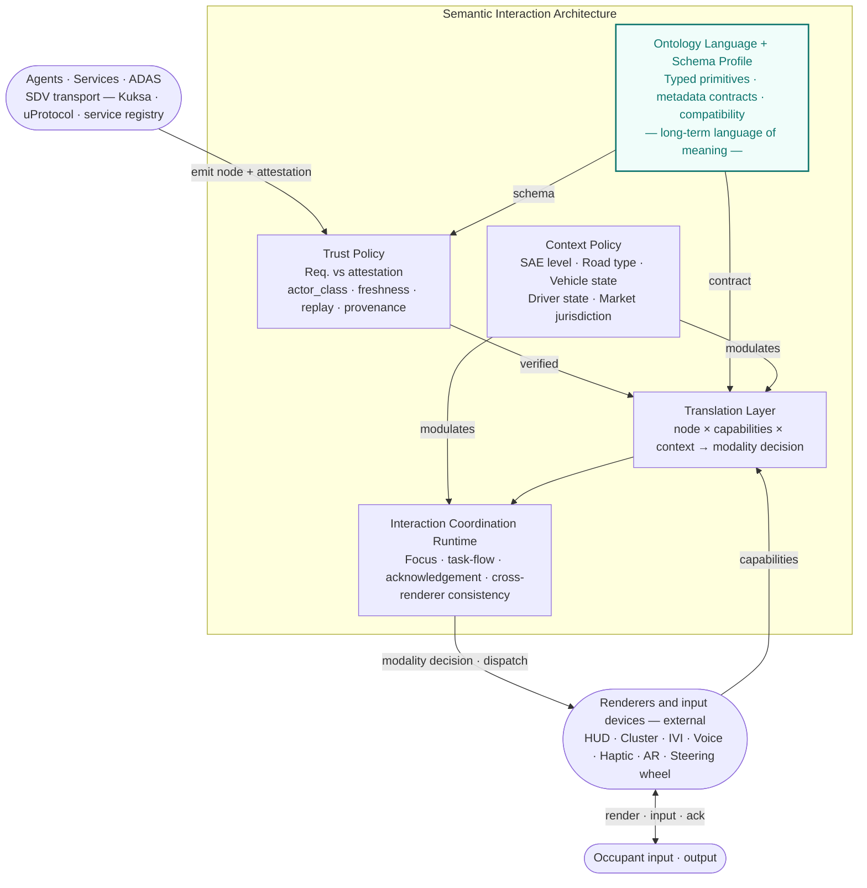
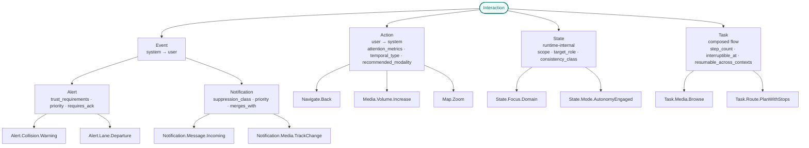

# Toward a Semantic Interaction Architecture for Software-Defined Vehicles

**A Position Paper on Semantic Mediation for In-Vehicle Interaction**

---

**Author:** Jan Janeček
**Affiliation:** Cars Making Sense
**Version:** 0.1 — Draft for circulation
**Date:** May 2026

---

## Abstract

As vehicles evolve into multimodal, AI-augmented, software-defined platforms, the Human–Machine Interface (HMI) is becoming one of the most volatile and fragile layers of the in-vehicle stack. Current automotive HMI architectures remain hardware-centric, vendor-specific, and tightly coupled to particular renderers and input devices, producing high rework cost, inconsistent user experience, and a growing attack surface. This position paper argues that there is a case for a *semantic mediation layer for high-value in-vehicle interactions*: a vendor-neutral interface in which selected interactions are described by their meaning, predicted attention demand, contextual fitness, and authority of origin, rather than by buttons, screens, or widgets. We position this mediation layer above existing Software-Defined Vehicle (SDV) data and service abstractions (COVESA VSS, Eclipse Kuksa, Eclipse uProtocol, AUTOSAR Adaptive), describe a scalable ontology language exposed initially through a typed event/command schema profile, and define policy hooks for attention and trust provenance. The goal is not to specify a complete HMI platform, but to define principles and interface boundaries that can be implemented incrementally while preserving backward compatibility across long vehicle lifecycles.

---

## 1. Motivation

The Software-Defined Vehicle is conventionally defined in terms of computing topology, OTA capability, and service-oriented architecture. Yet from the occupant's perspective, the SDV manifests almost entirely through interaction surfaces: head-up displays, instrument clusters, infotainment touchscreens, voice assistants, haptic actuators, and increasingly, AI agents that act on the occupant's behalf. The interaction layer is where the value of the SDV becomes perceptible, where regulatory exposure concentrates, and where the marginal cost of change is highest.

Despite this, the interaction layer has not received the abstraction work that data layers (signals, telemetry) and service layers (orchestration, OTA, digital twins) have received. Most production HMI stacks are still designed *screen-first*: a graphical layout binds a fixed widget to a fixed input device, exposes a fixed task flow, and treats voice, gesture, or haptic feedback as bolted-on alternatives. Cross-renderer consistency is achieved by repetition rather than abstraction. Capability changes require redesign rather than reconfiguration.

The cost of this tight coupling compounds along three axes. **Engineering cost** rises as each new screen size, input modality, or in-cabin AI feature triggers cascading rework. **User experience cost** rises as the same intent (*return to previous view*, *increase volume*, *acknowledge alert*) acquires inconsistent behaviour across vehicles, generations, and contexts. **Security cost** rises as third-party applications, cloud services, and AI agents acquire the ability to emit interactions that are indistinguishable, from the user's standpoint, from interactions originating in safety-critical subsystems.

We argue that these costs are not solved by better tooling, more screens, or larger language models alone. They are symptoms of a missing mediation boundary between SDV services and concrete HMI implementations.

The first version of such a boundary should be deliberately narrow. We scope it to three cores: **intent/action abstraction** for high-value commands and interaction events, **attention policy** for priority, interruptibility, and driving context, and **trust provenance** for determining which actors may emit which interaction types with which authority. The ontology language must nevertheless be designed for scale from the beginning: new domains, node families, metadata fields, and renderer capabilities should be additive where possible, and older vehicles must be able to ignore or degrade newer constructs safely. It must also be ergonomic for human authors: the language should mirror the structure of natural communication rather than expose only machine-oriented transport fields. Cross-domain portability and a vehicle-wide interaction runtime are treated as future specification work rather than as requirements for initial adoption.

---

## 2. Related Work and Position in the Ecosystem

Significant abstraction work exists below and around the interaction layer, but not within it.

**Data abstraction.** COVESA's Vehicle Signal Specification (VSS) defines a hierarchical, vendor-neutral catalogue of vehicle signals and is widely adopted as a common data vocabulary. VSS deliberately scopes itself to *signals*, not interactions; its recent `HMI` branch covers display properties such as font size and voice prompts, not interaction semantics.

**Service and communication abstraction.** Eclipse Kuksa provides a vehicle data broker over VSS. Eclipse uProtocol (with Eclipse Zenoh transport) abstracts in-vehicle and vehicle-to-cloud messaging. Eclipse Chariott provides a service registry and capability discovery. Eclipse Safe Open Vehicle Core (S-CORE) provides safety-ready middleware. None of these projects model *what an interaction means to the occupant*; they model how services and signals talk to each other.

**Middleware and runtime.** AUTOSAR Classic and Adaptive standardise ECU software architecture and middleware. SOAFEE introduces cloud-native, mixed-criticality runtime patterns. These layers sit below the interaction layer and are orthogonal to it.

**HMI frameworks.** Android Automotive's Car App Library is the closest production-grade hosted HMI model with semantic constraints: applications declare templates (List, Message, Navigation) and a host renders them with built-in distraction optimisation. Its scope is intentionally bounded to supported app categories and host-rendered templates; it is not a general interaction schema for the wider SDV stack. Qt Automotive, Kanzi, and similar tools offer renderer-side abstractions but not cross-renderer interaction semantics.

**Multimodal interaction.** The W3C Multimodal Architecture and Interfaces (MMI) Recommendation, with its EMMA annotation format, defines a generic semantic model for multimodal input. It has had limited automotive uptake, but it can inform input-side mapping and event annotation.

**Adjacent domains.** Game engines such as Unreal's Enhanced Input and Unity's Input System routinely abstract input actions from devices. ARIA performs an analogous role for web accessibility. These prior arts are useful analogies, but the remainder of this paper keeps the scope automotive-specific: safety, multi-renderer behavior, ASIL-related constraints, regulated distraction limits, and long vehicle lifecycles.

Figure 1 positions the proposed layer in the SDV stack.



*Figure 1. Position of the proposed Semantic Interaction Architecture relative to existing SDV layers.*

The proposed Semantic Interaction Architecture (SIA) sits **above** existing service and data abstractions and **below** concrete renderers. It is not a replacement for any current SDV project or HMI stack; it is a mediation boundary between them and occupant-facing interaction.

---

## 3. Architecture Overview

We propose three functional components and two cross-cutting policy functions, illustrated in Figure 2. This is a mediation architecture rather than an interaction operating system: it defines what crosses the boundary and how policy is applied, while leaving renderer implementation and most HMI runtime behavior to existing stacks.

**Ontology Language and Schema Profile.** A stable ontology language defines the long-term vocabulary of interaction meaning, inheritance, metadata contracts, and compatibility rules. The initial standardisation target should be a small typed event/command schema profile for high-value interactions. This keeps the first implementation tractable without sacrificing a scalable naming and evolution model.

**Translation Layer.** A bidirectional adaptor that maps semantic nodes to concrete input and output modalities given a capability set and a context. Its inputs are: the node, available renderers and input devices declaring measurable capabilities, the active context vector, and user accessibility profile. Its output is a candidate modality set and a rendering or input mapping decision.

**Interaction Coordination Runtime.** A coordination function for focus, in-flight task flows, acknowledgement timers, and consistency across distributed renderers. It does not replace a GUI framework; it coordinates semantic state that multiple renderers need to handle consistently.

**Trust Policy** is a gate at the entry point of SIA: all nodes emitted by agents, services, or ADAS systems pass through trust verification before entering the semantic pipeline. Nodes that fail verification are rejected and logged; they never reach the Translation Layer. **Context Policy** supplies a continuously updated context vector that modulates both the Translation Layer (modality selection) and the Interaction Coordination Runtime (conflict resolution, acknowledgement timeouts).

**Renderers and input devices are external to SIA.** Concrete output and input surfaces — HUD, cluster, IVI touchscreen, voice, haptic, AR overlay, steering wheel controls — are not components of SIA. They are vendor-specific implementations that interface with SIA in two directions: they *declare* measurable capabilities into the Translation Layer (Section 9), and they *consume* the modality decisions produced by the Coordination Runtime. This boundary is deliberate: it preserves SIA's vendor neutrality and keeps the standard small enough to be implementable across heterogeneous OEM stacks. Renderers are the only entities that face the occupant directly; all nodes reaching them have already been verified by Trust Policy and coordinated by the Runtime.



*Figure 2. Mediation architecture. SIA contains three functional components (Ontology, Translation, Runtime) and two cross-cutting policies (Trust, Context). Emitters and renderers are external: emitters submit nodes through Trust Policy; renderers register capabilities into Translation and consume the resulting modality decisions from Runtime. The Ontology Language + Schema Profile is the authoritative reference for both Trust Policy and Translation Layer.*

## 3.1 Human-Ergonomic Language Design

SIA should be machine-verifiable without becoming machine-shaped. Automotive interaction is ultimately communication between actors: an occupant asks, a vehicle informs or warns, an agent proposes, a safety system interrupts, and the recipient may acknowledge, ignore, defer, or recover. The ontology should therefore preserve communicative structure explicitly.

This does not mean the language should become free-form natural language. Natural communication should inform the ergonomics of the ontology — its primitives, naming, and authoring model — while the representation itself remains deterministic, typed, parsable, testable, and safe to validate at runtime. A node must be readable by humans and mechanically enforceable by software.

A useful node should answer a small set of human-readable questions:

| Communicative role | SIA representation |
| --- | --- |
| What is being requested, asserted, or coordinated? | Node identity and type (`Action`, `Event`, `State`, `Task`) |
| Who is speaking or acting? | `actor_class`, `actor_id`, attestation |
| Who is the intended recipient? | `target_role`, scope |
| How urgent or interruptive is it? | `priority`, `interruptibility`, `suppression_class` |
| What response is expected? | `requires_ack`, `ack_kind`, timeout and authority |
| What context changes its meaning? | Context vector and policy predicates |
| What happens if the preferred channel fails? | `fallback_chain`, `degradation_policy` |

This is an ergonomics requirement on the language itself. A schema that is technically valid but hard for HMI engineers, safety engineers, or UX researchers to read will not scale socially, even if it scales computationally. Conversely, a readable language that cannot be validated, diffed, tested, versioned, or safely degraded is not usable in an SDV stack. Naming should therefore prefer domain language over implementation jargon, preserve stable parent-child meaning, and make safety-relevant obligations visible at the node boundary.

---

## 4. Node Taxonomy

A common failure mode in interaction schemas is conflating semantically different node types into a single generic message model. We separate four primary semantic primitives, each with its own metadata contract.



*Figure 3. Node taxonomy. Four primary types with distinct metadata contracts; Event splits into Alert and Notification. Naming follows reverse-DNS hierarchy; subclasses may strengthen but not weaken contracts.*

**Action.** Occupant-initiated. May be discrete (`Navigate.Back`), sustained (`Media.Volume.Increase`), or continuous (`Map.Zoom`). Carries `recommended_modality`, `attention_metrics`, `temporal_type`.

**Event.** System-initiated. Splits into **Alert** (safety-relevant, may require acknowledgement) and **Notification** (informational, suppressible). Carries `priority`, `interruptibility`, `requires_ack`, `trust_requirements`.

**State.** Focus, mode, and context transitions consumed by the coordination runtime. State is not usually user-facing on its own. Carries `scope`, `target_role`, `consistency_class`.

**Task.** A composed multi-step flow over Actions and States, with start/end conditions and resumption semantics. In an initial standard this can be limited to a small set of high-value flows. Carries `step_count`, `interruptible_at`, `resumable_across_contexts`.

Each node declaration carries an `inherits_from` reference to its parent in the hierarchy (e.g., `Alert.Collision.Warning` declares `inherits_from: Interaction.Event.Alert`). `inherits_from` is a declaration-time field on the node, not a runtime field on the instance; it defines the contract resolution path. Naming follows a stable reverse-DNS hierarchy (`Interaction.Action.Navigate.Back`). First-version work should prefer explicit typed schemas over a deep class tree: subclasses may strengthen but not weaken metadata contracts. Versioning is mandatory on every node, and compatibility behavior must be defined for unknown subclasses and unknown optional fields.

---

## 5. Metadata Contracts

Every node carries a typed metadata block. Fields are partitioned into **declarative** (defined in the ontology language and stable across deployments) and **runtime** (filled by emitter at the moment of emission). The first schema profile should expose only the subset needed for interoperability, while reserving extension points for future node families and domain-specific bindings. We summarise the contract for each node type.

| Field | Action | Alert | Notification | State | Task |
| --- | --- | --- | --- | --- | --- |
| `since_version` | ● | ● | ● | ● | ● |
| `deprecated_since` | ○ | ○ | ○ | ○ | ○ |
| `replaced_by` | ○ | ○ | ○ | ○ | ○ |
| `compatible_with_min_version` | ○ | ○ | ○ | ○ | ○ |
| `direction` | ● | ● | ● | ● | ● |
| `temporal_type` | ● | ● | ● | — | — |
| `recommended_modality` | ● | — | — | — | — |
| `attention_metrics` | ● | ● | ● | — | ● |
| `priority` | — | ● | ● | — | — |
| `interruptibility` | — | ● | ● | — | ● |
| `requires_ack` | — | ● | ○ | — | — |
| `ack_kind` | — | ● | ○ | — | — |
| `ack_timeout_ms` | — | ● | ○ | — | — |
| `ack_authority` | — | ● | ○ | — | — |
| `trust_requirements` | ○ | ● | ○ | ○ | ○ |
| `target_role` | ● | ● | ● | ● | ● |
| `scope` | — | — | — | ● | ○ |
| `consistency_class` | — | — | — | ● | — |
| `accessibility_alt` | ● | ● | ● | — | ● |
| `regulatory_basis` | — | ● | ○ | — | ○ |
| `assessment_basis` | — | ○ | ○ | — | ○ |
| `pii_class` | ○ | ● | ● | — | ○ |
| `temporal_freshness_ms` | — | ● | ● | ● | — |
| `suppression_class` | — | ● | ● | — | — |
| `merges_with` | — | ● | ● | — | — |
| `fallback_chain` | ● | ● | ● | — | ● |
| `degradation_policy` | ● | ● | ● | — | ● |
| `step_count` | — | — | — | — | ● |
| `interruptible_at` | — | — | — | — | ● |
| `resumable_across_contexts` | — | — | — | — | ● |

● mandatory · ○ optional · — not applicable

Two further notes on table scope. `inherits_from` is a node-declaration field (it defines a parent in the ontology) and applies to every node; it is therefore omitted from the per-type contract table. The runtime `attestation` block (signature, timestamp, nonce, provenance chain) is required whenever `trust_requirements` are declared on the consuming side; its shape is specified in Section 6 rather than per node type.

Two design decisions warrant emphasis.

**Attention demand is represented by predictive proxies, not only enums.** The `attention_metrics` field carries predicted values — estimated glance time in milliseconds, mean single glance, task step count — rather than qualitative levels alone. These values are not direct measurements of driver attention; they are auditable proxies that can be compared against published distraction guidelines (NHTSA, JAMA, UNECE) and adjusted by context. A qualitative fallback (`cognitive_load: minimal | moderate | high | locked_while_driving`) is permitted for legacy and rapid prototyping use.

**Trust is split between requirement and attestation.** A node declares what trust properties consumers should require; an instance carries the attestation that those properties hold. The two are deliberately decoupled (Section 6).

---

## 6. Trust Model

In current automotive cybersecurity practice, trust is largely concerned with firmware integrity, ECU authentication, OTA signatures, platform integrity, transport integrity, and CAN-bus isolation. ISO/SAE 21434 and UNECE R155 codify much of this concern at the management-system level. These standards provide necessary foundations, but they do not fully specify what we term *interaction integrity*: the property that the meaning, priority, and origin of an interaction reaching the occupant is what it claims to be.

As in-vehicle AI agents, third-party applications, and cloud services proliferate, the interaction layer becomes a new attack surface. An attacker who cannot take the brakes can still suppress a collision warning, inject a fake low-trust alert, or coerce the priority of a benign notification to displace a critical one.

The proposed trust model separates two artefacts:

**Trust requirements** are declared on the node in the semantic schema. They specify what Trust Policy must verify before the node enters the semantic pipeline. Example fields:

```yaml
Alert.Collision.Warning:
  trust_requirements:
    signed_origin_required: true
    permitted_actor_classes: [adas, vsc]
    max_age_ms: 200
    replay_protection: required
```

Declarative authority is expressed exclusively through `permitted_actor_classes`: the actor taxonomy is the single source of who may emit what. Earlier drafts of this proposal carried an additional `min_trust_level` scalar; it was removed because it duplicated information already encoded in the actor taxonomy and created ambiguity when the two disagreed. Implementations that need a coarser policy summary can derive it locally from the class set rather than carry it on the node.

**Trust attestation** is attached to the instance by the emitter. It carries the cryptographic and provenance evidence:

```yaml
attestation:
  actor_class: adas
  actor_id: ADAS_v2.3.1
  signature: <JWS over canonical node form>
  timestamp_ms: 1778803920123          # ≈ 2026-05-14 12:12 UTC
  nonce: <random-per-emission>
  provenance_chain: [adas]             # one-hop at emission; multi-hop appended by intermediaries
```

Trust Policy verifies that attestation satisfies requirements declared in the ontology before the node enters the pipeline. Trust failure is fail-closed: the node is rejected and a `SecurityEvent` is logged; it never reaches the Translation Layer or any renderer. This is distinct from `degradation_policy`, which is declared on the node and applied by the Translation Layer to walk the `fallback_chain` when a preferred external renderer is unavailable — for example, routing to voice when a HUD is offline. A safety-critical node may define both: a strict trust requirement that fails closed, and a renderer fallback chain for when trust passes but the preferred output surface is unavailable.

An explicit `actor_class` taxonomy is one practical way to drive policy:

| Class | Description | Example |
| --- | --- | --- |
| `human_direct` | Physical input by occupant | Button press |
| `human_voice` | Voice command (occupant) | "Increase volume" |
| `agent_local` | On-device assistant | Local LLM |
| `agent_cloud` | Cloud-hosted assistant | Cloud LLM |
| `adas` | Driver assistance subsystem | AEB, LKA |
| `vsc` | Vehicle-state-critical system | Tyre pressure |
| `service` | Internal vehicle service | Climate |
| `third_party_app` | App-store application | Music app |

Policy can then be expressed mechanically: *"only `adas` and `vsc` may emit `Alert.Collision.Warning`"*; *"`third_party_app` notifications are subject to `suppression_class: third_party`"*. This complements current SDV trust work — token-based authentication between services, workload integrity, and platform security — by constraining not only whether an actor may speak, but what semantic authority it has when it speaks.

---

## 7. Attention Model

The Attention Policy is the second area in which the proposed mediation layer departs from current practice. Where contemporary automotive HMI guidelines (NHTSA Driver Distraction Guidelines, ISO 15005, JAMA) prescribe measurable thresholds — total eyes-off-road time, single glance duration, task completion time — most software-side HMI frameworks operate on qualitative tags ("distraction-optimised: true/false") that are not directly auditable against those thresholds.

The proposed model attaches predicted attention-demand proxies to interaction-bearing nodes:

```yaml
attention_metrics:
  glance_time_estimated_ms: 1500
  mean_single_glance_ms: 400
  task_steps: 3
  voice_alt_available: true
  cognitive_load: moderate
```

The Translation Layer composes the static node metric with a context modifier produced by context policy, producing a context-effective attention cost. One possible composition rule is:

```text
effective_cost(node, context) =
    node.attention_metrics × context.attention_modifier
    where context.attention_modifier =
        f(autonomy_level, road_type, traffic_density, driver_state)
```

Renderers and Runtime can then apply explicit budgets and reject, defer, or transform interactions that exceed them. Budgets are configured **per node class and per context**, not globally. For illustration in this paper we use two reference budgets for manual highway driving: ≤ 1500 ms TEORT for `Alert.*` (safety-critical, must surface immediately) and ≤ 2000 ms TEORT for general `Action.*` (e.g., media or navigation interactions the driver initiated). Concrete budgets are a deployment-level configuration aligned with NHTSA, JAMA, and ISO 15005 thresholds; SIA defines only the contract that makes such budgets mechanically enforceable. This does not make compliance automatic, but it makes compliance checks more explicit, auditable, and testable than renderer-local qualitative tags.

---

## 8. Context as a Multi-Axis Vector

Current automotive HMI architectures often model context as a flat enumeration (`city / highway / parking / autonomous`). Real context is multi-dimensional; collapsing it into a single label discards information that the Translation Layer needs.

We model context as a vector of orthogonal axes. First-version work should distinguish core axes, needed for most policies, from extended axes that may be supplied by richer deployments. Axes are deliberately separated by concern: road infrastructure (`road_type`) is independent of vehicle motion state (`vehicle_state`), which is independent of jurisdiction (`market_jurisdiction`).

| Axis | Class | Example values |
| --- | --- | --- |
| `sae_level` | Core | `0`, `1`, `2`, `3`, `4`, `5` |
| `autonomy_engaged` | Core | boolean |
| `road_type` | Core | `urban`, `rural`, `highway`, `off_road` |
| `vehicle_state` | Core | `moving`, `parked`, `charging`, `service` |
| `driver_state` | Core | `attentive`, `drowsy`, `distracted`, `not_monitoring`, `unknown` |
| `market_jurisdiction` | Core | ISO 3166-1 alpha-2 (`US`, `JP`, `CN`, `GB`, …) plus supranational `EU` |
| `traffic_density` | Extended | `free`, `dense`, `congested` |
| `weather` | Extended | `clear`, `rain`, `snow`, `fog` |
| `time_of_day` | Extended | `day`, `dusk`, `night` |

`market_jurisdiction` identifies the region under whose homologation regime the vehicle is currently operating, not a specific regulatory body — UNECE, NHTSA, KBA, MLIT, etc. are mapped from the jurisdiction by deployment-level configuration. This keeps the axis stable as regulatory bodies rename, merge, or harmonise.

Translation and suppression policies become composable predicates over the vector (`autonomy_engaged ∧ sae_level ≥ 3 ⇒ permit Task.Media.Browse`). VSS data populates several of these axes directly; others (driver state, market jurisdiction) require dedicated input.

**Context modifiers.** Context Policy may scale a defined whitelist of numeric node fields by published modifier rules — currently `attention_metrics.*` (per Section 7) and `ack_timeout_ms` (extended in low-attention contexts such as L4 autonomy). All other declarative fields are immutable across contexts: a node's `priority`, `permitted_actor_classes`, `suppression_class`, and `fallback_chain` cannot be context-modulated. This separates *what the node is* from *how its numeric thresholds adapt to context*, which is the only mutation Context Policy is permitted to perform.

---

## 9. Capability Negotiation

Renderers and input devices declare *measurable* capabilities, not labels. Example:

```yaml
Renderer.HUD:
  max_simultaneous_elements: 4
  text_max_chars: 32
  refresh_rate_hz: 60
  color_count: 4
  supports_animation: false
  safety_profile: safety_relevant_visual
  glance_optimized: true
```

```yaml
InputDevice.SteeringWheel.Right:
  axes: [rotate_continuous]
  buttons: [press, tilt_4way]
  haptic: [pulse, sustained_vibration]
  reachable_during: [driving, parking]
  safety_profile: driver_reachable_control
```

The Translation Layer can then compute candidate renderers for a given node and context, filter them by capability and policy, and select among remaining candidates using user accessibility profile and deployment-specific preferences. This should not be framed initially as a global optimisation problem; deterministic candidate filtering is sufficient for a first version. Capability declarations are versioned with the same scheme as semantic nodes.

The `safety_profile` field on each renderer and input device is an open-vocabulary tag describing the device's role in safety-critical interaction (e.g., `safety_relevant_visual`, `driver_reachable_control`, `non_safety_informational`). Its values are not formally enumerated in v0.1; they are deployment-level labels that map to ASIL/SEooC partitioning and are matched against `trust_requirements` and `target_role` during candidate filtering. Formal enumeration is deferred to specification work (Section 12) once two or more reference deployments inform a converging vocabulary.

---

## 10. Versioning and Evolution

A vehicle in service for 15 years must remain interoperable with newer ontology and schema versions delivered over the air. The mediation layer therefore needs explicit versioning on every node, capability, and policy:

```yaml
since_version: 1.4.0
deprecated_since: 2.0.0
replaced_by: Interaction.Action.Navigate.Hierarchical.Back
compatible_with_min_version: 1.2.0
```

Translation Layer should advertise supported ontology/schema versions and apply explicit fallback behavior when a renderer or input device cannot support a newer node. Schema changes follow semantic versioning: minor versions add nodes and optional fields; major versions may deprecate. Deprecation requires a transition period, a `replaced_by` pointer where possible, and a declared behavior for unsupported nodes.

Backward compatibility is not an implementation detail; it is a core design constraint. The ontology language should follow these rules:

1. New optional fields are additive and must be safely ignored by consumers that do not understand them.
2. New subclasses inherit parent contracts and may strengthen, but not weaken, safety, attention, or trust requirements.
3. Required-field additions need a major version or a feature flag with explicit fallback behavior.
4. Deprecated nodes remain resolvable for a defined support window and should point to `replaced_by` where semantics can be preserved.
5. Unknown critical nodes must fail closed or degrade through policy; unknown non-critical nodes may be suppressed, deferred, or mapped to a parent class.

---

## 11. Relation to Existing Standards

| Standard | Layer | Relationship |
| --- | --- | --- |
| COVESA VSS | Data | Can populate context axes; Action nodes may reference VSS signals |
| W3C MMI / EMMA | Multimodal input | Can inform Translation Layer input mapping |
| ISO 15005 / ISO 17287 | Ergonomics | Informs `attention_metrics` field semantics |
| NHTSA Driver Distraction Guidelines | Regulation | Informs checks on `effective_cost` |
| JAMA Guidelines | Regulation | Informs checks on `effective_cost` |
| UNECE R79 | Lane-keep / steering | Informs `regulatory_basis` of `Alert.Lane.*` family |
| UNECE R152 | AEBS for M1/N1 (passenger) | Informs `regulatory_basis` of `Alert.Collision.*` family |
| ISO 15623 | Forward collision warning systems | Informs `regulatory_basis` of `Alert.Collision.Warning` |
| UNECE R155 / ISO 21434 | Cybersecurity | Provides platform and process context for interaction integrity |
| Eclipse Kuksa / uProtocol | Transport | Can carry trust-validated semantic messages |
| Eclipse S-CORE | Middleware | Possible host environment for coordination and translation |
| Eclipse LMOS | AI agents | Potential source of `agent_local` / `agent_cloud` emitters |
| Android Car App Library | App-level HMI | Hosted template model with semantic constraints; not a substitute |

---

## 12. Open Questions and Path Forward

The proposal is deliberately scoped to a position paper; concrete specification work remains open. We identify the following near-term questions:

1. *Ontology and schema formalism.* JSON Schema, OWL, SHACL, or a hybrid (VSS uses a custom `.vspec` format generating to JSON Schema). The choice has long-term tooling and compatibility consequences.
2. *Cryptographic substrate for Trust.* JWS, COSE, W3C Verifiable Credentials, or a domain-specific scheme. Alignment with R155-mandated key management is required.
3. *Empirical validation of attention metric composition.* Any `effective_cost` formulation, including the simple multiplicative example above, requires user study evidence.
4. *Conflict resolution between renderers.* When two renderers can serve a node within budget, the selection policy needs principled grounding.
5. *Reference open-source implementation.* A prototype integrated with existing SDV middleware, for example Kuksa/uProtocol, would provide concrete grounding for further discussion.

**Future scope.** The pattern described in this paper may later generalise beyond automotive HMI, but this should not be part of the first standardisation target. Aviation flight decks, surgical and intensive-care environments, industrial control rooms, and XR surfaces have analogous coupling problems, but each domain has different regulatory hooks, actor-class taxonomies, attention metrics, and capability vocabularies. Useful generality should emerge from a validated automotive binding, not precede it.

We propose three coordinated paths:

**Standardisation path.** Engagement with the Eclipse SDV Working Group, including the proposed AI Special Interest Group discussed on the SDV mailing list in late 2025, to introduce the interaction layer as a complement to ongoing service-trust integration work across Ankaios, Kuksa, OpenSOVD, Symphony, and uProtocol. Advanced HMI, AI agents, and trustable interaction should be treated as candidate topics for coordinated SDV work rather than as isolated renderer concerns.

**Academic path.** A workshop or work-in-progress submission to AutomotiveUI 2026, targeting the in-vehicle agent and trust subcommunities. Adjacent venues: ACM CHI, HCII Mobility track, escar for the security dimension.

**Industry path.** Direct engagement with Tier-1 HMI groups (Bosch CoC HMI, Mercedes-Benz Tech Innovation, Harman) and OEM HMI research teams (BMW Group Research, MBition) for prototype co-development.

A worked example tracing one `Alert.Collision.Warning` end-to-end is provided as Appendix A.

---

## References (selected)

- COVESA. *Vehicle Signal Specification.* <https://covesa.global/project/vehicle-signal-specification/>
- Eclipse Foundation. *Eclipse SDV Working Group.* <https://sdv.eclipse.org/>
- Eclipse Foundation. *Special Interest Groups — Software Defined Vehicle.* <https://sdv.eclipse.org/special-interest-groups/>
- Eclipse SDV Working Group mailing list. *Proposal for an AI Special Interest Group.* <https://www.eclipse.org/lists/sdv-wg/msg00737.html>
- W3C. *Multimodal Architecture and Interfaces 1.0.* W3C Recommendation.
- W3C. *EMMA: Extensible MultiModal Annotation Markup Language.*
- ISO 15005:2017. *Road vehicles — Ergonomic aspects of transport information and control systems.*
- ISO/SAE 21434:2021. *Road vehicles — Cybersecurity engineering.*
- UNECE Regulation No. 155. *Cybersecurity and cybersecurity management system.*
- NHTSA. *Visual-Manual NHTSA Driver Distraction Guidelines for In-Vehicle Electronic Devices.*
- Ebel, P., Lingenfelder, C., Vogelsang, A. *Measuring Interaction-based Secondary Task Load* (arXiv:2108.13243).
- Demir, C., Meschtscherjakov, A., Gärtner, M. *Unlocking Trust and Acceptance in Tomorrow's Ride: How In-Vehicle Intelligent Agents Redefine SAE Level 5 Autonomy.* MTI 8(12):111, 2024.
- *Agent2Agent Threats in Safety-Critical LLM Assistants: A Human-Centric Taxonomy* (arXiv:2602.05877, 2026).
- Gomaa, A. *Adaptive user-centered multimodal interaction towards reliable and trusted automotive interfaces.* ICMI 2022.
- Google. *Android for Cars App Library.* <https://developer.android.com/training/cars/apps>

---

*Comments, corrections, and counter-positions are explicitly invited. Contact: <dizencz@gmail.com>*
