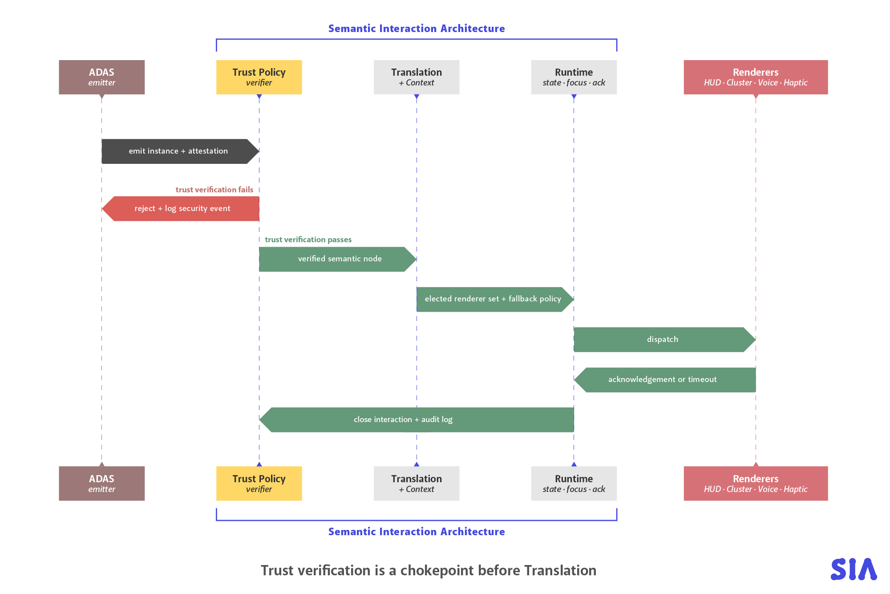

# Appendix A — Worked Example: `Alert.Collision.Warning` End to End

*Companion to “Toward a Semantic Interaction Architecture for Software-Defined Vehicles” (v0.4.0).*<br>
*The normative lifecycle and requirements are defined in [`03_Core-Specification.md`](./03_Core-Specification.md). The JSON files in [`examples/v0.4/`](./examples/v0.4/) are executable conformance material.*

This appendix follows one safety-critical interaction from declaration through trust, context, translation, renderer delivery and occupant response. The example uses the Minimal SIA Profile 0.4: `Alert` and `Notification`; cluster, IVI and voice output; six actor classes; and six orthogonal context axes. `Action` awaits a future input/execution profile.

---

## A.1 Node declaration

The declaration defines what the interaction means and owns every policy-relevant property. A runtime instance cannot override priority, actor permissions, context handling, retention, rendering or occupant response.

```yaml
id: Interaction.Event.Alert.Collision.Warning
inherits_from: Interaction.Event.Alert
since_version: 0.4.0
direction: system_to_occupant
target_role: driver
temporal_type: discrete
priority: critical
interruptibility: non_interruptible
semantic_validity_ms: 500
payload_schema_ref: sia:payload:collision-warning:1
payload_schema_sha256: aaaaaaaaaaaaaaaaaaaaaaaaaaaaaaaaaaaaaaaaaaaaaaaaaaaaaaaaaaaaaaaa

trust_requirements:
  signed_origin_required: true
  permitted_actor_classes: [adas]
  max_ingress_age_ms: 200
  replay_protection: required
  session_revocation_required: true

attention_metrics:
  glance_time_estimated_ms: 800
  mean_single_glance_ms: 300
  task_steps: 0
  voice_alt_available: true
  cognitive_load: minimal

context_policy:
  policy_ref: sia:policy:core-context:1
  policy_sha256: bbbbbbbbbbbbbbbbbbbbbbbbbbbbbbbbbbbbbbbbbbbbbbbbbbbbbbbbbbbbbbbb
  applicability: always
  unknown_context: safe_worst_case
  on_blocked:
    disposition: never_block

presentation_contract:
  preferred_renderers: [cluster, voice]
  required_renderers: []
  delivery_success_policy: any_selected_presented
  delivery_timeout_ms: 300
  degradation_policy: next_eligible

occupant_response:
  kind: explicit_or_timeout
  authority: driver_only
  timeout_ms: 2000

pii_class: none
accessibility_alternatives: [visual, auditory]
regulatory_basis: [ISO_15623, UNECE_R152]
```

The alert remains meaningful while stationary or charging because another vehicle may still strike the car. Context cannot silently drop or retain it: `never_block` sends it to capability negotiation and the documented safety fallback. Delivery succeeds when a primary or explicitly attempted fallback renderer proves presentation. Only then does the independent two-second occupant-response wait begin.

---

## A.2 Legitimate runtime instance

```yaml
spec_version: 0.4.0
profile_id: sia-minimal
profile_version: 0.4.0
catalog_version: 0.4.0
catalog_sha256: cccccccccccccccccccccccccccccccccccccccccccccccccccccccccccccccc
node_id: Interaction.Event.Alert.Collision.Warning
node_schema_sha256: aaaaaaaaaaaaaaaaaaaaaaaaaaaaaaaaaaaaaaaaaaaaaaaaaaaaaaaaaaaaaaaa
instance_id: c8e1f4b2-7bd0-4c44-9a8e-0a9c7c2c4b21
occurred_at_ms: 1784116800000
valid_until_ms: 1784116800500
target_role: driver

payload:
  time_to_collision_s: 1.4
  threat_bearing_deg: 12
  threat_range_m: 18
  relative_speed_kmh: 42

attestation:
  actor_class: adas
  actor_id: ADAS_v2.3.1
  actor_registry_version: 0.4.0
  actor_registry_sha256: dddddddddddddddddddddddddddddddddddddddddddddddddddddddddddddddd
  actor_credential_id: 11111111-1111-4111-8111-111111111111
  actor_credential_sha256: eeeeeeeeeeeeeeeeeeeeeeeeeeeeeeeeeeeeeeeeeeeeeeeeeeeeeeeeeeeeeeee
  key_id: vehicle-hsm:adas:7
  algorithm: ES256
  timestamp_ms: 1784116800000
  nonce: cmFuZG9tLW5vbmNlLTE
  provenance_chain: [ADAS_v2.3.1]
  signature: ZXhhbXBsZS1zaWduYXR1cmU
```

The three version axes are explicit. `catalog_sha256` and `node_schema_sha256` bind the instance to the signed catalog and reviewed declaration; the registry and credential digests bind its claimed identity to current authority and revocation state. `valid_until_ms` may not exceed `occurred_at_ms + semantic_validity_ms`. The attestation timestamp is evaluated against the separate 200 ms ingress-freshness limit.

---

## A.3 Trust verification



*Figure A.1. Trust verification is a chokepoint before Translation. A failed instance never reaches a renderer, regardless of claimed urgency. The sequence shown is the 0.3 sketch: in 0.4, dispatch is an ordered, deadline-bounded attempt per renderer, the “acknowledgement or timeout” return is split into an authenticated delivery receipt and a separate occupant response, and the response window opens only on `presented` evidence (§A.6–A.7).*

Trust Policy performs these checks before context or rendering:

1. validate the closed runtime envelope and node-specific payload;
2. resolve the catalog declaration and verify its digest;
3. verify that `adas` is an authorised actor class;
4. verify signature or negotiated session authenticator and algorithm;
5. check ingress freshness;
6. check nonce replay protection;
7. check current credential and session revocation;
8. verify declaration-bounded semantic validity at acceptance;
9. record a stable pass or rejection reason.

SIA does not determine whether a physical collision is real. It determines whether the interaction claim crossing the HMI boundary is authorised, fresh, attributable and structurally valid.

---

## A.4 Context decision

### A.4.1 Moving, highway, attentive driver

```yaml
context_id: 1a2b3c4d-1111-4aaa-8bbb-1234567890ab
captured_at_ms: 1784116800040
policy_ref: sia:policy:core-context:1
policy_version: 0.4.0
policy_sha256: bbbbbbbbbbbbbbbbbbbbbbbbbbbbbbbbbbbbbbbbbbbbbbbbbbbbbbbbbbbbbbbb
axes:
  motion_state:
    value: moving
    source_id: Vehicle.SpeedState
    observed_at_ms: 1784116800036
    confidence: 100
  operating_mode:
    value: driving
    source_id: Vehicle.OperatingMode
    observed_at_ms: 1784116800036
    confidence: 100
  energy_state:
    value: not_charging
    source_id: Vehicle.ChargeState
    observed_at_ms: 1784116800030
    confidence: 100
  road_type:
    value: highway
    source_id: Navigation.RoadClass
    observed_at_ms: 1784116799800
    confidence: 96
  driver_state:
    value: attentive
    source_id: DMS.AttentionState
    observed_at_ms: 1784116800028
    confidence: 92
  occupancy:
    occupied_roles: [driver]
    source_id: Cabin.Occupancy
    observed_at_ms: 1784116800030
    confidence: 98
integrity:
  issuer: Vehicle Context Authority
  key_id: vehicle-hsm:context:3
  algorithm: HMAC-SHA-256
  signature: Y29udGV4dC1zaWduYXR1cmU
```

The alert is applicable because its declared applicability is `always`, not merely because the vehicle is moving. It proceeds directly to renderer capability negotiation. Context inputs are immutable, sourced, timed, confidence-scored and authenticated; the decision binds this exact `context_id` and signed policy digest.

### A.4.2 Charging

```yaml
axes:
  motion_state: {value: stationary, source_id: Vehicle.SpeedState, observed_at_ms: 1784116800036, confidence: 100}
  operating_mode: {value: parked, source_id: Vehicle.OperatingMode, observed_at_ms: 1784116800036, confidence: 100}
  energy_state: {value: charging, source_id: Vehicle.ChargeState, observed_at_ms: 1784116800030, confidence: 100}
  road_type: {value: urban, source_id: Navigation.RoadClass, observed_at_ms: 1784116799800, confidence: 96}
  driver_state: {value: unknown, source_id: DMS.AttentionState, observed_at_ms: 1784116800028, confidence: 70}
  occupancy: {occupied_roles: [driver], source_id: Cabin.Occupancy, observed_at_ms: 1784116800030, confidence: 98}
```

The collision warning remains applicable. Charging describes energy state; it does not prove that an external vehicle cannot reverse into the car. SIA continues to a safe renderer while recording that motion is stationary and operating mode is parked.

### A.4.3 A genuinely non-applicable stationary interaction

`Alert.Lane.Departure.Warning` declares `moving_only`. With the same charging snapshot it transitions to `not_applicable`, emits `CONTEXT_NOT_APPLICABLE`, and closes without a render plan, dispatch attempt, receipt, or occupant response. It is not retained or transformed. A sensor diagnostic is a separate `Notification.Diagnostic.CollisionSensorTest` instance.

### A.4.4 Unknown motion state

An unknown, stale, or low-confidence core axis cannot make the system more permissive. The signed policy defines the threshold and `safe_worst_case` behaviour, so unknown motion is evaluated as the stricter moving case for safety and attention. Capability negotiation continues for the non-suppressible collision alert; the uncertainty and source evidence remain visible in the audit trail.

---

## A.5 Deterministic render plan

```yaml
decision_id: d8e1f4b2-7bd0-4c44-9a8e-0a9c7c2c4b22
instance_id: c8e1f4b2-7bd0-4c44-9a8e-0a9c7c2c4b21
context_id: 1a2b3c4d-1111-4aaa-8bbb-1234567890ab
spec_version: 0.4.0
profile_version: 0.4.0
catalog_version: 0.4.0
catalog_sha256: cccccccccccccccccccccccccccccccccccccccccccccccccccccccccccccccc
node_schema_sha256: aaaaaaaaaaaaaaaaaaaaaaaaaaaaaaaaaaaaaaaaaaaaaaaaaaaaaaaaaaaaaaaa
policy_ref: sia:policy:core-context:1
policy_version: 0.4.0
policy_sha256: bbbbbbbbbbbbbbbbbbbbbbbbbbbbbbbbbbbbbbbbbbbbbbbbbbbbbbbbbbbbbbbb
created_at_ms: 1784116800060
selected:
  - {renderer_id: Renderer.Cluster.Primary, role: primary}
  - {renderer_id: Renderer.Voice.Primary, role: fallback}
rejected:
  - {renderer_id: Renderer.IVI.Primary, reason_code: SAFETY_PROFILE_INELIGIBLE}
delivery_success_policy: any_selected_presented
delivery_timeout_ms: 300
reason_code: PRIMARY_WITH_FALLBACK_STANDBY
```

Cluster is selected for immediate dispatch and voice remains an eligible ordered fallback on standby. IVI is explicitly rejected. Voice is not concurrent and must not be dispatched unless a preceding attempt fails or times out. Repeating the decision with the same declaration, context, capabilities and policy version must produce the same plan.

---

## A.6 Renderer delivery feedback

Dispatch is not proof of delivery. Runtime first records the ordered attempt:

```yaml
attempt_id: a0e1f4b2-7bd0-4c44-9a8e-0a9c7c2c4b20
decision_id: d8e1f4b2-7bd0-4c44-9a8e-0a9c7c2c4b22
instance_id: c8e1f4b2-7bd0-4c44-9a8e-0a9c7c2c4b21
renderer_id: Renderer.Cluster.Primary
role: primary
sequence: 0
previous_attempt_id: null
dispatched_at_ms: 1784116800060
deadline_at_ms: 1784116800360
state: dispatched
integrity: {issuer: coordination_runtime, key_id: vehicle-hsm:runtime:1, algorithm: EdDSA, signature: <signature>}
```

The selected renderer then sends authenticated, idempotent feedback bound to that attempt:

```yaml
receipt_id: e8e1f4b2-7bd0-4c44-9a8e-0a9c7c2c4b23
attempt_id: a0e1f4b2-7bd0-4c44-9a8e-0a9c7c2c4b20
receipt_sequence: 0
decision_id: d8e1f4b2-7bd0-4c44-9a8e-0a9c7c2c4b22
instance_id: c8e1f4b2-7bd0-4c44-9a8e-0a9c7c2c4b21
renderer_id: Renderer.Cluster.Primary
issuer: renderer
state: presented
observed_at_ms: 1784116800132
elapsed_ms: 72
reason_code: null
attestation:
  key_id: vehicle-hsm:cluster:4
  algorithm: HMAC-SHA-256
  signature: ZGVsaXZlcnktcmVjZWlwdA
```

`received` would prove only that the renderer accepted the request. `presented` proves occupant-facing output. `failed` is renderer-originated; `timed_out` is emitted only by Coordination Runtime at the 300 ms deadline. A receipt cannot predate or outlive its bound attempt. Because the success policy is `any_selected_presented`, the cluster receipt satisfies delivery and voice is never dispatched. If cluster failed, a new voice attempt would use `sequence: 1` and `previous_attempt_id` equal to the cluster attempt.

SIA assumes at-least-once transport. Duplicate receipts are ignored by `receipt_id`; the architecture does not claim distributed exactly-once delivery.

---

## A.7 Occupant response

Only after delivery succeeds does the response wait begin. An explicit driver response is a separate authenticated artifact:

```yaml
response_id: f8e1f4b2-7bd0-4c44-9a8e-0a9c7c2c4b24
decision_id: d8e1f4b2-7bd0-4c44-9a8e-0a9c7c2c4b22
instance_id: c8e1f4b2-7bd0-4c44-9a8e-0a9c7c2c4b21
context_id: 1a2b3c4d-1111-4aaa-8bbb-1234567890ab
delivery_receipt_ids: [e8e1f4b2-7bd0-4c44-9a8e-0a9c7c2c4b23]
state: acknowledged
authority: driver_only
subject_role: driver
opened_at_ms: 1784116800132
deadline_at_ms: 1784116802132
occurred_at_ms: 1784116800552
input_channel: InputDevice.SteeringWheel.Right.Press
evidence:
  kind: verified_input
  key_id: vehicle-hsm:input:5
  algorithm: HMAC-SHA-256
  signature: b2NjdXBhbnQtcmVzcG9uc2U
```

The response window opens exactly from the presented receipt. Its subject must be an occupied driver in the bound context. If no valid response arrives within 2000 ms, Coordination Runtime emits `response_timed_out` exactly at the deadline; it must not forge a human action. Presented, noticed, understood and acknowledged are four different claims. Version 0.4 encodes only what can be evidenced.

---

## A.8 What happens to a distracted-driver notification?

The answer is declaration-specific, never implicit. `Notification.Media.NowPlaying` declares `coalesce`, 30 s TTL and the key fields `node_id`, `target_role`, `actor_id` and `payload.session_id`.

While the driver is distracted:

1. the first applicable instance becomes `held` and gets a retention record;
2. each newer equivalent instance supersedes the older retained entry;
3. the store keeps only the newest state for that canonical key;
4. expiry, quota eviction and supersession are all audited;
5. when driver state changes, the newest instance is revalidated against current trust, semantic validity, context, capabilities and policy;
6. only a successful re-evaluation produces a render plan and delivery receipts.

A held instance has not fallen into a black hole, and it has not failed delivery. Delivery has not started. By contrast, `Assistant.Suggestion` declares `drop` and closes with an audit record, while `Notification.Diagnostic.CollisionSensorTest` declares `defer` and retains each bounded item. This is why “suppressed” is too ambiguous for a robust model.

---

## A.9 Adversarial scenarios

### A.9.1 Unauthorised actor

A correctly signed third-party application is still rejected when it emits `Alert.Collision.Warning`, because authentication proves identity, not semantic authority. `third_party_app` is absent from `permitted_actor_classes`.

### A.9.2 Stale or replayed warning

An otherwise valid warning arriving after `max_ingress_age_ms: 200`, outside `valid_until_ms`, or with a reused nonce is rejected before Translation. These are separate failure reasons because transport delay, stale meaning and replay are different faults.

### A.9.3 Priority injection

An adversary adds `priority: critical` to a benign runtime instance. The closed envelope fails schema validation. The field is rejected and logged; it is not silently ignored. Declaration-owned policy therefore cannot be smuggled through the payload.

### A.9.4 Valid session, malicious behaviour

A valid symmetric session ticket does not grant new semantic authority. Individual policy violations are rejected, counted and rate-limited. Repeated violations may revoke the session before expiry. Queue, nonce-cache and audit-storage bounds prevent an authenticated actor from turning retention or replay protection into an exhaustion attack.

### A.9.5 Renderer failure

If the primary attempt fails, Runtime may dispatch the plan's standby fallback as the next ordered attempt. If no attempted renderer meets `any_selected_presented` within the remaining semantic-validity window, delivery closes through the declared failure policy. The occupant-response wait remains `not_started`. A deployment must document its fail-operational safety path, watchdog behaviour and duplicate-prevention strategy; SIA must not become an undocumented single point of failure.

---

## A.10 What this example demonstrates

1. A single declaration governs semantic authority, context, retention, presentation and response policy.
2. Trust and payload validation occur before context and rendering.
3. Applicability is distinct from temporary blocking.
4. Retained notifications are bounded, observable and re-evaluated rather than forgotten.
5. Renderer delivery and occupant acknowledgement are independent feedback loops.
6. Failure and timeout issuers are explicit, so audit evidence cannot overclaim.
7. Closed envelopes reject policy injection.
8. Stable reason codes and machine-readable, causally bound records make the lifecycle testable.

---

## A.11 Remaining production work

- Evaluate a production binary encoding alongside the normative JCS representation.
- Replace illustrative digest placeholders in prose automatically from executable examples.
- Define deployment latency budgets and certified safety fallbacks.
- Calibrate attention estimates with simulator and in-vehicle evidence.
- Specify privacy policy for retained personal notifications and audit redaction.
- Expand interoperability vectors from single-attempt examples to multi-interaction and transport-loss sequences.
- Validate context and renderer attestation chains against the vehicle trust architecture.

These are explicit profile and deployment tasks, not reasons to leave lifecycle semantics ambiguous.

---

*End of Appendix A · SIA 0.4.0 · July 2026*
