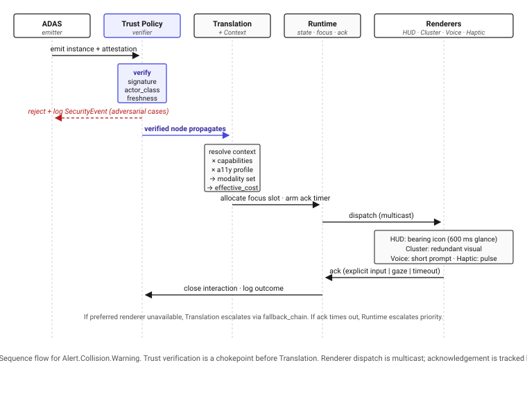

# Appendix A — Worked Example: `Alert.Collision.Warning` End-to-End

*Companion to "Toward a Semantic Interaction Architecture for Software-Defined Vehicles" (v0.1).*

This appendix traces a single safety-critical alert from its emission by the ADAS subsystem to its delivery across multiple renderers, under varying contexts and adversarial conditions. The goal is to make the proposed metadata contracts and trust model concrete enough to evaluate. All field names match Sections 4–10 of the main paper.

---

## A.1 Ontology declaration

The node is declared once in the ontology and frozen against a version. The following declaration is what every vehicle, regardless of OEM, sees as the canonical definition.

```yaml
node: Interaction.Event.Alert.Collision.Warning
since_version: 1.0.0
inherits_from: Interaction.Event.Alert
direction: output

priority: 95                       # 0–100, integer
interruptibility: false
requires_ack: true
ack_kind: explicit_input | gaze
ack_timeout_ms: 3000
ack_authority: driver_only

attention_metrics:
  glance_time_estimated_ms: 600    # short, single-glance design intent
  mean_single_glance_ms: 600
  task_steps: 1
  voice_alt_available: true
  cognitive_load: high

trust_requirements:
  min_trust_level: critical
  signed_origin_required: true
  permitted_actor_classes: [adas, vsc]
  max_age_ms: 200
  replay_protection: required

temporal_type: discrete
temporal_freshness_ms: 500
suppression_class: safety_critical
merges_with: []                    # never merged
fallback_chain: [hud, cluster, voice, haptic]
degradation_policy: escalate       # if preferred renderer unavailable, escalate

target_role: driver
accessibility_alt:
  low_vision: [voice, haptic]
  hearing_impaired: [hud, cluster, haptic]
  motor_limited:
    ack_kind: gaze
regulatory_basis: [UNECE_R79, ISO_15623, NHTSA_FCW_NCAP]
pii_class: none
```

Several properties are worth noting. `priority: 95` places this alert above almost every other interaction; `merges_with: []` forbids aggregation with other events; `suppression_class: safety_critical` prevents any policy from silencing it; and `requires_ack` with `ack_authority: driver_only` ensures that a passenger cannot dismiss the warning.

---

## A.2 Runtime instance — legitimate emission

At runtime, the ADAS subsystem emits an instance carrying its attestation. Trust and provenance policy verifies the attestation against the semantic declaration before propagation.

```yaml
instance_of: Interaction.Event.Alert.Collision.Warning
ontology_version: 1.0.0
instance_id: c8e1f4b2-...                # for ack correlation
timestamp_ms: 1731504920123

payload:
  ttc_seconds: 1.4                       # time to collision
  threat_bearing_deg: 12                 # right of vehicle heading
  threat_range_m: 18

attestation:
  actor_class: adas
  actor_id: ADAS_v2.3.1
  signature: <JWS over canonical form>
  timestamp_ms: 1731504920123
  provenance_chain: [adas]
```

The trust and provenance policy checks: signature validity, `actor_class ∈ permitted_actor_classes`, age ≤ `max_age_ms`, replay nonce not seen before, and signed `ontology_version` resolvable. All checks pass; the instance enters the Runtime.

---

## A.3 Trust verification flow



Trust and provenance policy is the chokepoint at which interaction integrity is enforced. Importantly, verification operates *before* Translation — a node that fails verification never reaches a renderer, regardless of its declared priority.

---

## A.4 Translation under three contexts

The same instance is translated differently depending on the active Context vector. Below we show three representative contexts and the resulting renderer assignment. Capability profiles for renderers are taken from Section 9 of the main paper.

### A.4.1 Highway, manual driving

```yaml
context:
  sae_level: 1
  road_type: highway
  traffic_density: dense
  weather: clear
  autonomy_engaged: false
  driver_state: attentive
  market_jurisdiction: UNECE
```

Translation Layer decision:

- **Primary:** HUD (glance-optimised, in driver's forward field of view, ≤ `glance_time_estimated_ms`)
- **Concurrent:** Cluster (redundant visual), Haptic on driver seat (sub-second TTI)
- **Concurrent:** Voice short prompt (250 ms)
- **Not selected:** IVI touchscreen (off-axis, exceeds glance budget under dense traffic context modifier)

Effective attention cost: `600 ms × 1.2 (dense traffic modifier) = 720 ms` — within budget for highway manual driving (configured at 1500 ms TEORT for safety-critical alerts).

### A.4.2 Parked, charging

```yaml
context:
  sae_level: 0
  road_type: stationary
  traffic_density: none
  autonomy_engaged: false
  driver_state: unknown
  market_jurisdiction: UNECE
```

The alert is suppressed by an upstream rule: ADAS does not emit `Collision.Warning` while stationary. If emitted anyway (e.g., during diagnostics), Translation Layer renders to IVI only with an inline label "Diagnostic mode — not a real warning". The label is not free-form text generated at runtime; it is a static string bound to a policy rule of the form `context.road_type = stationary ∧ actor_class = adas → inject_override_label: "Diagnostic mode — not a real warning"`. This is policy-encoded behaviour, not designer judgement.

### A.4.3 Autonomous L4, highway

```yaml
context:
  sae_level: 4
  road_type: highway
  autonomy_engaged: true
  driver_state: not_monitoring
  market_jurisdiction: UNECE
```

Translation Layer decision:

- **Primary:** Cluster (driver may be looking away; sustained display)
- **Concurrent:** Voice prompt full sentence (driver context recovery)
- **Concurrent:** Haptic on seat
- **Not selected:** HUD (driver not assumed to be looking forward)

The `ack_timeout_ms: 3000` is extended by a context-derived modifier to 6000 ms, reflecting the longer take-over time from non-driving-related task engagement. The modifier is a property of context policy, not the semantic node.

---

## A.5 Adversarial scenarios

### A.5.1 Spoofed actor class

A third-party application emits a message claiming to be `Alert.Collision.Warning`:

```yaml
attestation:
  actor_class: third_party_app
  actor_id: com.example.musicapp
  signature: <valid app-store signature>
```

Trust and provenance policy rejects the instance: `third_party_app ∉ permitted_actor_classes`. The message does not propagate. A `State.SecurityEvent.UnauthorisedEmission` is generated for logging.

### A.5.2 Expired freshness

A replay of a 1-second-old legitimate instance arrives for verification.

```yaml
attestation.timestamp_ms: 1731504919023
current_time_ms:           1731504920123  # 1100 ms later
```

Trust and provenance policy rejects: age `1100 ms > max_age_ms (200)`. The instance does not propagate. This protects against captured-and-replayed warnings designed to desensitise the driver.

### A.5.3 AI agent attempting to issue critical alert

A local LLM agent (`actor_class: agent_local`), having parsed a misleading input, emits:

```yaml
instance_of: Interaction.Event.Alert.Collision.Warning
attestation:
  actor_class: agent_local
  ...
```

Trust and provenance policy rejects: `agent_local ∉ permitted_actor_classes`. The agent may emit lower-trust nodes (`Notification.Suggestion.*`), but the integrity of safety-critical alerts is structurally protected from agentic emission, regardless of how the agent was prompted. This complements service-level authentication by constraining what an authenticated actor is authorised to say.

### A.5.4 Priority injection

An adversary attempts to emit a benign notification with elevated `priority: 99` to displace a real alert. Because `priority` is a property of the semantic node declaration, not the instance, the runtime `priority` is recomputed from the declaration and the spoofed value is discarded.

---

## A.6 What this example demonstrates

1. **A single declarative node** governs behaviour across heterogeneous renderers, contexts, and accessibility profiles, without per-vehicle, per-screen redesign.
2. **Attention checks are more auditable.** A regulator or safety team can inspect the declared attention-demand proxies and verify that policy decisions are traceable to explicit thresholds.
3. **Trust is enforced at a chokepoint** before rendering, and the policy is expressed in the semantic schema rather than embedded in renderer code.
4. **AI agents are not categorically blocked from interaction**, but they cannot impersonate safety-critical subsystems. This is a different and stronger property than service-level authentication: it constrains *what kinds of things an authenticated agent may say*, not merely *whether it may speak*.
5. **Adversarial cases reduce to schema checks.** Spoofing, replay, and priority injection are caught by mechanical validation of declared contracts rather than ad-hoc detection.

---

## A.7 Open issues raised by this example

- The numerical priority scale (0–100) is convenient but arbitrary. Comparative semantics across OEMs require either a shared scale or per-vehicle calibration policy.
- `context.attention_modifier` is presented as a scalar in the formula `effective_cost = base × modifier`. In practice it is likely a function of multiple context axes; any composition rule deserves empirical validation.
- `ack_kind: explicit_input | gaze` mixes a deterministic input with a probabilistic inference (gaze detection has error rates). The ontology may need to distinguish certified from inferred acknowledgement.
- `provenance_chain` in this example contains a single hop. In realistic agentic deployments the chain may be multi-hop (`sensor → adas → trust_verifier → runtime`), and the semantics of chain-level trust composition are not yet specified.

These issues are intentionally listed: they are the next units of specification work after the position paper is circulated.

---

*This appendix is normative for the worked example only. The main paper (v0.1) carries the definitional weight.*
