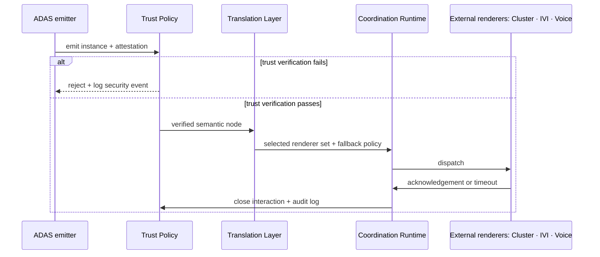

# Appendix A — Worked Example: `Alert.Collision.Warning` End-to-End

*Companion to “Toward a Semantic Interaction Architecture for Software-Defined Vehicles” (v0.3.1).*  
*This appendix is illustrative for the worked example. The main paper carries the definitional weight.*

This appendix traces one safety-critical interaction from emission by an ADAS subsystem to dispatch through external renderers. The purpose is to make the main paper’s semantic contract concrete without expanding SIA beyond its intended narrow boundary.

The example uses the **Minimal SIA Profile v1** from the main paper wherever possible: three node families (`Action`, `Alert`, `Notification`), three renderers (cluster, IVI, voice), and three core context axes (`vehicle_state`, `road_type`, `driver_state`). Optional extended axes are shown only where they clarify the scenario.

---

## A.1 Node declaration

The collision warning is declared once in the semantic vocabulary. The declaration defines what the interaction means, which actors may emit it, what attention demand it carries, and which fallback behaviour applies if the preferred renderer is unavailable.

```yaml
id: Interaction.Event.Alert.Collision.Warning
inherits_from: Interaction.Event.Alert
since_version: 1.0.0
direction: system_to_occupant
temporal_type: discrete

priority: critical
interruptibility: non_interruptible
requires_ack: true
ack_kind: explicit_or_timeout
ack_timeout_ms: 2000
target_role: driver

trust_requirements:
  signed_origin_required: true
  permitted_actor_classes: [adas]
  max_age_ms: 200
  replay_protection: required

attention_metrics:
  glance_time_estimated_ms: 800
  mean_single_glance_ms: 300
  task_steps: 0
  voice_alt_available: true
  cognitive_load: minimal

fallback_chain: [cluster, voice]
degradation_policy: fail_to_cluster_plus_audio
suppression_class: non_suppressible
pii_class: none

regulatory_basis:
  - ISO 15623
  - UNECE R152
```

Several properties are intentionally conservative. `priority: critical` and `suppression_class: non_suppressible` prevent the alert from being displaced by lower-authority interactions. `permitted_actor_classes: [adas]` prevents services, applications and agents from issuing this node even if they are otherwise authenticated. `priority` is declarative: it is not trusted from the runtime payload.

---

## A.2 Runtime instance — legitimate emission

At runtime, the ADAS subsystem emits an instance carrying its payload and attestation. Trust Policy verifies the attestation before the node reaches Translation or any renderer.

```yaml
node_id: Interaction.Event.Alert.Collision.Warning
ontology_version: 1.0.0
instance_id: c8e1f4b2-7bd0-4c44-9a8e-0a9c7c2c4b21
timestamp_ms: 1778803920123

payload:
  time_to_collision_s: 1.4
  threat_bearing_deg: 12
  threat_range_m: 18
  relative_speed_kmh: 42

attestation:
  actor_class: adas
  actor_id: ADAS_v2.3.1
  signature: <signature-over-canonical-instance>
  timestamp_ms: 1778803920123
  nonce: <random-per-emission>
  provenance_chain: [adas]
```

Trust Policy checks signature validity, permitted actor class, age against `max_age_ms`, replay protection and schema compatibility. All checks pass; the verified instance enters the semantic pipeline.

---

## A.3 Trust verification flow



*Figure A.1. Trust verification is a chokepoint before Translation. A failed node never reaches a renderer, regardless of declared priority.*

This is the central interaction-integrity property: SIA does not determine whether a collision is physically real, but it does determine whether the interaction claim is authorised, fresh, attributable and eligible for presentation.

---

## A.4 Translation under selected contexts

The same verified node may be dispatched differently depending on context and renderer capabilities. In v1, the available renderer set is deliberately small: **cluster**, **IVI** and **voice**.

### A.4.1 Highway, manual driving

```yaml
context:
  vehicle_state: moving
  road_type: highway
  driver_state: attentive

  # optional extended axes
  traffic_density: dense
  autonomy_engaged: false
  sae_level: 1
  market_jurisdiction: DE
```

Translation Layer decision:

- **Primary:** cluster, because it is the safety-relevant visual surface in the v1 profile.
- **Concurrent:** short voice prompt, because `voice_alt_available: true` and the alert is critical.
- **Rejected:** IVI, because it is a general interactive surface and may exceed the active attention budget during manual highway driving.

Effective attention cost using an illustrative dense-traffic modifier (the specific value is not normatively defined in v1; it is an example of the kind of empirically calibrated modifier a deployment would configure):

```text
800 ms × 1.2 dense-traffic modifier = 960 ms
```

The value remains within the deployment-defined budget for a critical alert. The exact budget is not a claim of compliance; it is an enforcement parameter to be calibrated and audited.

### A.4.2 Parked or charging

```yaml
context:
  vehicle_state: charging
  road_type: urban
  driver_state: unknown
```

The preferred design is that ADAS does not emit `Alert.Collision.Warning` when `vehicle_state ≠ moving`. Diagnostic or test information should use a separate semantic node, for example `Notification.Diagnostic.CollisionSensorTest`, rather than reusing a live safety alert.

If the safety alert is nevertheless emitted during diagnostics, policy may suppress the live warning path and render a clearly labelled diagnostic notification on IVI. This behaviour must be policy-encoded and auditable; it should not depend on renderer-local judgement.

### A.4.3 Unknown core context axis

```yaml
context:
  vehicle_state: unknown
  road_type: highway
  driver_state: attentive
```

If a core context axis cannot be determined, Context Policy must not relax constraints. The safe fallback is to treat the unknown value as the stricter applicable case. For attention budgeting, an unknown `vehicle_state` is therefore treated as `moving` unless a lower-level safety-certified source proves a less restrictive state.

Translation Layer decision:

- **Primary:** cluster.
- **Concurrent:** voice.
- **Rejected:** IVI, because uncertainty in a core axis forces the stricter attention policy.

This example prevents a common failure mode: loss of context data must not accidentally make the HMI more permissive.

### A.4.4 L4 autonomy, highway

```yaml
context:
  vehicle_state: moving
  road_type: highway
  driver_state: not_monitoring

  # optional extended axes
  autonomy_engaged: true
  sae_level: 4
  market_jurisdiction: DE
```

At L4 autonomy, the Automated Driving System (ADS) handles the collision response autonomously; the occupant alert serves primarily as awareness and recovery information. The node identity, trust requirement, priority and fallback chain remain unchanged. Context Policy may only adjust whitelisted numeric fields, such as acknowledgement timing.

Translation Layer decision:

- **Primary:** cluster, because it remains the safety-relevant visual surface.
- **Concurrent:** fuller voice prompt, because the driver is not assumed to be monitoring.
- **Rejected:** IVI for the initial critical alert path, unless a deployment-specific policy allows a secondary persistent explanation after the critical dispatch.

The acknowledgement timeout may be extended by a published Context Policy rule, but this changes only the effective runtime value. It does not rewrite the semantic node.

---

## A.5 Adversarial scenarios

### A.5.1 Unauthorised actor class

A third-party application emits a message addressed as `Alert.Collision.Warning` and truthfully attests its class:

```yaml
attestation:
  actor_class: third_party_app
  actor_id: com.example.musicapp
  signature: <valid app-store signature>
```

Even with a valid signature, Trust Policy rejects the instance because `third_party_app` is not in `permitted_actor_classes`. The complementary attack — falsely claiming `actor_class: adas` — fails signature verification because the app cannot sign as ADAS.

### A.5.2 Expired freshness

A replay of an otherwise legitimate warning arrives too late:

```yaml
attestation.timestamp_ms: 1778803919023
current_time_ms:           1778803920123  # 1100 ms later
```

Trust Policy rejects it because the age exceeds `max_age_ms: 200`. The instance does not reach Translation.

### A.5.3 Agent attempting to issue a critical alert

A local or cloud agent emits the collision warning after misinterpreting a prompt:

```yaml
node_id: Interaction.Event.Alert.Collision.Warning
attestation:
  actor_class: agent_local
  actor_id: LocalAssistant_v1
```

Trust Policy rejects it because `agent_local` is not permitted to emit this node. The agent may still emit lower-authority suggestions or notifications, but it cannot impersonate a safety-critical subsystem at the semantic layer.

### A.5.4 Priority injection

An adversary attempts to attach `priority: critical` or `priority: 99` to a benign notification.

The ontology declaration is authoritative for priority. The Translation Layer resolves priority from the schema, not from the runtime payload, so any instance-level priority field is ignored. Trust Policy is not the enforcement point here — a node may pass trust verification and still have its injected priority silently discarded, because semantic authority over priority is a property of the declaration, not the instance. A runtime payload may not raise its own semantic authority.

### A.5.5 Valid session, malicious behaviour

A third-party application has a valid Tier 2 symmetric session ticket after legitimate session establishment. During the session it begins emitting policy-violating interaction attempts, for example repeated unauthorised safety alerts or notification flooding.

```yaml
session:
  actor_class: third_party_app
  actor_id: com.example.musicapp
  ticket_type: symmetric_hmac
  status: active
```

Individual unauthorised emissions are still rejected by semantic policy. In addition, the onboard intrusion-detection or policy-monitoring component may explicitly revoke the session ticket before expiry:

```yaml
session_revocation:
  actor_id: com.example.musicapp
  reason: repeated_policy_violation
  effect: invalidate_symmetric_ticket
```

This preserves the latency advantage of Tier 2 verification without treating a verified session as unconditional trust.

---

## A.6 What this example demonstrates

1. **A single semantic declaration** governs trust, attention, fallback and renderer eligibility across contexts.
2. **Trust is checked before Translation**, so unauthorised nodes never reach renderers.
3. **Renderer selection remains narrow and auditable** in v1: cluster, IVI and voice are sufficient to test the core mechanism.
4. **Attention demand is explicit**, but not overclaimed as proof of regulatory compliance.
5. **Unknown context degrades safely**, rather than relaxing interaction constraints.
6. **AI agents and third-party apps are constrained by semantic authority**, not merely by service-level authentication.
7. **Adversarial cases reduce to mechanical checks**: actor class, freshness, replay, declaration-derived priority and session revocation.

---

## A.7 Open issues raised by this example

- The categorical `priority: critical` is easier to standardise than a 0–100 scale, but deployments still need an ordering policy between multiple critical alerts.
- The illustrative `effective_cost = base × modifier` rule is intentionally simple; a real implementation should validate context modifiers empirically.
- `ack_kind: explicit_or_timeout` avoids relying on gaze as a normative acknowledgement in v1. Future profiles may add gaze or driver-monitoring acknowledgement, but they must distinguish certified input from probabilistic inference.
- `provenance_chain` is single-hop in this example. Multi-hop agentic flows require a more precise trust-composition model.
- Diagnostic emissions should use distinct diagnostic node types rather than overloaded safety alerts.

These issues are the next units of specification work after the position paper is circulated.

---

*End of Appendix A.*
