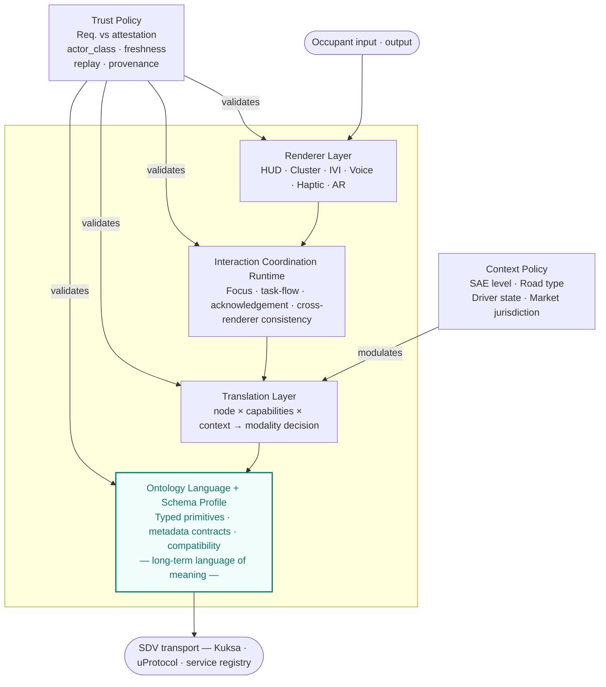
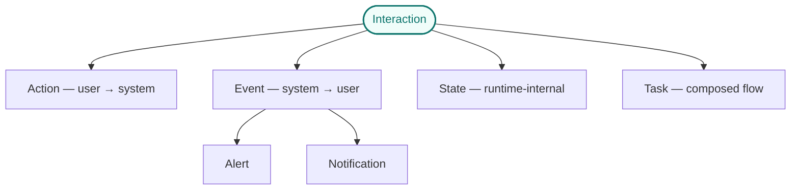
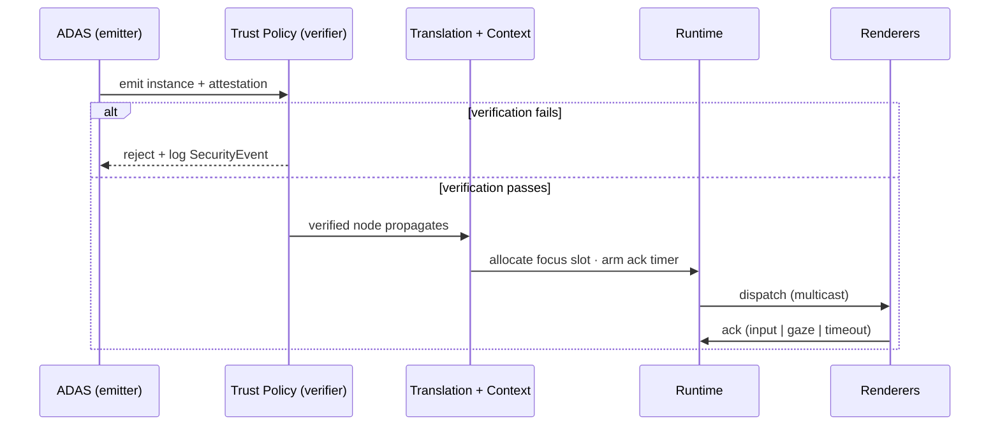

# Toward a Semantic Mediation Layer for In-Vehicle Interaction

*Work-in-Progress — AutomotiveUI 2026*
*[ANONYMOUS FOR REVIEW]*

---

## Abstract

Software-defined vehicles are accumulating interaction surfaces faster than the abstractions needed to manage them. Head-up displays, instrument clusters, infotainment touchscreens, voice assistants, and on-device AI agents each demand separate, screen-first implementations of the same occupant-facing intent. This paper argues for a *semantic mediation layer* — positioned above existing SDV service and data abstractions and below concrete renderers — that would reduce rework cost, enable cross-renderer consistency, and introduce machine-checkable attention and trust guarantees into the in-vehicle interaction stack. We describe a typed node taxonomy (Actions, Events, States, Tasks), a declarative metadata contract encoding predicted attention demand and trust provenance on every interaction node, and a policy architecture for context-driven renderer selection. A worked example traces a safety-critical alert through trust verification, context-aware translation, and adversarial rejection. We identify implications for the AutomotiveUI research agenda and open questions for standardisation.

---

## 1. Introduction

The software-defined vehicle is conventionally defined at the infrastructure level: compute topology, OTA updates, service-oriented architecture. From the occupant's perspective, however, the SDV manifests almost entirely through interaction — head-up displays, voice assistants, haptic feedback, and increasingly AI agents acting on the occupant's behalf. The interaction layer is where the value of the SDV becomes perceptible, where regulatory exposure concentrates, and where the marginal cost of change is highest.

Current HMI stacks are screen-first. A graphical layout binds a fixed widget to a fixed input device; voice and haptic modalities are added as alternatives after the fact. When a new surface arrives — or an AI agent needs to emit an interaction — the logic must be rewritten. Engineering cost rises with each new screen size or modality. User experience cost rises as the same intent (*acknowledge an alert*, *increase volume*, *navigate back*) acquires inconsistent behaviour across vehicles, generations, and contexts. Security cost rises as AI agents and third-party applications gain the ability to emit interactions that are indistinguishable, from the occupant's standpoint, from safety-critical subsystems.

We argue these costs are symptoms of a missing mediation boundary — not a tooling deficit or a renderer deficit, but a missing layer of abstraction. We propose a Semantic Interaction Architecture (SIA): a vendor-neutral layer in which selected in-vehicle interactions are described by their meaning, attention demand, contextual fitness, and authority of origin, rather than by buttons, screens, or widgets.

The first version of such a layer should be deliberately narrow. We scope the proposal to three cores: *intent/action abstraction* for high-value commands and events, *attention policy* for priority, interruptibility, and driving context, and *trust provenance* for determining which actors may emit which interaction types with which authority. The ontology language is designed for incremental adoption and long lifecycle compatibility.

---

## 2. Related Work

**SDV data and service layers.** COVESA VSS defines a vendor-neutral catalogue of vehicle signals [COVESA]. Eclipse Kuksa, uProtocol, and Chariott abstract data brokering, messaging, and service discovery [Eclipse SDV]. None of these projects model what an interaction *means to the occupant*; they model how services and signals communicate.

**HMI frameworks.** Android Automotive's Car App Library is the closest production-grade analogue to a semantic interaction model: applications declare templates and a host renders them with built-in distraction optimisation [Google]. Its scope is bounded to supported app categories within a single-OEM ecosystem. Qt Automotive and Kanzi offer renderer-side abstractions without cross-renderer interaction semantics.

**Multimodal interaction.** The W3C MMI Recommendation and EMMA annotation format define a generic semantic model for multimodal input [W3C MMI, W3C EMMA]. Automotive uptake has been limited; the vocabulary remains a candidate substrate for the input side of SIA.

**Adjacent domains.** Unreal's Enhanced Input and Unity's Input System abstract actions from devices in game engines. ARIA performs an analogous role for web accessibility. These precedents demonstrate tractability; they have not been adapted to automotive constraints (ASIL, regulated distraction limits, multi-renderer safety requirements, 15-year vehicle lifecycles).

SIA occupies the gap above SDV service abstractions and below concrete renderers — the missing connective tissue that none of the above projects addresses.

---

## 3. Mediation Architecture

We propose a mediation architecture of four functional components and two cross-cutting policy functions. This is not a complete HMI platform; it defines what crosses the semantic boundary and how policy is applied, leaving renderer implementation and GUI framework behaviour to existing stacks.



*Figure 1. Mediation architecture. Trust and context are cross-cutting policy functions; the Ontology Language is the canonical source of meaning.*

**Ontology Language and Schema Profile.** A stable language defines the long-term vocabulary of interaction meaning, inheritance, metadata contracts, and compatibility rules. The first standardisation target is a small typed event/command schema profile for high-value interactions — tractable to implement without locking in a deep class hierarchy.

**Translation Layer.** A bidirectional adaptor that maps semantic nodes to concrete modalities given a capability set and context. Inputs: the node, declared renderer and input device capabilities, the active context vector, and user accessibility profile. Output: a candidate modality set and rendering or input mapping decision.

**Interaction Coordination Runtime.** A coordination function for focus, in-flight task flows, acknowledgement timers, and consistency across distributed renderers. It does not replace a GUI framework; it coordinates semantic state that multiple renderers must share.

**Renderer Layer.** The set of concrete output and input surfaces — HUD, cluster, IVI touchscreen, voice, haptic, AR, steering wheel controls — that consume the semantic stream. Each renderer declares measurable capabilities; the Translation Layer selects among them. Renderers are interchangeable; the ontology is not.

**Trust Policy** verifies message origin, freshness, and authority before semantic propagation. **Context Policy** supplies a continuously updated vector of driving context that modulates priority, modality preference, and suppression rules.

---

## 4. Node Taxonomy and Metadata Contracts

A common failure mode in interaction schemas is conflating semantically different node types into a single generic message model. SIA separates four primary semantic primitives, each with its own metadata contract.



*Figure 2. Four primary node types; Event splits into Alert and Notification.*

**Action** — occupant-initiated; discrete, sustained, or continuous. Carries `attention_metrics`, `temporal_type`, `recommended_modality`.

**Event** — system-initiated; splits into **Alert** (safety-relevant, may require acknowledgement) and **Notification** (informational, suppressible). Alerts carry `priority`, `requires_ack`, `trust_requirements`.

**State** — focus, mode, and context transitions consumed by the coordination runtime. Carries `scope`, `target_role`, `consistency_class`.

**Task** — a composed multi-step flow over Actions and States with resumption semantics. Carries `step_count`, `interruptible_at`, `resumable_across_contexts`.

Every node carries two categories of metadata fields: **declarative** fields defined in the ontology and stable across deployments (e.g., `attention_metrics`, `trust_requirements`, `fallback_chain`), and **runtime** fields filled by the emitter at the moment of emission (e.g., attestation, instance payload). Table 1 summarises mandatory (●), optional (○), and not-applicable (—) fields for each type.

| Field | Action | Alert | Notification | State | Task |
| --- | --- | --- | --- | --- | --- |
| `since_version` | ● | ● | ● | ● | ● |
| `attention_metrics` | ● | ● | ● | — | ● |
| `priority` | — | ● | ● | — | — |
| `requires_ack` | — | ● | ○ | — | — |
| `trust_requirements` | ○ | ● | ○ | ○ | ○ |
| `suppression_class` | — | ● | ● | — | — |
| `fallback_chain` | ● | ● | ● | — | ● |
| `degradation_policy` | ● | ● | ● | — | ● |

*Table 1. Partial metadata contract by node type (abbreviated). Full contract in accompanying technical report.*

---

## 5. Trust and Attention Policy

### 5.1 Trust

Current SDV cybersecurity practice — ISO/SAE 21434, UNECE R155 — addresses firmware integrity, ECU authentication, and transport security. These are necessary but insufficient: they do not constrain what an authenticated actor is *authorised to say* at the interaction level. An attacker who cannot compromise the brakes can still suppress a collision warning, inject a fake alert, or elevate the priority of a benign notification to displace a critical one.

SIA separates trust into two artefacts. **Trust requirements** are declared on the node in the ontology — what consumers must verify before propagating or rendering. **Trust attestation** is attached to the instance by the emitter — cryptographic and provenance evidence that requirements are met. The Trust Policy verifies attestation satisfies requirements before the node propagates; mismatches degrade through a declared `degradation_policy`.

An `actor_class` taxonomy drives policy mechanically: `adas` and `vsc` may emit safety-critical alerts; `agent_local` and `agent_cloud` may not — regardless of how the agent was prompted. This is a structurally stronger property than service-level authentication: it constrains what kinds of things an authenticated actor may say, not merely whether it may speak.

### 5.2 Attention

Contemporary HMI guidelines (NHTSA, ISO 15005, JAMA) prescribe measurable thresholds — total eyes-off-road time (TEORT), single glance duration, task step count. Most software-side frameworks operate on qualitative tags (`distraction-optimised: true/false`) not directly auditable against those thresholds.

SIA attaches predicted attention-demand proxies to every interaction-bearing node:

```yaml
attention_metrics:
  glance_time_estimated_ms: 1500
  mean_single_glance_ms: 400
  task_steps: 3
  voice_alt_available: true
  cognitive_load: moderate
```

The Translation Layer composes node metrics with a context modifier from Context Policy (`effective_cost = base_metric × context_modifier`), enabling explicit budget checks (*"maximum 2000 ms TEORT during manual highway driving"*) and mechanical policy decisions to reject, defer, or transform interactions that exceed them.

---

## 6. Worked Example: Alert.Collision.Warning

We trace a single safety-critical alert end-to-end to make the contracts concrete.

**Ontology declaration (abbreviated):**

```yaml
node: Interaction.Event.Alert.Collision.Warning
priority: 95
requires_ack: true
ack_authority: driver_only
trust_requirements:
  permitted_actor_classes: [adas, vsc]
  max_age_ms: 200
  replay_protection: required
attention_metrics:
  glance_time_estimated_ms: 600
suppression_class: safety_critical
fallback_chain: [hud, cluster, voice, haptic]
```

**Trust verification:**



*Figure 3. Sequence flow. Trust Policy is a chokepoint before Translation.*

**Context-dependent translation.** Under manual highway driving (`sae_level: 1`, `traffic_density: dense`), the Translation Layer selects HUD as primary with concurrent cluster and haptic, and rejects IVI touchscreen (off-axis, exceeds attention budget under dense-traffic modifier). Under L4 autonomous driving (`driver_state: not_monitoring`), HUD is de-prioritised in favour of cluster and full-sentence voice prompt; `ack_timeout_ms` extends from 3000 ms to 6000 ms via context modifier.

**Adversarial rejection.** A third-party application claiming `Alert.Collision.Warning` is rejected because `third_party_app ∉ permitted_actor_classes`. A replay of a 1100 ms-old instance is rejected because age exceeds `max_age_ms: 200`. A local LLM agent is rejected for the same class reason. Priority injection — an adversary emitting a notification with `priority: 99` — is defeated because priority is a property of the ontology declaration, not the instance.

---

## 7. Implications for AutomotiveUI Research

SIA introduces a semantic vocabulary and a set of machine-readable contracts that open several research directions directly relevant to the AutomotiveUI community.

**Attention as a first-class research variable.** The `attention_metrics` contract makes declared attention cost comparable across HMI designs, OEMs, and evaluation studies — without requiring every comparison to be grounded in a new user study. Researchers could evaluate whether declared proxies predict empirical TEORT, and how context modifiers should be calibrated. This creates a feedback loop between user studies and the ontology itself.

**Cross-renderer semantic equivalence.** By expressing the same interaction node across modalities (visual, voice, haptic), SIA enables controlled studies of cross-modal equivalence — does `Alert.Collision.Warning` delivered via voice versus HUD produce equivalent driver response? Currently such comparisons are confounded by differing implementations; a shared semantic node removes that confound.

**Trust and agency in AI-augmented vehicles.** The `actor_class` taxonomy provides a vocabulary for the growing AutomotiveUI literature on in-vehicle agents. Empirical work on driver trust calibration, appropriate reliance, and agent transparency can be grounded in the structural distinction between `agent_local`, `agent_cloud`, `adas`, and `human_direct` — classes that carry different implied authority and verifiability.

**Context-adaptive interaction design.** The multi-axis context vector (`sae_level`, `driver_state`, `road_type`, `market_jurisdiction`) formalises the context space that AutomotiveUI researchers use informally. Experiments can be designed against explicit context predicates rather than bespoke scenario definitions, improving replicability.

**Standardisation input.** AutomotiveUI researchers regularly engage with industry and standards bodies. Empirical validation of the attention metric composition formula, the priority scale, and the ack_kind distinction (certified versus inferred acknowledgement) are directly actionable contributions to a future standardisation process.

---

## 8. Open Questions

This work is scoped to a position paper; we identify the following near-term research and specification questions.

1. *Schema formalism.* JSON Schema, OWL/SHACL, or a VSS-style custom format generating to JSON Schema. The choice has long-term tooling and adoption consequences.
2. *Empirical validation of attention metric composition.* The `effective_cost = base × context_modifier` formula requires user study evidence. The composition law is likely not scalar.
3. *Certified versus inferred acknowledgement.* `ack_kind: gaze` mixes deterministic input with probabilistic inference; the ontology may need to distinguish certified from inferred acknowledgement, with different safety implications.
4. *Multi-hop trust provenance.* In agentic deployments, the provenance chain may have multiple hops (`sensor → adas → trust_verifier → runtime`); chain-level trust composition is not yet specified.
5. *Reference implementation and tooling roadmap.* Architecture adoption is gated not only on specification quality but on the availability of a supporting toolchain. Prior art from W3C MMI and related efforts suggests that well-specified interfaces without reference tooling consistently fail to achieve adoption. We identify three tooling layers, each a prerequisite for the next.

   **Core layer.** A machine-readable schema (JSON Schema or Protobuf) for Action, Event, State, and Task nodes with their full metadata contracts; a validation engine that answers "may this node be rendered in this context?" given the active context vector; and a declarative policy engine (OPA/Rego-style) encoding rules such as "`agent_local` actors may not emit `safety_critical` nodes" and "a `fallback_chain` with no `voice` entry is invalid during L4 autonomy."

   **Integration layer.** Thin adaptors to COVESA VSS, Eclipse Kuksa, and uProtocol so that SIA is a plug-in layer over existing SDV transports rather than a replacement. A renderer capability interface — analogous to Android's capability detection or React Native's platform abstraction — through which concrete surfaces declare what they can render and at what attention cost. An agent interface that accepts semantic node payloads from LLM-based agents and routes them through trust verification before any UI surface is reached.

   **Developer tooling.** A context simulator that exercises the Translation Layer against scripted driving contexts and failure modes; a structured debugger that makes suppression decisions transparent (*"collision warning suppressed — reason: `actor_class agent_local` ∉ `permitted_actor_classes`"*); and a declarative test harness expressing automotive certification scenarios as given/when/then predicates against the schema and policy engine. The test harness is likely the most direct contribution to ASIL-relevant certification workflows and the tool most likely to determine whether practitioners adopt SIA or not.

---

## References

- COVESA. *Vehicle Signal Specification.* https://covesa.global/project/vehicle-signal-specification/
- Eclipse Foundation. *Eclipse SDV Working Group.* https://sdv.eclipse.org/
- W3C. *Multimodal Architecture and Interfaces 1.0.* W3C Recommendation, 2012.
- W3C. *EMMA: Extensible MultiModal Annotation Markup Language.* W3C Recommendation, 2009.
- ISO 15005:2017. *Road vehicles — Ergonomic aspects of transport information and control systems.*
- ISO/SAE 21434:2021. *Road vehicles — Cybersecurity engineering.*
- UNECE Regulation No. 155. *Cybersecurity and cybersecurity management system.*
- NHTSA. *Visual-Manual NHTSA Driver Distraction Guidelines for In-Vehicle Electronic Devices.* 2012.
- Google. *Android for Cars App Library.* https://developer.android.com/training/cars/apps
- Ebel, P., Lingenfelder, C., Vogelsang, A. *Measuring Interaction-based Secondary Task Load.* arXiv:2108.13243, 2021.
- Demir, C., Meschtscherjakov, A., Gärtner, M. *Unlocking Trust and Acceptance in Tomorrow's Ride.* MTI 8(12):111, 2024.
- Gomaa, A. *Adaptive user-centered multimodal interaction towards reliable and trusted automotive interfaces.* ICMI 2022.
- *Agent2Agent Threats in Safety-Critical LLM Assistants: A Human-Centric Taxonomy.* arXiv:2602.05877, 2026.

---

*Work in progress. Comments and counter-positions invited.*
