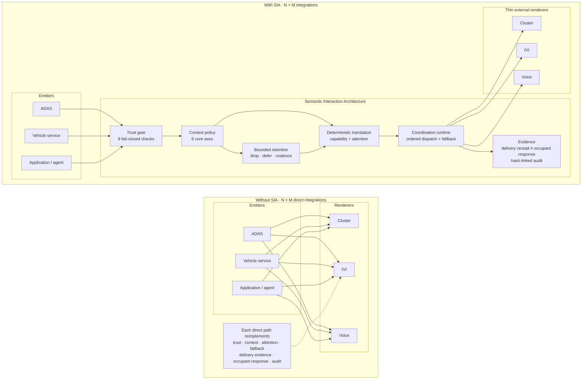
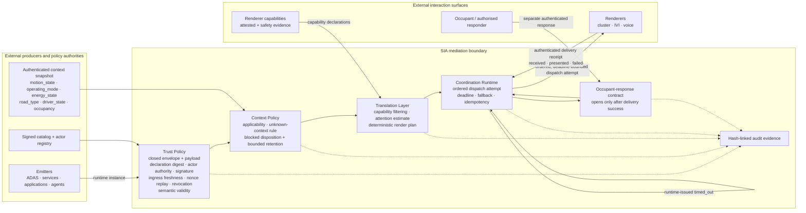
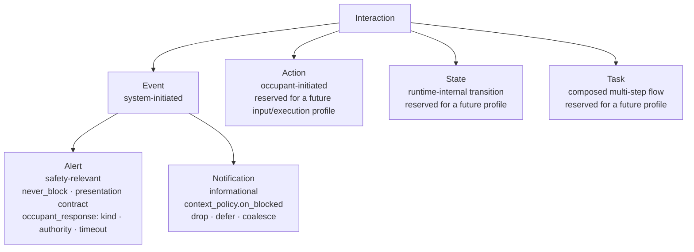
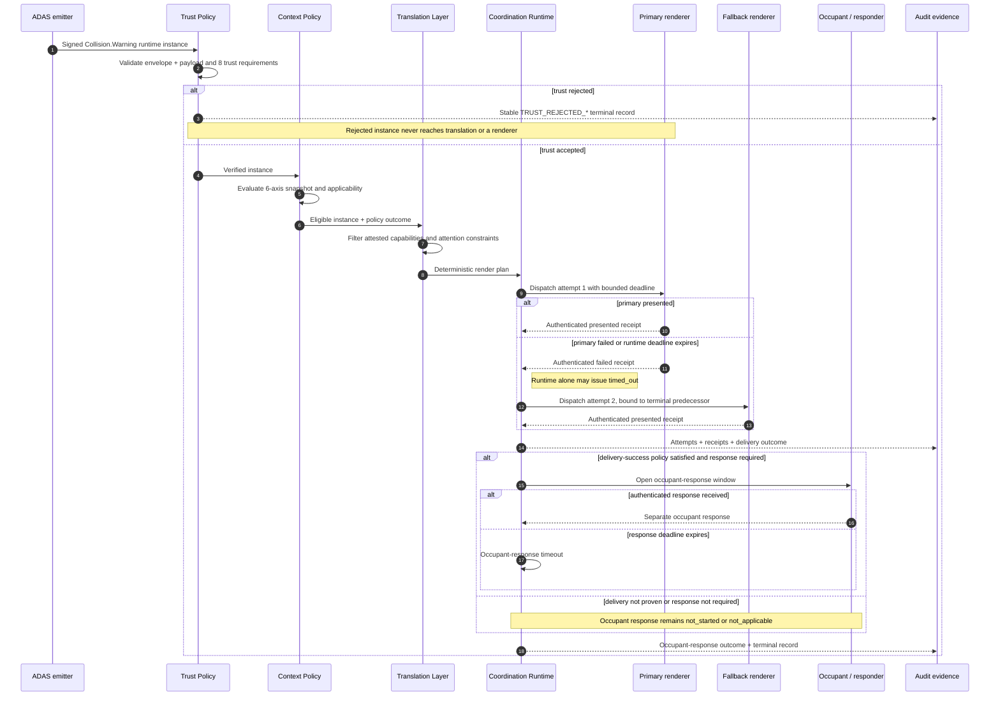

# SIA 0.4.0 figure redraw reference

These diagrams are the editable semantic source for redrawing the remaining
0.3-era raster figures. They are explanatory, not a second normative source.
When a label or relationship is uncertain, the precedence order is:

1. [`../03_Core-Specification.md`](../03_Core-Specification.md)
2. [`../schema/`](../schema/) and [`../examples/v0.4.0/`](../examples/v0.4.0/)
3. these redraw diagrams

The final artwork may change layout, typography, colour, and iconography, but it
must preserve the labelled nodes, edge direction, loop separation, and profile
scope stated below.

## Figure 1 — Complexity comparison

Redraw constraints:

- The left side communicates duplicated policy/evidence per emitter–renderer
  pairing; it must not imply that only one shared pre-SIA component exists.
- The right side communicates one mediation boundary with N emitter adapters and
  M renderer adapters.
- Trust is labelled as eight checks, retention is bounded, and delivery receipt
  and occupant response remain visibly distinct.
- Renderers stay outside the SIA boundary.

## Figure 3 — Mediation architecture

Redraw constraints:

- Trust Policy is the mandatory chokepoint before context, translation, or
  dispatch; claimed urgency never bypasses it.
- The six context axes are orthogonal observations, not a single vehicle-state
  enum.
- Renderer capabilities flow into Translation; render plans and attempts flow
  out through Coordination Runtime.
- `failed` comes from a renderer; `timed_out` comes only from Coordination
  Runtime.
- Delivery evidence and occupant response are two separate authenticated loops.
- Audit observes every terminal decision but must not become an unbounded
  prerequisite for critical dispatch.

## Figure 4 — Semantic node taxonomy

Redraw constraints:

- The architecture contains four top-level families: Event, Action, State, and
  Task; Event has Alert and Notification subtypes.
- The `sia-minimal` 0.4.0 profile emits only Alert and Notification.
- Do not restore `requires_ack`, `ack_kind`, `suppression_class`, or
  `merges_with`. Use the structured occupant-response and blocked-disposition
  contracts shown above.
- Action must not reuse the output-renderer delivery contract as an input or
  execution-result contract.

## Figure A.1 — Collision-warning trust and delivery sequence

Redraw constraints:

- The dispatch deadline is bounded by semantic validity; neither fallback nor
  queueing silently extends freshness or validity.
- A `received` receipt alone is not delivery success. The applicable success
  policy requires `presented` evidence.
- Fallback dispatch requires a terminal failed/timed-out predecessor and a
  still-valid instance.
- Delivery timeout never substitutes for occupant-response timeout, and a
  renderer receipt never proves awareness or comprehension.

## Export checklist

Before replacing a raster figure, verify that the artwork:

- says `0.4.0` wherever a public release version is shown;
- contains no retired fields (`requires_ack`, `ack_kind`, `suppression_class`,
  `merges_with`);
- preserves the eight trust requirements and six core context axes;
- keeps renderers outside SIA;
- distinguishes render plan, dispatch attempt, delivery receipt, and occupant
  response;
- labels uncertainty and overload outcomes as explicit, bounded, and auditable;
- remains legible in the paper at its final rendered width.
