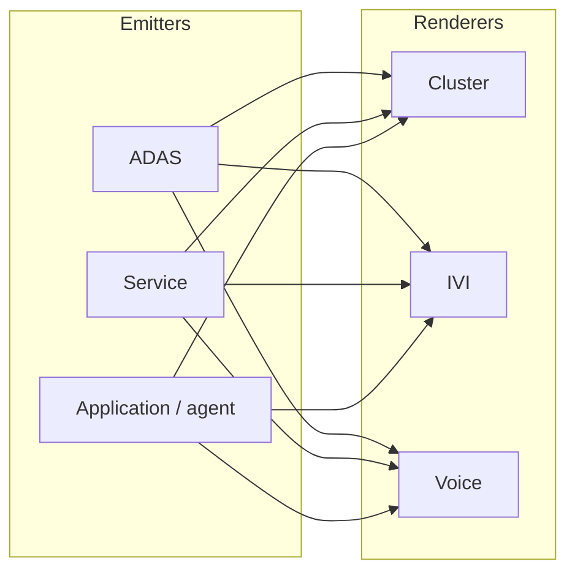
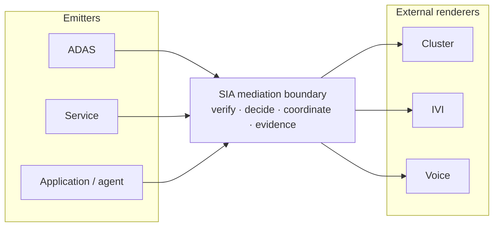
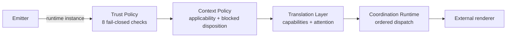
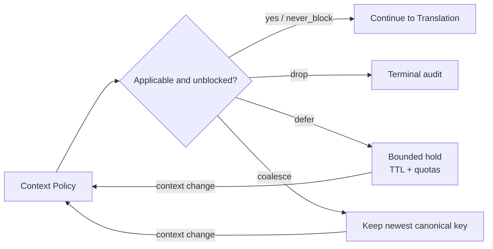
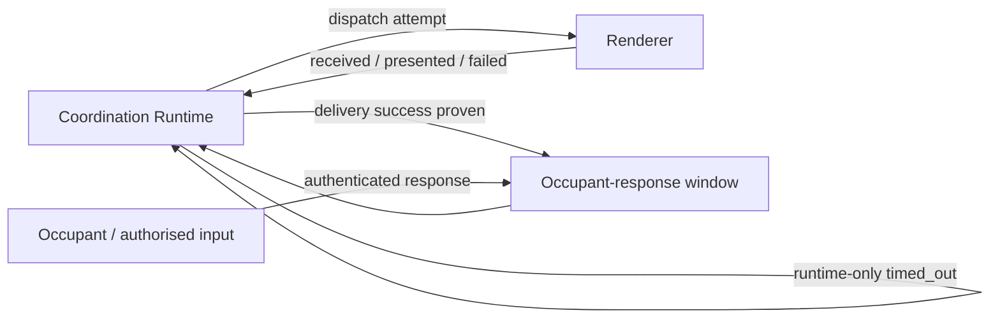
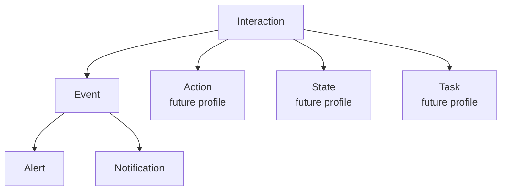
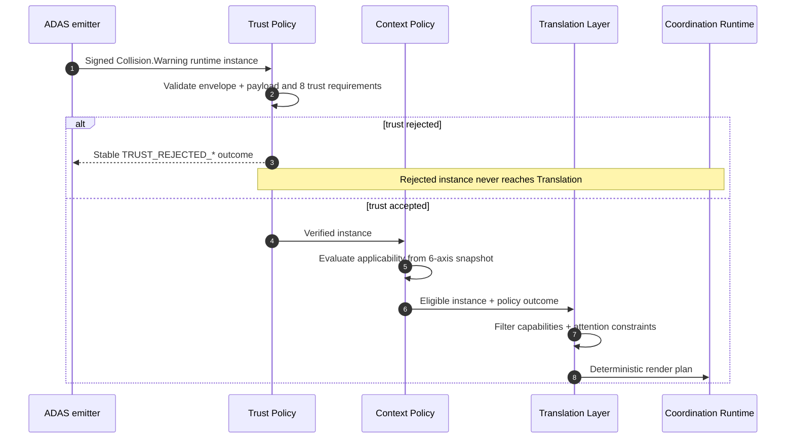
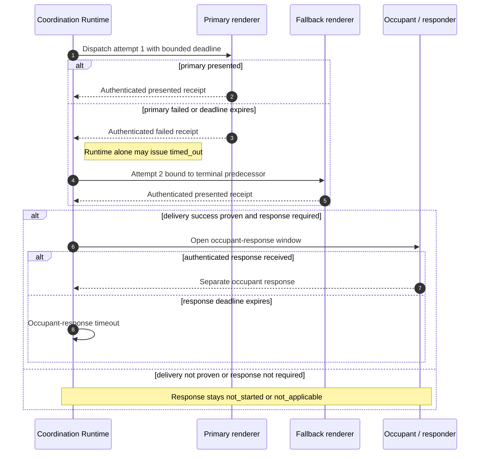

# SIA 0.4.0 figure redraw reference

These diagrams are the editable semantic source for redrawing the remaining
0.3-era raster figures. They are explanatory, not a second normative source.
When a label or relationship is uncertain, the precedence order is:

1. [`../03_Core-Specification.md`](../03_Core-Specification.md)
2. [`../schema/`](../schema/) and [`../examples/v0.4.0/`](../examples/v0.4.0/)
3. these redraw diagrams

The final artwork may change layout, typography, colour, and iconography, but it
must preserve the labelled nodes, edge direction, loop separation, and profile
scope stated below. Each panel answers one question. Do not merge panels merely
to reduce the published figure count; a multi-panel figure or two consecutive
figures are both preferable to one unreadable surface.

## Figure 1 — Complexity comparison

### Figure 1A — Without SIA

Shared caption/callout outside the graph: **every direct path repeats trust,
context, attention, fallback, evidence, and audit logic — N × M integrations.**

### Figure 1B — With SIA

Redraw constraints:

- 1A communicates duplicated policy/evidence per emitter–renderer pairing.
- 1B communicates one mediation boundary with N emitter adapters and M renderer
  adapters.
- Do not expand SIA internals here; Figure 3 owns that explanation.
- Renderers stay outside the SIA boundary.

## Figure 3 — Mediation architecture

### Figure 3A — Forward decision path

Place three small input callouts beneath the relevant stage, not inside its box:

- Trust: signed catalog + actor registry.
- Context: authenticated snapshot with six core axes.
- Translation: attested renderer capabilities.

### Figure 3B — Context outcome branch

### Figure 3C — Delivery and human feedback

Redraw constraints:

- 3A owns the architectural forward path; it must remain readable without the
  other panels.
- 3B owns retention and overload meaning. The six context-axis names belong in
  one compact callout or legend, not inside the flow.
- 3C owns the two feedback loops. `failed` comes from a renderer; `timed_out`
  comes only from Coordination Runtime.
- Add one shared footer across the three panels: every terminal decision produces
  hash-linked audit evidence, but persistence never blocks critical dispatch
  without a bound.

## Figure 4 — Semantic node taxonomy

Keep contract details in a two-row legend beside or below the tree:

| Emitted family in `sia-minimal` 0.4.0 | Contract emphasis |
|---|---|
| Alert | safety relevance · `never_block` where declared · presentation contract · separate occupant response |
| Notification | informational · blocked disposition: `drop`, `defer`, or `coalesce` |

Redraw constraints:

- The architecture contains four top-level families: Event, Action, State, and
  Task; Event has Alert and Notification subtypes.
- The `sia-minimal` 0.4.0 profile emits only Alert and Notification.
- Do not put field lists inside taxonomy nodes. Do not restore `requires_ack`,
  `ack_kind`, `suppression_class`, or `merges_with`.
- Action must not reuse the output-renderer delivery contract as an input or
  execution-result contract.

## Figure A.1 — Collision-warning trust and delivery sequence

### Figure A.1A — Acceptance and planning

### Figure A.1B — Delivery, fallback, and response

Redraw constraints:

- A.1A ends at the render plan. A.1B starts from that plan; do not reconnect all
  nine lifelines into one sequence.
- The dispatch deadline is bounded by semantic validity; neither fallback nor
  queueing silently extends freshness or validity.
- A `received` receipt alone is not delivery success. The applicable success
  policy requires `presented` evidence.
- Fallback dispatch requires a terminal failed/timed-out predecessor and a
  still-valid instance.
- Delivery timeout never substitutes for occupant-response timeout, and a
  renderer receipt never proves awareness or comprehension.
- Show audit as one shared footer or side annotation: rejected trust, delivery
  outcome, and occupant-response outcome each produce terminal evidence. Audit
  does not need its own lifeline.

## Export checklist

Before replacing a raster figure, verify that the artwork:

- says `0.4.0` wherever a public release version is shown;
- contains no retired fields (`requires_ack`, `ack_kind`, `suppression_class`,
  `merges_with`);
- preserves the eight trust requirements and six core context axes;
- keeps renderers outside SIA;
- distinguishes render plan, dispatch attempt, delivery receipt, and occupant
  response;
- labels uncertainty and overload outcomes as explicit, bounded, and auditable;
- remains legible in the paper at its final rendered width.
